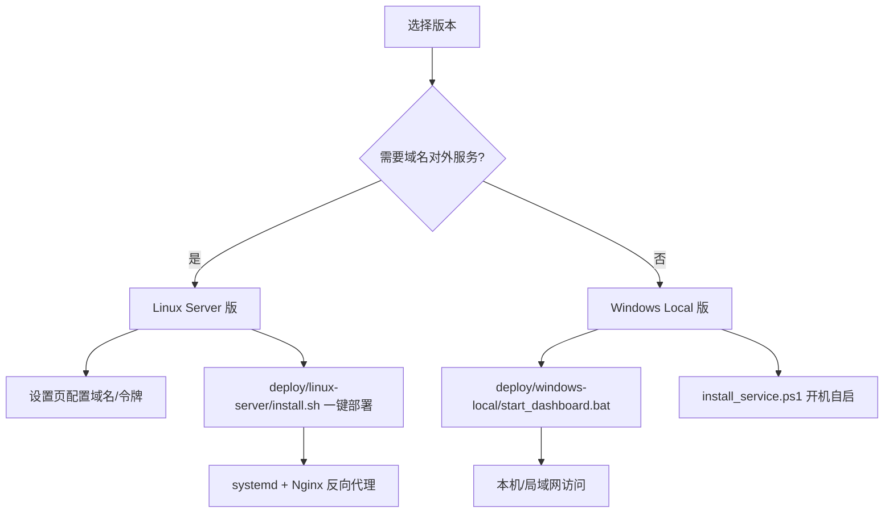

# Tavily Key Pool — 部署包总览

同一套代码库，通过 `data/config.json` 中的 `mode` 区分两种部署形态：

| 版本 | 目录 | 适用场景 | 默认监听 | 域名 |
| --- | --- | --- | --- | --- |
| **Linux Server 版** | `deploy/linux-server/` | Linux 云服务器，通过**域名**对外提供服务 | `0.0.0.0:8000` | 绑定域名，Nginx 反向代理 |
| **Windows Local 版** | `deploy/windows-local/` | Windows 本机/局域网提供服务 | `127.0.0.1:8000` | 不需要 |

## 选择版本

- 需要公网/多人访问、有域名 → [Linux Server 版](linux-server/README.md)
- 个人本机、内网使用 → [Windows Local 版](windows-local/README.md)

## 配置说明

部署后通过 **Web 设置页**（界面右上「设置」标签页）或直接编辑 `data/config.json` 调整：

```json
{
  "mode": "server",        // server = Linux 公网 / local = Windows 本地
  "domain": "api.example.com",  // 绑定域名（仅界面展示与部署指引用途）
  "host": "0.0.0.0",       // 监听地址：0.0.0.0 对外 / 127.0.0.1 仅本机
  "port": 8000,            // 监听端口
  "auth_token": ""         // 访问令牌（留空不鉴权）
}
```

> 修改 `host` / `port` 需**重启服务**生效；修改 `mode` / `domain` / `auth_token` 即时生效。
> `data/config.json` 不存在时首次启动自动生成默认值。

## 搜索代理（可选服务）

搜索代理（Tavily 兼容 REST，默认监听 `0.0.0.0:8002`）是独立子进程，**不随 Linux systemd 服务自动启动**。需使用时在面板「搜索代理」页开启（或设置 `proxy_auto_start: true`）；Linux Server 若需对外暴露，请为其单独配置 Nginx 反向代理，并**务必设置 `proxy_token` 密钥**（留空则对外开放）。

## 部署流程图


