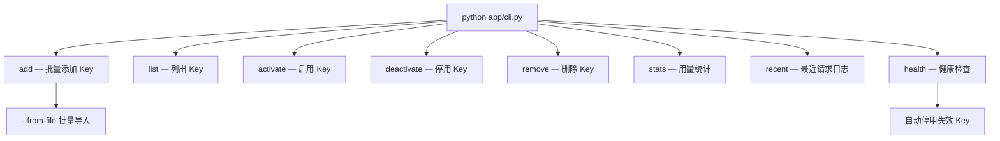
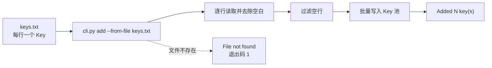

# CLI 使用

<cite>来源：<a href="file://app/cli.py">cli.py</a>（全部子命令定义与实现） · <a href="file://README.md">README.md</a>（安装、导入与命令示例）</cite>

## 目录

- [简介](#简介)
- [命令总览](#命令总览)
- [通用调用方式](#通用调用方式)
- [Key 管理命令](#key-管理命令)
- [统计与健康命令](#统计与健康命令)
- [批量导入 Key](#批量导入-key)
- [退出码与错误处理](#退出码与错误处理)
- [相关页面](#相关页面)

## 简介

`cli.py` 是 Tavily API Key Pool 的命令行入口，所有子命令都通过 `KeyPool` 操作 SQLite 数据库 `tavily_keys.db`（自动创建，删除后下次运行自动重建空库）。

本文是命令速查索引，覆盖 `add` / `list` / `activate` / `deactivate` / `remove` / `stats` / `recent` / `health` 八个子命令。各分组的详细说明见本主题下的《Key 管理命令》与《统计与健康命令》。

## 命令总览



| 分组 | 命令 | 功能 | 常用参数 |
|---|---|---|---|
| Key 管理 | `add` | 添加一个或多个 Key | `keys...` / `-f` |
| Key 管理 | `list` | 列出 Key 池 | `-a` |
| Key 管理 | `activate` | 启用 Key | `masked` |
| Key 管理 | `deactivate` | 停用 Key | `masked` / `-r` |
| Key 管理 | `remove` | 删除 Key | `key` |
| 统计与健康 | `stats` | 用量统计（JSON） | — |
| 统计与健康 | `recent` | 最近请求日志 | `-n` |
| 统计与健康 | `health` | 健康检查 | — |

## 通用调用方式

```bash
python app/cli.py <子命令> [参数...]
python app/cli.py --help        # 查看全部子命令
```

- 不带子命令运行时打印帮助文本并以退出码 1 退出。
- 帮助信息中的程序名显示为 `tavily-pool`，与 `python app/cli.py` 等价。
- `list` 输出的掩码 key（形如 `tvly-abc****123`）可作为 `activate` / `deactivate` / `remove` 的定位参数。

## Key 管理命令

### add — 添加 Key

```bash
# 直接传入一个或多个 key
python app/cli.py add tvly-xxxxxxxxxxxxx tvly-yyyyyyyyyyyyy

# 从文件批量导入（每行一个 key）
python app/cli.py add --from-file keys.txt
```

- `keys`（位置参数）：要添加的完整 API key，可多个。
- `-f, --from-file`：从文件读取，逐行 strip 并过滤空行，优先于位置参数。

输出示例：
```text
Added 2 key(s).
```

### list — 列出 Key

```bash
python app/cli.py list            # 全部 key
python app/cli.py list --active   # 仅活跃 key
```

输出示例：

```text
=== API Key Pool (ALL) ===
  + tvly-abc****123 | 128 reqs, 34.56 credits, last: 2025-06-01 10:24
  - tvly-def****456 | 12 reqs, 3.14 credits
      last error: 401 rate limit exceeded
Total: 2 keys, 1 active
```

- `+` 表示活跃，`-` 表示已停用。
- 每行显示掩码 key、请求数、credits 用量、最后使用时间；有 `last_error` 时额外打印错误信息（截断 100 字符）。

### activate / deactivate — 启用与停用

```bash
python app/cli.py activate tvly-abc****123
python app/cli.py deactivate tvly-abc****123 -r "日常维护"
```

- `masked`：来自 `list` 输出的掩码 key。
- `deactivate` 的 `-r, --reason` 用于记录停用原因，缺省为 `manual`。

输出示例：

```text
Deactivated: tvly-abc****123
Activated: tvly-abc****123
```

### remove — 删除 Key

```bash
python app/cli.py remove tvly-abc****123
```

接受掩码 key 或完整 key，直接删除：

```text
Removed key: tvly-abc****123
```

## 统计与健康命令

### stats — 用量统计

```bash
python app/cli.py stats
```

以 JSON 格式输出用量统计（`indent=2`、`ensure_ascii=False`），字段以 `get_stats()` 实际输出为准，通常包含 key 总数、活跃数、请求数与用量汇总等：

```json
{
  "total_keys": 12,
  "active_keys": 9,
  "total_requests": 3456,
  "total_credits_used": 123.45
}
```

### recent — 最近请求日志

```bash
python app/cli.py recent          # 最近 20 条（默认）
python app/cli.py recent -n 50    # 最近 50 条
```

输出示例：

```text
=== Recent Requests (last 5) ===
  [06-01 10:24:31] OK tavily-search via tvly-abc****123 (152ms)
  [06-01 10:23:58] FAIL tavily-extract via tvly-def****456 (503ms) | timeout
```

### health — 健康检查

```bash
python app/cli.py health
```

对所有活跃 key 发起探测，失败（DEAD）的 key 会自动停用：

```text
Running health checks on all active keys...
  ALIVE tvly-abc****123 (230ms)
  DEAD tvly-def****456 [401 unauthorized]
Result: 1 alive, 1 dead
```


## 批量导入 Key

最常用的导入方式：把 key 逐行放入 `keys.txt`（空行自动忽略），然后一次性导入：

```bash
$ cat keys.txt
tvly-xxxxxxxxxxxxx
tvly-yyyyyyyyyyyyy

$ python app/cli.py add --from-file keys.txt
Added 2 key(s).
```



## 退出码与错误处理

| 场景 | 输出 | 退出码 |
|---|---|---|
| 未提供子命令 | 帮助文本 | 1 |
| `--from-file` 文件不存在 | `File not found: <path>` | 1 |
| `add` 没有有效 key | `No keys provided.` | 1 |
| 正常执行 | 各命令输出 | 0 |

其他说明：

- 所有 Key 状态与请求日志保存在 SQLite 文件 `tavily_keys.db`，删除后下次运行自动重建空库，不影响功能。
- 掩码 key 来自 `list` 输出，形如 `tvly-abc****123`；`remove` 也可接受完整 key。

## 相关页面

- [项目概述](项目概述/项目概述.md) — 项目定位与整体功能
- [启动服务](快速开始/启动服务.md) — MCP Server 与 Dashboard 的启动方式