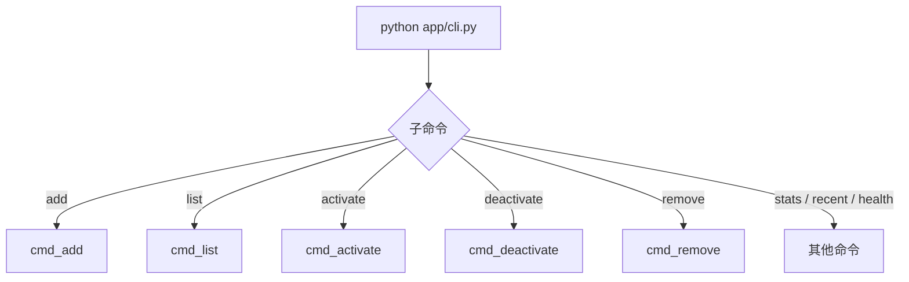
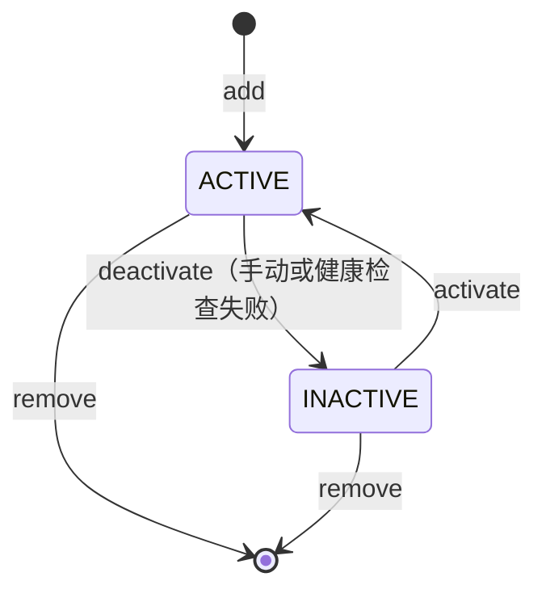

# Key 管理命令

> <cite>来源：[cli.py](file://app/cli.py) · [README.md](file://README.md)</cite>

Key 管理命令是 [Tavily API Key Pool](../项目概述/项目概述.md) 命令行工具的核心操作集合，负责向密钥池**添加**、**查询**、**启用/停用**和**删除** Tavily API Key。本文面向运维人员，逐一说明每个命令的语法、参数、预期输出以及 Key 的唯一标识规则。

## 目录

- [命令总览](#命令总览)
- [add —— 批量添加 Key](#add--批量添加-key)
- [list —— 查询 Key 列表](#list--查询-key-列表)
- [activate / deactivate —— 启停 Key](#activate--deactivate--启停-key)
- [remove —— 删除 Key](#remove--删除-key)
- [Key 标识与掩码规则](#key-标识与掩码规则)
- [删除后的数据影响](#删除后的数据影响)
- [相关页面](#相关页面)

## 命令总览

所有 Key 管理命令均通过 `cli.py` 入口执行（`parser` 中注册的命令名为 `tavily-pool`），下表给出各子命令的速查信息：

| 子命令 | 作用 | 必填参数 | 常用选项 |
| --- | --- | --- | --- |
| `add` | 添加一个或多个 Key | `keys`（位置参数）或 `--from-file` | `--from-file` |
| `list` | 列出密钥池全部 Key | 无 | `--active` |
| `activate` | 启用指定 Key | `masked`（掩码） | 无 |
| `deactivate` | 停用指定 Key | `masked`（掩码） | `--reason` |
| `remove` | 删除指定 Key | `key`（掩码或完整 Key） | 无 |

命令入口代码位于 [cli.py](file://app/cli.py) 的 `main()` 函数中，各子命令通过 `add_parser()` 注册并分发到对应的 `cmd_*` 函数。



## add —— 批量添加 Key

`add` 命令支持两种输入方式：**命令行直接传入**和**从文件批量读取**。若同时使用两种方式，以 `--from-file` 为准（代码中会覆盖位置参数）。

### 语法

```bash
python app/cli.py add [keys ...] [--from-file FILE]
```

| 参数 | 说明 |
| --- | --- |
| `keys` | 位置参数，一个或多个完整 API Key，空格分隔 |
| `--from-file, -f` | 从文本文件读取 Key，每行一个；文件不存在或为空时报错退出 |

### 从文件批量导入

最典型的使用场景是首次部署时批量导入。在项目根目录准备 `keys.txt`（每行一个 Key）：

```
tvly-xxxxxxxxxxxxxxxxx
tvly-yyyyyyyyyyyyyyyyy
tvly-zzzzzzzzzzzzzzzzz
```

执行导入：

```bash
python app/cli.py add --from-file keys.txt
```

预期输出：

```
Added 3 key(s).
```

### 命令行直接添加

```bash
python app/cli.py add tvly-aaaaaaaaaaaaaaaa tvly-bbbbbbbbbbbbbbbb
```

预期输出：

```
Added 2 key(s).
```

### 执行流程

```mermaid
flowchart TD
    A[add 命令] --> B{指定 --from-file?}
    B -->|是| C[读取文件]
    C --> D{文件存在?}
    D -->|否| E[打印 File not found 并退出]
    D -->|是| F[按行 strip 并过滤空行]
    B -->|否| G[使用位置参数 keys]
    F --> H{keys 为空?}
    G --> H
    H -->|是| I[打印 No keys provided 并退出]
    H -->|否| J[调用 add_keys_batch]
    J --> K[打印 Added n key(s)]
```

## list —— 查询 Key 列表

`list` 命令用于查看密钥池当前的全部 Key 及其状态、用量信息。

### 语法

```bash
python app/cli.py list [--active]
```

| 参数 | 说明 |
| --- | --- |
| `--active, -a` | 仅显示活跃状态的 Key |

不带任何参数时，列表头部会显示 `ALL`，随后逐行输出每个 Key 的信息。每行格式为：

```
  {状态符号} {掩码Key} | {请求次数} reqs, {已用额度} credits, last: {最后使用时间}
```

其中状态符号 `+` 表示**活跃**，`-` 表示**已停用**。若 Key 最近一次请求失败，还会额外输出一行 `last error:` 摘要（截断 100 字符），便于快速定位问题。

### 示例：列出全部 Key

```bash
python app/cli.py list
```

预期输出：

```
=== API Key Pool (ALL) ===
  + tvly-aaa****aaa | 152 reqs, 12.80 credits, last: 2025-01-15 10:24
  + tvly-bbb****bbb | 38 reqs, 3.25 credits
  - tvly-ccc****ccc | 0 reqs, 0 credits
      last error: 429 rate limit exceeded
Total: 3 keys, 2 active
```

### 示例：仅列出活跃 Key

```bash
python app/cli.py list --active
```

预期输出：

```
=== API Key Pool (ACTIVE) ===
  + tvly-aaa****aaa | 152 reqs, 12.80 credits, last: 2025-01-15 10:24
  + tvly-bbb****bbb | 38 reqs, 3.25 credits
Total: 3 keys, 2 active
```

若密钥池为空，则输出 `No keys in pool.`。

该命令对应的实现位于 [cli.py](file://app/cli.py) 的 `cmd_list()`，会读取每个 Key 对象的 `is_active`、`masked`、`request_count`、`credits_used`、`last_used_at` 等字段，并在结尾汇总活跃数量。

## activate / deactivate —— 启停 Key

当某个 Key 触发限流、欠费或密钥过期时，可以用 `deactivate` 将其临时停用；问题解决后再用 `activate` 恢复。停用 / 启用命令操作的是 Key 的 **掩码标识**（见下文），而不是完整 Key。

### deactivate

```bash
python app/cli.py deactivate <masked_key> [--reason REASON]
```

参数说明：

| 参数 | 说明 |
| --- | --- |
| `masked` | 必填，Key 的掩码形式，例如 `tvly-aaa****aaa` |
| `--reason, -r` | 可选，停用原因；省略时默认写入 `manual` |

示例：

```bash
python app/cli.py deactivate tvly-ccc****ccc --reason "rate limited"
```

预期输出：

```
Deactivated: tvly-ccc****ccc
```

### activate

```bash
python app/cli.py activate <masked_key>
```

示例：

```bash
python app/cli.py activate tvly-ccc****ccc
```

预期输出：

```
Activated: tvly-ccc****ccc
```

> 提示：执行 [健康检查](统计与健康命令.md) 时，系统会自动停用探测失败的 Key；运维人员可先用 `list` 确认停用状态，再决定是 `activate` 恢复还是 `remove` 删除。

## remove —— 删除 Key

`remove` 命令将 Key 从密钥池中**永久删除**。它接受掩码 Key 或完整 Key 两种形式，是唯一一个不强制要求掩码的管理命令。

### 语法

```bash
python app/cli.py remove <key>
```

参数说明：

| 参数 | 说明 |
| --- | --- |
| `key` | 必填，掩码 Key 或完整 Key |

示例（使用掩码）：

```bash
python app/cli.py remove tvly-ccc****ccc
```

预期输出：

```
Removed key: tvly-ccc****ccc
```

示例（使用完整 Key）：

```bash
python app/cli.py remove tvly-cccccccccccccccccccc
```

预期输出：

```
Removed key: tvly-cccccccccccccccccccc
```

删除后该 Key 不再参与轮询分发，`list` 输出中也不会再出现。

### Key 生命周期状态图

以下状态图概括了 Key 从添加到删除的完整流转过程：



## Key 标识与掩码规则

使用管理命令时，需要注意不同命令对 Key 标识的要求：

| 命令 | 接受的标识 | 原因 |
| --- | --- | --- |
| `add` | 完整 Key | 需要完整密钥才能写入池中 |
| `list` | 无需提供 | 输出中展示的是掩码 |
| `activate` | 掩码 Key | 命令参数名为 `masked` |
| `deactivate` | 掩码 Key | 命令参数名为 `masked` |
| `remove` | 掩码 Key 或完整 Key | 参数名为 `key`，两者皆可 |

掩码格式为 `tvly-xxx****yyy` 形式（前几位 + `****` + 后几位），由密钥池自动生成。运维操作中最可靠的工作流是：

```bash
python app/cli.py list              # 先查询，拿到掩码
python app/cli.py deactivate tvly-xxx****yyy   # 停用
python app/cli.py remove tvly-xxx****yyy       # 删除
```

## 删除后的数据影响

`remove` 命令调用 `pool.remove_key()`，其数据影响如下：

- **api_keys 表**：该 Key 的记录被永久删除，无法通过 `activate` 找回，需要重新 `add` 才能再次使用；
- **request_log 表**：历史请求日志不会被清除，仍然可以通过 `recent` 命令查询到该 Key 过去的调用记录；
- **轮询分发**：已删除的 Key 立即从轮询候选集中移除，不再承担任何请求。

数据库为 SQLite 文件 `tavily_keys.db`（位于项目根目录，自动创建），包含 `api_keys` 和 `request_log` 两张表。若整体删除该数据库文件，密钥池会重建为空库，但已录入的 Key 也会全部丢失，操作前建议先备份。

## 相关页面

- [项目概述](../项目概述/项目概述.md) — 了解密钥池整体设计目标
- [快速开始](../快速开始/快速开始.md) — 环境准备与首个 Key 导入
- [启动服务](../快速开始/启动服务.md) — 了解 MCP Server 与 Web Dashboard 的启动方式