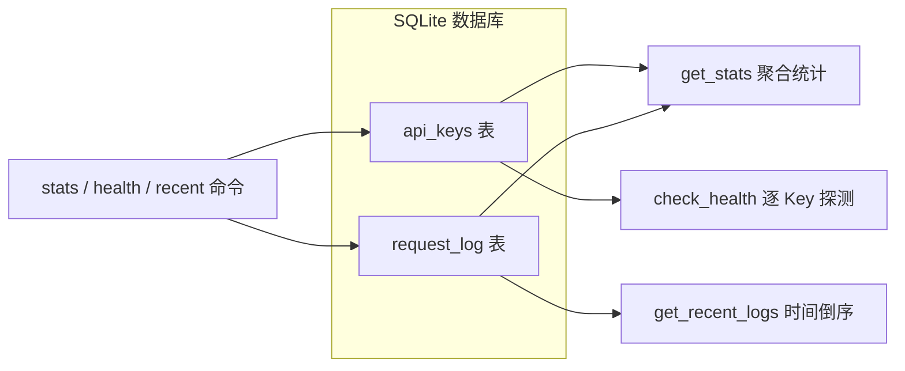
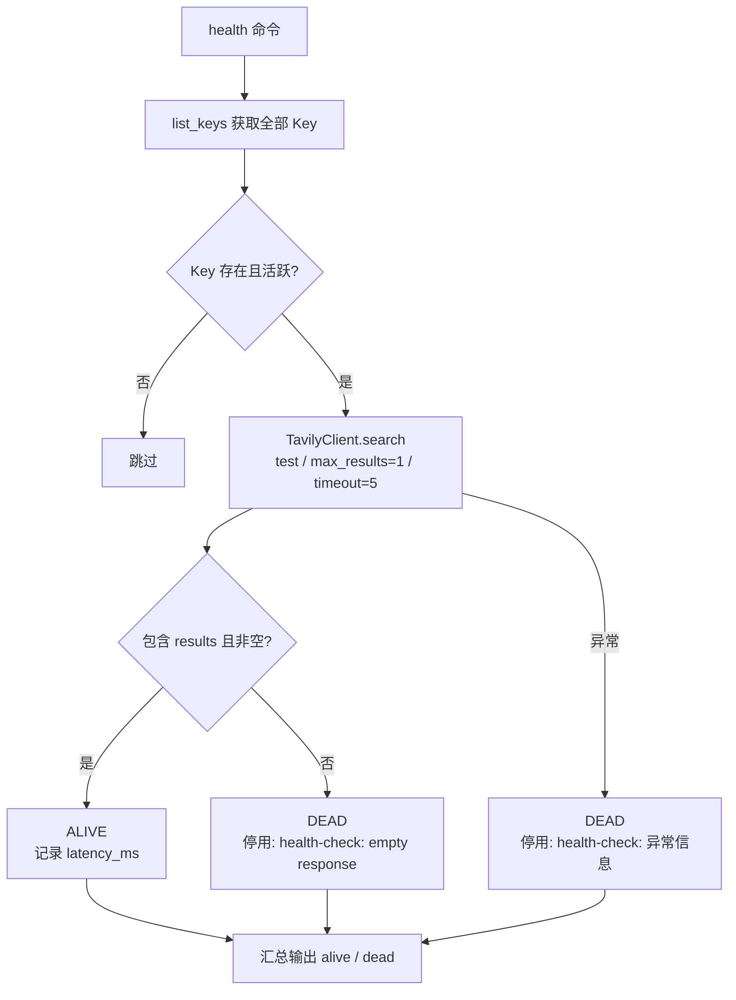

# 统计与健康命令

> <cite>本文档基于 [file://app/cli.py](file://app/cli.py) 与 [file://app/key_pool.py](file://app/key_pool.py) 中的命令行实现及 `KeyPool` 统计逻辑编写。</cite>

## 目录

- [概述](#概述)
- [stats — 查看用量统计](#stats--查看用量统计)
- [health — 健康检查](#health--健康检查)
- [recent — 最近请求日志](#recent--最近请求日志)
- [方法速查](#方法速查)
- [相关页面](#相关页面)

## 概述

`tavily-pool` 提供三个与监控、排障相关的子命令，用于查看 Key 池的运行状态：

| 子命令 | 功能 | 对应方法 |
| --- | --- | --- |
| `stats` | 以 JSON 格式输出整个池的用量统计 | `KeyPool.get_stats()` |
| `health` | 对全部活跃 Key 发起真实探测请求，自动停用失效 Key | `KeyPool.check_health_all()` |
| `recent` | 按时间倒序输出最近的请求日志 | `KeyPool.get_recent_logs()` |

三者数据均来自 SQLite 数据库（`tavily_keys.db`）中的 `api_keys` 与 `request_log` 两张表：



## stats — 查看用量统计

### 使用方式

```bash
tavily-pool stats
```

命令无需参数，输出由 [file://app/cli.py](file://app/cli.py) 中的 `cmd_stats` 调用 `pool.get_stats()` 获取，并使用 `json.dumps(..., ensure_ascii=False, indent=2)` 格式化打印。

### 输出示例

```json
{
  "total_keys": 5,
  "active_keys": 4,
  "total_requests": 1287,
  "total_errors": 12,
  "total_credits": 3420,
  "recent_24h": {
    "/search": {
      "success": 86,
      "failed": 2
    }
  },
  "keys": [
    {
      "masked": "tvly-abc123****wxyz",
      "is_active": true,
      "request_count": 486,
      "error_count": 2,
      "credits_used": 1250,
      "credits_limit": 1000,
      "usage_pct": 125.0,
      "last_used_at": 1718434981.23,
      "added_at": 1718000000.0,
      "last_error": ""
    }
  ]
}
```

### 字段含义

顶层字段由 `KeyPool.get_stats()` 返回：

| 字段 | 含义 |
| --- | --- |
| `total_keys` | Key 池中的 Key 总数（含已停用） |
| `active_keys` | 当前活跃（`is_active=1`）的 Key 数量 |
| `total_requests` | 池内所有 Key 的累计请求次数 |
| `total_errors` | 池内所有 Key 的累计错误次数 |
| `total_credits` | 池内所有 Key 的累计消耗积分 |
| `recent_24h` | 过去 24 小时内按 `endpoint` 分组的成功/失败次数 |
| `keys` | 每个 Key 的明细数组 |

`recent_24h` 的时间窗口在 [file://app/key_pool.py](file://app/key_pool.py) 的 `get_stats()` 中定义为：

```python
SELECT endpoint, success, COUNT(*) as cnt
FROM request_log
WHERE created_at > ?   -- time.time() - 86400，即最近 24 小时
GROUP BY endpoint, success
```

若过去 24 小时没有任何请求，`recent_24h` 为空对象 `{}`。

每个 Key 明细中的关键字段（由 `_apikey_to_dict()` 生成）：

| 字段 | 含义 |
| --- | --- |
| `masked` | 脱敏后的 Key（如 `tvly-abc123****wxyz`） |
| `is_active` | 是否处于活跃状态 |
| `request_count` | 该 Key 累计请求次数 |
| `error_count` | 该 Key 累计失败次数 |
| `credits_used` / `credits_limit` | 已用积分 / 积分上限 |
| `usage_pct` | 积分使用百分比，由 `ApiKey.usage_pct` 计算（`credits_used / effective_limit × 100`，保留 1 位小数；`effective_limit` 优先取 `credits_limit`，为 `0` 时回退套餐额度 `plan_limit`，两者均为 `0` 时返回 `0.0`） |
| `last_used_at` / `added_at` | 最近使用时间 / 添加时间，均为 Unix 时间戳（秒） |
| `last_error` | 最近一次错误信息（健康检查停用原因也会写入此处） |

> 注意：`keys` 中的时间戳为原始浮点秒值，需要自行转换为可读格式；而 `recent` 命令输出中的时间已格式化。

### 典型用途

- 通过 `usage_pct` 判断哪些 Key 接近积分上限，需要续费或调整配额。
- 通过 `active_keys` 与 `total_keys` 的比例确认池内可用 Key 是否充足。
- 通过 `recent_24h` 观察各 endpoint 的失败率，辅助定位接口问题。

## health — 健康检查

### 使用方式

```bash
tavily-pool health
```

命令执行时，[file://app/cli.py](file://app/cli.py) 中的 `cmd_health` 会先打印 `Running health checks on all active keys...`，随后调用 `pool.check_health_all()` 对**所有活跃 Key** 执行探测，最后输出汇总结果。

### 检测流程

`KeyPool.check_health()` 对每个活跃 Key 执行以下逻辑：

1. 构建 `TavilyClient(k.key)`；
2. 调用 `client.search("test", max_results=1, search_depth="basic", timeout=5)` 发起一次轻量搜索；
3. 记录耗时（毫秒）；
4. 判定响应中是否包含非空的 `results` 列表。



### 判定与自动停用规则

判定条件在 [file://app/key_pool.py](file://app/key_pool.py) 的 `check_health()` 中：

```python
ok = "results" in resp and len(resp.get("results", [])) > 0
```

| 结果 | 输出状态 | 副作用 |
| --- | --- | --- |
| 响应包含非空 `results` | `ALIVE tvly-xxx****xxxx (412ms)` | 无 |
| 响应为空 | `DEAD tvly-xxx****xxxx [empty response]` | 自动停用该 Key |
| 请求抛出异常（鉴权失败等） | `DEAD tvly-xxx****xxxx [错误信息]` | 鉴权类错误自动停用；quota 类错误标记为耗尽；临时错误（超时/网络抖动）累计 `error_count` |

自动停用调用 `deactivate_key(masked, reason)`，原因会写入该 Key 的 `last_error` 字段（截断至 200 字符），之后可以通过 `tavily-pool list` 查看停用原因；确认问题解决后可执行 `tavily-pool activate <masked>` 重新启用。

> ⚠️ 注意：`check_health()` 的停用规则——**鉴权类错误**（401/403 等）直接停用；**quota 类错误**标记为耗尽（`exhausted`，移出轮询，计费周期重置后自动恢复）；**临时错误**（超时、网络抖动）需连续失败 ≥2 次才停用，避免瞬时故障误停。另外，探测请求本身会计入 Tavily 的调用配额（`max_results=1` 的轻量搜索）。

### 输出示例

```text
Running health checks on all active keys...
  ALIVE tvly-abc123****wxyz (412ms)
  ALIVE tvly-def456****abcd (98ms)
  DEAD  tvly-ghi789****efgh [401 unauthorized]
Result: 2 alive, 1 dead
```

## recent — 最近请求日志

### 使用方式

```bash
tavily-pool recent              # 默认显示最近 20 条
tavily-pool recent -n 50        # 显示最近 50 条
tavily-pool recent --limit 100  # 同上，--limit 与 -n 等价
```

`--limit` / `-n` 参数在 [file://app/cli.py](file://app/cli.py) 中定义，默认值为 `20`；`KeyPool.get_recent_logs()` 的默认上限为 `100`，但 CLI 层会以用户传入的 `limit` 为准。

### 日志来源与排序

日志由 `KeyPool.record_request()` 写入 `request_log` 表，查询逻辑：

```python
SELECT * FROM request_log ORDER BY created_at DESC LIMIT ?
```

即按 `created_at` 时间倒序返回最近 `N` 条记录，无需额外的时间窗口参数。若表中无记录，命令输出 `No recent requests.`

### 输出格式

每条日志由 `cmd_recent` 格式化为一行的形式：

```text
[MM-DD HH:MM:SS] 状态 endpoint via key_masked (延迟ms) | 错误信息
```

```text
=== Recent Requests (last 20) ===
  [06-15 14:23:01] OK /search via tvly-abc123****wxyz (412ms)
  [06-15 14:22:47] FAIL /search via tvly-def456****abcd (503ms) | 401 unauthorized
  [06-15 14:22:31] OK /search via tvly-abc123****wxyz (87ms)
```

展示字段说明：

| 字段 | 来源 | 说明 |
| --- | --- | --- |
| 时间 | `created_at` | 格式化为 `%m-%d %H:%M:%S` |
| 状态 | `success` | 成功显示 `OK`，失败显示 `FAIL` |
| `endpoint` | `endpoint` | 实际调用的 Tavily 接口路径 |
| `key_masked` | `key_masked` | 发起请求的 Key（脱敏） |
| `latency_ms` | `latency_ms` | 耗时，保留 0 位小数 |
| 错误信息 | `error_msg` | 仅失败时显示，截断至 60 字符 |

### 典型用途

- 回溯某个 Key 的失败请求，定位鉴权失败或限流问题。
- 结合 `latency_ms` 评估各 Key 的响应速度差异。
- 与 `health` 结果对照，确认停用的 Key 在停用前是否已有失败记录。

## 方法速查

| CLI 命令 | CLI 处理函数 | KeyPool 方法 | 主要数据表 |
| --- | --- | --- | --- |
| `stats` | `cmd_stats` | `get_stats()` | `api_keys`、`request_log` |
| `health` | `cmd_health` | `check_health_all()` / `check_health()` | `api_keys` |
| `recent` | `cmd_recent` | `get_recent_logs(limit)` | `request_log` |

更多实现细节可查阅 [file://app/cli.py](file://app/cli.py) 中的 `cmd_stats`、`cmd_health`、`cmd_recent` 函数，以及 [file://app/key_pool.py](file://app/key_pool.py) 中的 `get_stats`、`check_health`、`get_recent_logs` 方法。

## 相关页面

- [项目概述](项目概述/项目概述.md) — 了解项目整体定位与功能清单
- [快速开始](快速开始/快速开始.md) — 环境准备与首个命令
- [安装与配置](快速开始/安装与配置.md) — 安装依赖与初始化 Key 池
- [启动服务](快速开始/启动服务.md) — 以服务方式运行 `tavily-pool`