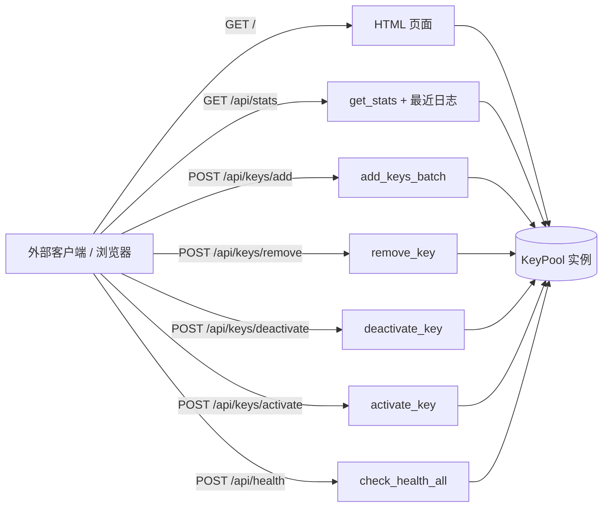
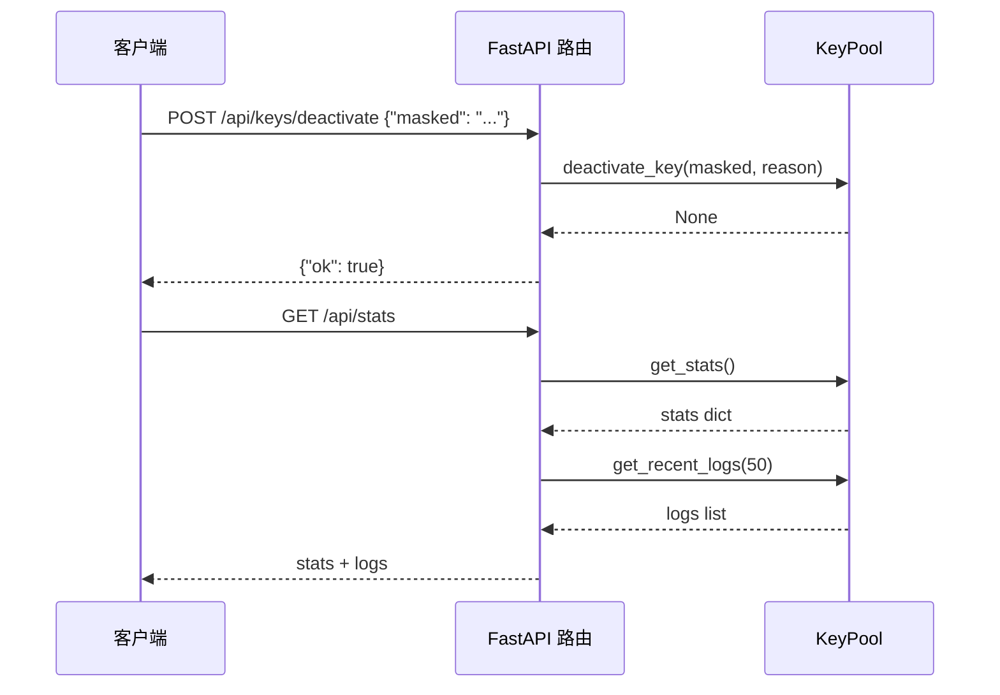

# API 接口

> <cite>本文档基于 [`dashboard.py`](file://app/dashboard.py) 中的 FastAPI 路由定义编写，面向希望通过 HTTP 方式集成 Dashboard 能力的开发者。</cite>

## 目录

- [概述](#概述)
- [基础信息](#基础信息)
- [端点一览](#端点一览)
- [端点详解](#端点详解)
  - [GET /](#get-)
  - [GET /api/stats](#get-apistats)
  - [POST /api/keys/add](#post-apikeysadd)
  - [POST /api/keys/remove](#post-apikeysremove)
  - [POST /api/keys/deactivate](#post-apikeysdeactivate)
  - [POST /api/keys/activate](#post-apikeysactivate)
  - [POST /api/health](#post-apihealth)
- [与 KeyPool 的关系](#与-keypool-的关系)
- [错误与边界情况](#错误与边界情况)
- [相关文档](#相关文档)

## 概述

Dashboard 后端基于 **FastAPI** 构建，共暴露 9 个 HTTP 端点：1 个 HTML 页面端点与 8 个 JSON API 端点。其中 Key 池相关端点均直接委托给全局唯一的 [`KeyPool`](file://app/dashboard.py) 实例（`pool = KeyPool()`）执行实际操作，因此这些 API 可以视为 KeyPool 核心能力的 HTTP 封装，便于外部脚本、监控系统或自定义前端直接调用。

API 端点的设计遵循以下约定：

- 查询类操作为 `GET`，写入类操作为 `POST`；
- 写入类端点统一返回 `{"ok": true}` 风格的成功响应；
- Key 的标识统一使用 **掩码（masked）** 形式，而非明文 Key，避免在日志与请求体中泄露完整凭证。

## 基础信息

| 项目 | 值 |
| --- | --- |
| Web 框架 | FastAPI |
| 默认监听地址 | `127.0.0.1` |
| 默认端口 | `8000` |
| 启动方式 | `python dashboard.py`（从 `data/config.json` 读取 host/port 后调用 `uvicorn.run`，默认 `127.0.0.1:8000`） |
| 接口文档 | 启动后访问 `http://127.0.0.1:8000/docs`（FastAPI 自动生成 Swagger UI） |

## 端点一览

| 方法 | 路径 | 请求体 | 说明 |
| --- | --- | --- | --- |
| GET | `/` | 无 | 返回 Dashboard HTML 页面 |
| GET | `/api/stats` | 无 | 获取 Key 池统计信息与最近 50 条日志 |
| POST | `/api/keys/add` | `{"keys": [...]}` | 批量添加 Key |
| POST | `/api/keys/remove` | `{"masked": "..."}` | 移除指定 Key |
| POST | `/api/keys/deactivate` | `{"masked": "...", "reason": "..."}` | 停用指定 Key |
| POST | `/api/keys/activate` | `{"masked": "..."}` | 重新激活指定 Key |
| POST | `/api/health` | 无 | 对池内所有 Key 执行健康检查 |
| GET | `/api/settings` | 无 | 读取当前部署设置（mode/domain/host/port/auth_token） |
| POST | `/api/settings` | 部分设置字段 | 保存部署设置（mode/domain/host/port/auth_token） |



## 端点详解

### GET /

返回 Dashboard 首页。响应类型为 `HTMLResponse`，内容来自 `templates/dashboard.html` 模板文件——该文件在模块加载时一次性读取到内存（`TPL.read_text()`），因此修改模板后需要重启服务才能生效。

响应示例：

```http
HTTP/1.1 200 OK
Content-Type: text/html; charset=utf-8

<!DOCTYPE html>
<html> ... </html>
```

前端页面通过 JavaScript 调用下文中的 JSON 端点完成数据渲染，具体交互方式参见「界面使用」相关文档。

### GET /api/stats

获取 Key 池的当前状态统计，并在响应中附带最近 50 条运行日志。这是 Dashboard 首页数据刷新的核心接口。

内部逻辑：

```python
@app.get("/api/stats")
def api_stats():
    stats = pool.get_stats()
    stats["logs"] = pool.get_recent_logs(50)
    return stats
```

响应结构（`stats` 字段由 [`KeyPool.get_stats()`](file://app/dashboard.py) 决定，通常包含 Key 总数、可用数、停用数等指标）：

```json
{
  "total": 12,
  "available": 8,
  "deactivated": 3,
  "in_use": 1,
  "logs": [
    {
      "time": "2025-06-01 10:00:00",
      "level": "INFO",
      "message": "Key tvly-**** 健康检查通过"
    }
  ]
}
```

`logs` 数组为最近 50 条日志记录，具体字段格式由 `KeyPool.get_recent_logs()` 决定，可参考「用量追踪与日志」一文。

### POST /api/keys/add

批量添加 Key 到池中。请求体必须为 JSON 对象：

| 字段 | 类型 | 必填 | 说明 |
| --- | --- | --- | --- |
| `keys` | `string[]` | 是 | 待添加的完整 API Key 列表 |

请求示例：

```json
{
  "keys": ["tvly-aaaaaaaa", "tvly-bbbbbbbb"]
}
```

对应处理逻辑：

```python
@app.post("/api/keys/add")
def api_keys_add(payload: dict = Body(...)):
    keys = payload.get("keys", [])
    added = pool.add_keys_batch(keys)
    return {"ok": True, "added": added}
```

成功响应：

```json
{
  "ok": true,
  "added": 2
}
```

`added` 为实际成功添加的 Key 数量，重复的 Key 会被自动跳过。

### POST /api/keys/remove

从池中永久移除指定 Key。使用掩码标识目标 Key，避免传输明文。

请求示例：

```json
{
  "masked": "tvly-****1234"
}
```

对应处理逻辑：

```python
@app.post("/api/keys/remove")
def api_keys_remove(payload: dict = Body(...)):
    pool.remove_key(payload["masked"])
    return {"ok": True}
```

成功响应：

```json
{
  "ok": true
}
```

### POST /api/keys/deactivate

将指定 Key 停用。停用后该 Key 不再参与轮询与请求分配。可通过 `reason` 字段记录停用原因（如配额耗尽、被上游封禁等），默认值为 `"manual"`。

请求示例：

```json
{
  "masked": "tvly-****1234",
  "reason": "quota_exceeded"
}
```

对应处理逻辑：

```python
@app.post("/api/keys/deactivate")
def api_keys_deactivate(payload: dict = Body(...)):
    pool.deactivate_key(payload["masked"], payload.get("reason", "manual"))
    return {"ok": True}
```

成功响应：

```json
{
  "ok": true
}
```

### POST /api/keys/activate

将已停用的 Key 重新激活，使其恢复参与轮询。与停用操作相反。

请求示例：

```json
{
  "masked": "tvly-****1234"
}
```

对应处理逻辑：

```python
@app.post("/api/keys/activate")
def api_keys_activate(payload: dict = Body(...)):
    pool.activate_key(payload["masked"])
    return {"ok": True}
```

成功响应：

```json
{
  "ok": true
}
```

### POST /api/health

对池内**所有** Key 主动执行一次健康检查，返回每个 Key 的检查结果。适合接入外部监控系统做定时巡检。

对应处理逻辑：

```python
@app.post("/api/health")
def api_health():
    results = pool.check_health_all()
    return {"results": results}
```

响应结构示例：

```json
{
  "results": [
    {
      "masked": "tvly-****1234",
      "ok": true,
      "latency_ms": 230
    },
    {
      "masked": "tvly-****5678",
      "ok": false,
      "error": "429 Too Many Requests"
    }
  ]
}
```

具体字段以 `KeyPool.check_health_all()` 的返回值为准，健康检查的判定逻辑参见「Key 轮询与健康检查」一文。

## 与 KeyPool 的关系

所有 API 端点都是对 `KeyPool` 方法的薄封装，映射关系如下：

| HTTP 端点 | KeyPool 方法 |
| --- | --- |
| `GET /api/stats` | `get_stats()` + `get_recent_logs(50)` |
| `POST /api/keys/add` | `add_keys_batch(keys)` |
| `POST /api/keys/remove` | `remove_key(masked)` |
| `POST /api/keys/deactivate` | `deactivate_key(masked, reason)` |
| `POST /api/keys/activate` | `activate_key(masked)` |
| `POST /api/health` | `check_health_all()` |
| `GET/POST /api/settings` | `settings` 模块读写 data/config.json |



## 错误与边界情况

由于端点直接在处理函数中调用 `KeyPool` 方法，未做显式的异常捕获，需要注意以下行为：

- **缺少必填字段**：`remove`、`deactivate`、`activate` 端点直接访问 `payload["masked"]`，若请求体缺少该字段会抛出 `KeyError`，FastAPI 返回 `500 Internal Server Error`。建议调用方始终携带完整字段。
> 访问鉴权：设置了 `auth_token` 后，所有 `/api/*` 请求都需要携带 `X-Auth-Token` 请求头（或 `?token=` 查询参数）且值匹配，否则返回 `401`。部署设置通过 `GET/POST /api/settings` 读写，持久化于 `data/config.json`（字段：mode/domain/host/port/auth_token）。

- **请求体格式错误**：`add` 端点要求请求体为 JSON 对象，否则 FastAPI 返回 `422 Unprocessable Entity`。
- **无效掩码**：若 `masked` 对应的 Key 不存在，行为取决于 `KeyPool` 对应方法的实现（可能静默忽略或抛异常）。
- **服务启动即校验资源**：`dashboard.py` 在导入时即读取 HTML 模板文件，若 `templates/dashboard.html` 缺失，服务将无法启动，详细排查可参考「故障排查」文档。

## 相关文档

- [项目概述](../项目概述/项目概述.md)
- [快速开始](../快速开始/快速开始.md)
- [启动服务](../快速开始/启动服务.md)
- [核心功能](../核心功能/核心功能.md)
- [Key 轮询与健康检查](../核心功能/Key轮询与健康检查.md)
- [用量追踪与日志](../核心功能/用量追踪与日志.md)