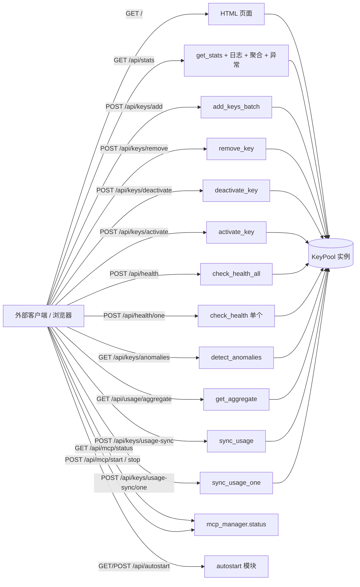
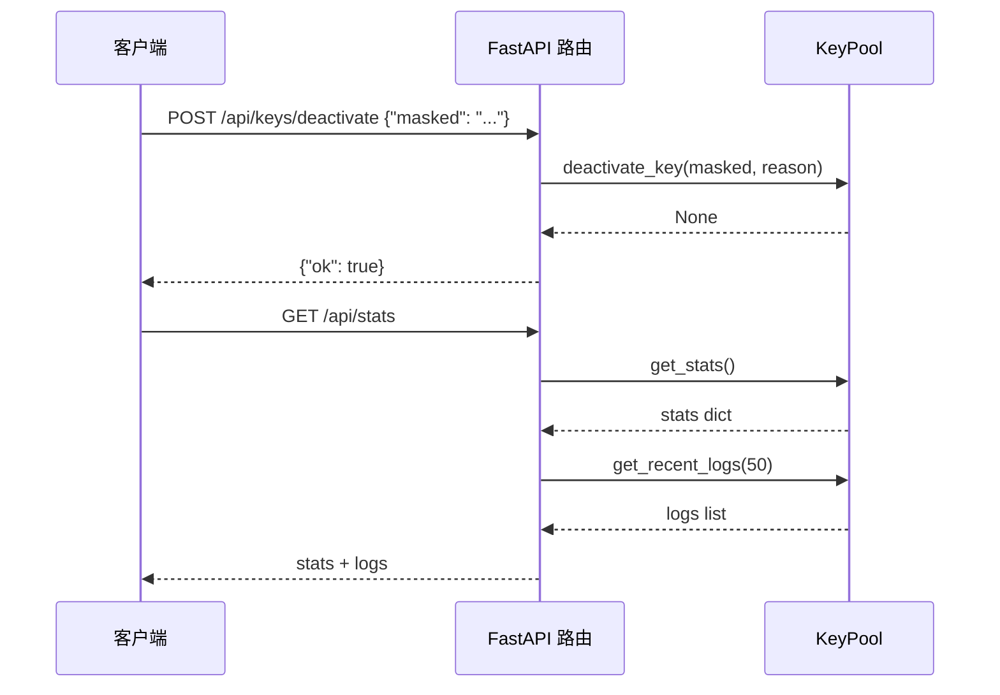

# API 接口

> <cite>本文档基于 [`dashboard.py`](file://app/dashboard.py) 中的 FastAPI 路由定义编写，面向希望通过 HTTP 方式集成 Dashboard 能力的开发者。</cite>

## 目录

- [概述](#概述)
- [基础信息](#基础信息)
- [端点一览](#端点一览)
- [端点详解](#端点详解)
  - [GET /](#get-)
  - [GET /logo.png](#get-apilogonpng)
  - [GET /favicon.ico](#get-apifaviconico)
  - [GET /api/stats](#get-apistats)
  - [POST /api/keys/add](#post-apikeysadd)
  - [POST /api/keys/remove](#post-apikeysremove)
  - [POST /api/keys/deactivate](#post-apikeysdeactivate)
  - [POST /api/keys/activate](#post-apikeysactivate)
  - [POST /api/health](#post-apihealth)
  - [POST /api/health/one](#post-apihealthone)
  - [GET /api/keys/anomalies](#get-apikeysanomalies)
  - [GET /api/usage/aggregate](#get-apiusageaggregate)
  - [POST /api/keys/usage-sync](#post-apikeysusage-sync)
  - [POST /api/keys/usage-sync/one](#post-apikeysusage-syncone)
  - [GET/POST /api/settings](#getpost-apisettings)
  - [GET/POST /api/autostart](#getpost-apiautostart)
  - [GET /api/mcp/status](#get-apimcpstatus)
  - [POST /api/mcp/start 与 /api/mcp/stop](#post-apimcpstart-与-apimcpstop)
- [与 KeyPool 的关系](#与-keypool-的关系)
- [错误与边界情况](#错误与边界情况)
- [相关文档](#相关文档)

## 概述

Dashboard 后端基于 **FastAPI** 构建，共暴露 21 个 HTTP 端点：3 个页面/静态资源端点（`/`、`/logo.png`、`/favicon.ico`）与 18 个 JSON API 端点。其中 Key 池相关端点均直接委托给全局唯一的 [`KeyPool`](file://app/dashboard.py) 实例（`pool = KeyPool()`）执行实际操作，因此这些 API 可以视为 KeyPool 核心能力的 HTTP 封装；设置、开机自启与 MCP 服务端点则分别封装 `settings` / `autostart` / `mcp_manager` 模块，便于外部脚本、监控系统或自定义前端直接调用。

API 端点的设计遵循以下约定：

- 查询类操作为 `GET`，写入类操作为 `POST`；
- 写入类端点统一返回 `{"ok": true}` 风格的成功响应；
- Key 的标识统一使用 **掩码（masked）** 形式，而非明文 Key，避免在日志与请求体中泄露完整凭证。

## 基础信息

| 项目 | 值 |
| --- | --- |
| Web 框架 | FastAPI |
| 默认监听地址 | `0.0.0.0`（本机访问 `127.0.0.1`） |
| 默认端口 | `8000` |
| 启动方式 | `python dashboard.py`（默认网页套壳应用模式）或 `python dashboard.py --server`（纯服务模式）；host/port 从 `data/config.json` 读取（默认 `0.0.0.0:8000`，本机访问 `http://127.0.0.1:8000`） |
| 接口文档 | 启动后访问 `http://127.0.0.1:8000/docs`（FastAPI 自动生成 Swagger UI） |

## 端点一览

| 方法 | 路径 | 请求体 | 说明 |
| --- | --- | --- | --- |
| GET | `/` | 无 | 返回 Dashboard HTML 页面 |
| GET | `/logo.png` | 无 | 返回应用 Logo（顶部栏/登录层，由 .ico 实时转换） |
| GET | `/favicon.ico` | 无 | 返回浏览器标签页图标 |
| GET | `/api/stats` | 无 | 获取 Key 池统计（含 Key 列表、聚合容量、异常识别）与最近 50 条日志 |
| POST | `/api/keys/add` | `{"keys": [...]}` | 批量添加 Key |
| POST | `/api/keys/remove` | `{"masked": "..."}` | 移除指定 Key |
| POST | `/api/keys/deactivate` | `{"masked": "...", "reason": "..."}` | 停用指定 Key |
| POST | `/api/keys/activate` | `{"masked": "..."}` | 重新激活指定 Key |
| POST | `/api/health` | 无 | 对池内所有 Key 执行健康检查 |
| POST | `/api/health/one` | `{"masked": "..."}` | 对单个 Key 执行健康检查（供面板逐个进度展示） |
| GET | `/api/keys/anomalies` | 无 | 识别异常 Key（耗尽/近耗尽/疑似泄露/高错误率/静默/慢） |
| GET | `/api/usage/aggregate` | 无 | 全池聚合容量（剩余总积分、已用总积分、可用 Key 数） |
| POST | `/api/keys/usage-sync` | 无 | 从 Tavily 官方 `/usage` 同步所有 active Key 的真实用量 |
| POST | `/api/keys/usage-sync/one` | `{"masked": "..."}` | 更新单个 Key 的官方用量（供面板逐个进度展示） |
| GET | `/api/settings` | 无 | 读取当前部署设置（mode/domain/host/port/auth_token 等） |
| POST | `/api/settings` | 部分设置字段 | 保存部署设置（非法值返回 400） |
| GET | `/api/autostart` | 无 | 读取开机自启状态（以注册表实际状态为准） |
| POST | `/api/autostart` | `{"enabled": true}` | 设置开机自启 |
| GET | `/api/mcp/status` | 无 | 获取 MCP 服务运行状态（running/pid/url 等） |
| POST | `/api/mcp/start` | 无 | 启动 MCP 服务（仅网络模式） |
| POST | `/api/mcp/stop` | 无 | 停止 MCP 服务 |



## 端点详解

### GET /

返回 Dashboard 首页。响应类型为 `HTMLResponse`，内容来自 `app/dashboard.html` 模板文件——该文件在模块加载时一次性读取到内存（`TPL.read_text()`），因此修改模板后需要重启服务才能生效。

响应示例：

```http
HTTP/1.1 200 OK
Content-Type: text/html; charset=utf-8

<!DOCTYPE html>
<html> ... </html>
```

前端页面通过 JavaScript 调用下文中的 JSON 端点完成数据渲染，具体交互方式参见「界面使用」相关文档。

### GET /logo.png

返回应用 Logo（页面顶部栏与登录层使用）。开发模式下从项目根目录 `assets/tavily.ico` 实时转换：PIL 可用时输出 PNG，不可用时回退返回原始 ico 字节；资源缺失时返回 `404`。

### GET /favicon.ico

返回浏览器标签页图标（与应用图标统一）；资源缺失时返回 `404`。

### GET /api/stats

获取 Key 池的当前状态统计，并在响应中附带 Key 列表、最近 50 条运行日志、全池聚合容量与异常识别结果。这是 Dashboard 首页数据刷新的核心接口。

内部逻辑：

```python
@app.get("/api/stats")
def api_stats():
    stats = pool.get_stats()
    stats["logs"] = pool.get_recent_logs(50)
    stats["aggregate"] = pool.get_aggregate()
    stats["anomalies"] = pool.detect_anomalies()
    return stats
```

顶层字段由 [`KeyPool.get_stats()`](file://app/key_pool.py) 与 `get_aggregate()` / `detect_anomalies()` 决定：

| 字段 | 类型 | 说明 |
| --- | --- | --- |
| `keys` | `object[]` | 全部 Key 的详情（字段由 `_apikey_to_dict()` 生成，见下方示例） |
| `total_keys` | `int` | Key 池总数 |
| `active_keys` | `int` | 当前活跃 Key 数 |
| `total_requests` | `int` | 累计请求次数 |
| `total_errors` | `int` | 累计错误次数 |
| `total_credits` | `int` | 累计消耗 Credits |
| `recent_24h` | `object` | 近 24h 按端点分组的成功/失败计数 |
| `logs` | `object[]` | 最近 50 条请求日志 |
| `aggregate` | `object` | 全池聚合容量（`total_limit`/`total_used`/`remaining`/`usage_pct`/`exhausted_count`） |
| `anomalies` | `object[]` | 异常 Key 列表（`masked`/`flags`/`reasons` 等） |

响应结构示例：

```json
{
  "keys": [
    {
      "masked": "tvly-****1234",
      "is_active": true,
      "is_exhausted": false,
      "request_count": 12,
      "error_count": 1,
      "credits_used": 356,
      "credits_limit": 1000,
      "usage_pct": 35.6,
      "last_used_at": 1749000000,
      "added_at": 1748000000,
      "last_error": "",
      "plan": "Free 1000 Credits",
      "plan_usage": 356,
      "plan_limit": 1000,
      "research_usage": 0,
      "usage_synced_at": 1749000000
    }
  ],
  "total_keys": 12,
  "active_keys": 10,
  "total_requests": 128,
  "total_errors": 3,
  "total_credits": 356,
  "recent_24h": {
    "search": { "success": 40, "failed": 1 }
  },
  "logs": [
    {
      "created_at": 1749000000.0,
      "key_masked": "tvly-****1234",
      "endpoint": "search",
      "credits_consumed": 2,
      "success": 1,
      "error_msg": "",
      "latency_ms": 230,
      "request_id": "req-abc123",
      "usage_source": "response"
    }
  ],
  "aggregate": {
    "total_keys": 12,
    "active_keys": 10,
    "exhausted_count": 1,
    "total_limit": 12000,
    "total_used": 356,
    "remaining": 11644,
    "usage_pct": 3.0
  },
  "anomalies": [
    {
      "masked": "tvly-****5678",
      "is_active": true,
      "is_exhausted": false,
      "flags": ["high_error_rate"],
      "reasons": ["近24h错误率 45%（quota）"],
      "usage_pct": 12.3,
      "credits_used": 123,
      "credits_limit": 1000
    }
  ]
}
```

`keys` 数组中的字段由 `KeyPool._apikey_to_dict()` 生成；`logs` 数组为最近 50 条请求日志，字段对应 `request_log` 表：`created_at` 为 Unix 时间戳，`usage_source` 取值 `response` / `unknown` / `none`，分别表示「接口响应含用量」「接口不返回用量（如 Research）」「失败请求」。详细说明可参考「用量追踪与日志」一文。

### POST /api/keys/add

批量添加 Key 到池中。请求体必须为 JSON 对象：

| 字段 | 类型 | 必填 | 说明 |
| --- | --- | --- | --- |
| `keys` | `string[]` | 是 | 待添加的完整 API Key 列表 |

请求示例：

```json
{
  "keys": ["tvly-aaaaaaaa", "tvly-bbbbbbbb"]
}
```

对应处理逻辑：

```python
@app.post("/api/keys/add")
def api_keys_add(payload: dict = Body(...)):
    keys = payload.get("keys", [])
    added = pool.add_keys_batch(keys)
    return {"ok": True, "added": added}
```

成功响应：

```json
{
  "ok": true,
  "added": 2
}
```

`added` 为实际成功添加的 Key 数量，重复的 Key 会被自动跳过。

### POST /api/keys/remove

从池中永久移除指定 Key。使用掩码标识目标 Key，避免传输明文。

请求示例：

```json
{
  "masked": "tvly-****1234"
}
```

对应处理逻辑：

```python
@app.post("/api/keys/remove")
def api_keys_remove(payload: dict = Body(...)):
    pool.remove_key(payload["masked"])
    return {"ok": True}
```

成功响应：

```json
{
  "ok": true
}
```

### POST /api/keys/deactivate

将指定 Key 停用。停用后该 Key 不再参与轮询与请求分配。可通过 `reason` 字段记录停用原因（如配额耗尽、被上游封禁等），默认值为 `"manual"`。

请求示例：

```json
{
  "masked": "tvly-****1234",
  "reason": "quota_exceeded"
}
```

对应处理逻辑：

```python
@app.post("/api/keys/deactivate")
def api_keys_deactivate(payload: dict = Body(...)):
    pool.deactivate_key(payload["masked"], payload.get("reason", "manual"))
    return {"ok": True}
```

成功响应：

```json
{
  "ok": true
}
```

### POST /api/keys/activate

将已停用的 Key 重新激活，使其恢复参与轮询。与停用操作相反。

请求示例：

```json
{
  "masked": "tvly-****1234"
}
```

对应处理逻辑：

```python
@app.post("/api/keys/activate")
def api_keys_activate(payload: dict = Body(...)):
    pool.activate_key(payload["masked"])
    return {"ok": True}
```

成功响应：

```json
{
  "ok": true
}
```

### POST /api/health

对池内**所有** Key 主动执行一次健康检查，返回每个 Key 的检查结果。适合接入外部监控系统做定时巡检。

对应处理逻辑：

```python
@app.post("/api/health")
def api_health():
    results = pool.check_health_all()
    return {"results": results}
```

响应结构示例：

```json
{
  "results": [
    {
      "masked": "tvly-****1234",
      "ok": true,
      "latency_ms": 230
    },
    {
      "masked": "tvly-****5678",
      "ok": false,
      "error": "429 Too Many Requests"
    }
  ]
}
```

具体字段以 `KeyPool.check_health_all()` 的返回值为准，健康检查的判定逻辑参见「Key 轮询与健康检查」一文。

### POST /api/health/one

对单个 Key 执行健康检查，供面板「健康检查」弹窗逐个进度展示。请求体携带掩码：

```json
{
  "masked": "tvly-****1234"
}
```

对应处理逻辑：

```python
@app.post("/api/health/one")
def api_health_one(payload: dict = Body(...)):
    masked = (payload.get("masked") or "").strip()
    results = pool.check_health(masked)
    if results:
        return {"ok": True, "result": results[0]}
    k = pool.get_key(masked)
    if k is None:
        return {"ok": True, "result": {"masked": masked, "alive": False, "error": "key not found"}}
    return {"ok": True, "result": {"masked": masked, "alive": False, "skipped": True, "error": "inactive key skipped"}}
```

Key 不存在时 `result.error = "key not found"`，Key 已停用时 `result.skipped = true`（均不视为请求失败）。`result` 字段与 `check_health_all()` 单条结果一致（`masked`/`alive`/`latency_ms`/`error`/`error_category`），后端会按错误类别自动停用失效 Key。

### GET /api/keys/anomalies

结合本地调用记录与官方用量识别异常 Key，返回：

```json
{
  "ok": true,
  "anomalies": [
    {
      "masked": "tvly-****5678",
      "is_active": true,
      "is_exhausted": false,
      "flags": ["suspected_leak", "high_error_rate"],
      "reasons": ["官方用量比本地记录多 ≥50 积分（已扣除官方 research 0），疑似被外部使用", "近24h错误率 45%（quota）"],
      "usage_pct": 12.3,
      "credits_used": 123,
      "credits_limit": 1000
    }
  ]
}
```

`flags` 取值：`exhausted`（官方额度耗尽）/ `near_exhausted`（用量 ≥ 90%）/ `suspected_leak`（疑似泄露）/ `high_error_rate`（近 24h 错误率过高）/ `stale`（静默）/ `slow`（延迟偏慢）。该结果也随 `/api/stats` 的 `anomalies` 字段一并返回，阈值可在 `data/config.json` 的 `anomaly_thresholds` 中调整。

### GET /api/usage/aggregate

全池聚合容量：剩余总积分、已用总积分、可用 Key 数等：

```json
{
  "ok": true,
  "aggregate": {
    "total_keys": 12,
    "active_keys": 10,
    "exhausted_count": 1,
    "total_limit": 12000,
    "total_used": 356,
    "remaining": 11644,
    "usage_pct": 3.0
  }
}
```

对应 `KeyPool.get_aggregate()`：`total_limit` 为各 Key 官方额度（单 Key 无限额时回退账户套餐额度）之和，`remaining = max(0, total_limit - total_used)`，`usage_pct` 为全池用量占比。

### POST /api/keys/usage-sync

从 Tavily 官方 `/usage` 接口同步所有 active Key 的 billing cycle 真实用量（含套餐、单 Key 额度、research 用量等），并检测月度额度重置：已耗尽 Key 的用量归零/低于上限时自动恢复。请求体可为空，响应：

```json
{
  "ok": true,
  "synced": 9,
  "failed": 1,
  "results": [
    {
      "masked": "tvly-****1234",
      "ok": true,
      "usage": 356,
      "limit": 1000,
      "search_usage": 300,
      "extract_usage": 20,
      "crawl_usage": 10,
      "map_usage": 0,
      "research_usage": 26,
      "plan": "Free 1000 Credits",
      "plan_usage": 356,
      "plan_limit": 1000,
      "recovered": false
    }
  ]
}
```

`synced` / `failed` 分别为成功与失败的 Key 数；`results` 中单个 Key 失败时为 `{"masked": ..., "ok": false, "error": ...}`。接口带 TTL 缓存（`usage_cache_ttl`，默认 60 秒），同一 Key 短时间内重复同步直接返回缓存结果。

### POST /api/keys/usage-sync/one

更新单个 Key 的官方用量（供面板「更新用量」弹窗逐个进度展示）。请求体：

```json
{
  "masked": "tvly-****1234"
}
```

Key 不存在时 `result.error = "key not found"`，Key 已停用时 `result.skipped = true`（均不视为失败）。`result` 字段与 `usage-sync` 中单个条目一致。

### GET/POST /api/settings

读取与保存部署设置。GET 返回：

```json
{
  "ok": true,
  "settings": {
    "mode": "local",
    "domain": "",
    "host": "0.0.0.0",
    "port": 8000,
    "auth_token": "",
    "autostart": false,
    "mcp_auto_start": false,
    "mcp_transport": "sse",
    "mcp_host": "0.0.0.0",
    "mcp_port": 8001,
    "mcp_token": ""
  },
  "public_url": "http://192.168.1.10:8000",
  "mcp_url": "http://192.168.1.10:8001/sse"
}
```

`settings.autostart` 以 Windows 注册表实际状态为准；`public_url` / `mcp_url` 为按当前配置推导的对外访问地址。POST 请求体为部分设置字段（白名单校验），合法字段持久化到 `data/config.json` 并同步开机自启；非法值（如端口越界、`mode` / `mcp_transport` 取值非法）返回 `400 {"ok": false, "error": "..."}`。

### GET/POST /api/autostart

开机自启（Windows 注册表 Run 键）。GET 返回 `{"ok": true, "enabled": true, "command": "..."}`；POST 请求体 `{"enabled": true}` 写入注册表并返回最新状态。该功能由 `autostart` 模块实现，仅 Windows 有效。

### GET /api/mcp/status

获取 MCP 服务运行状态：

```json
{
  "ok": true,
  "running": true,
  "pid": 12345,
  "transport": "sse",
  "host": "0.0.0.0",
  "port": 8001,
  "url": "http://192.168.1.10:8001/sse",
  "network": true,
  "auto_start": false
}
```

网络模式（sse / streamable-http）下 `running` 以端口监听为准；stdio 模式 `network` 为 `false`，无法由面板启停。

### POST /api/mcp/start 与 /api/mcp/stop

启动 / 停止 MCP 服务子进程（仅网络模式）。stdio 模式下调用 `start` 返回 `{"ok": false, "error": "当前为 stdio 模式，由 AI 客户端直接拉起进程，无法由面板管理。"}`。成功后响应附带最新 `status` 字段（结构与 `/api/mcp/status` 一致）：

```json
{
  "ok": true,
  "status": { "running": true, "pid": 12345, "url": "http://192.168.1.10:8001/sse" }
}
```

## 与 KeyPool 的关系

Key 池相关的 API 端点都是对 `KeyPool` 方法的薄封装；设置、自启与 MCP 端点则分别封装 `settings` / `autostart` / `mcp_manager` 模块。映射关系如下：

| HTTP 端点 | KeyPool 方法 |
| --- | --- |
| `GET /api/stats` | `get_stats()` + `get_recent_logs(50)` + `get_aggregate()` + `detect_anomalies()` |
| `POST /api/keys/add` | `add_keys_batch(keys)` |
| `POST /api/keys/remove` | `remove_key(masked)` |
| `POST /api/keys/deactivate` | `deactivate_key(masked, reason)` |
| `POST /api/keys/activate` | `activate_key(masked)` |
| `POST /api/health` | `check_health_all()` |
| `POST /api/health/one` | `check_health(masked)` |
| `GET /api/keys/anomalies` | `detect_anomalies()` |
| `GET /api/usage/aggregate` | `get_aggregate()` |
| `POST /api/keys/usage-sync` | `sync_usage()` |
| `POST /api/keys/usage-sync/one` | `sync_usage_one(masked)` |
| `GET/POST /api/settings` | `settings` 模块读写 data/config.json（POST 经 `validate_patch` 校验） |
| `GET/POST /api/autostart` | `autostart` 模块（Windows 注册表 Run 键） |
| `GET /api/mcp/status` | `mcp_manager.status()` |
| `POST /api/mcp/start` | `mcp_manager.start()` |
| `POST /api/mcp/stop` | `mcp_manager.stop()` |



## 错误与边界情况

端点直接在处理函数中调用 `KeyPool` / 设置模块方法，需要注意以下行为：

- **访问鉴权**：设置了 `auth_token` 后，所有 `/api/*` 请求都需要携带 `X-Auth-Token` 请求头（或 `?token=` 查询参数）且值匹配，否则返回 `401 {"ok": false, "error": "unauthorized"}`。部署设置通过 `GET/POST /api/settings` 读写，持久化于 `data/config.json`。
- **缺少必填字段**：`remove`、`deactivate`、`activate` 端点直接访问 `payload["masked"]`，若请求体缺少该字段会抛出 `KeyError`，FastAPI 返回 `500 Internal Server Error`；`add` 端点缺少 `keys` 字段时视为空列表。建议调用方始终携带完整字段。
- **请求体格式错误**：`add`、`remove`、`deactivate`、`activate`、`health/one`、`usage-sync/one` 端点要求请求体为 JSON 对象，否则 FastAPI 返回 `422 Unprocessable Entity`。
- **设置校验**：`POST /api/settings` 经白名单与类型/取值范围校验（如端口须在 0-65535、`mode` 须为 server/local、`mcp_transport` 须为 stdio/sse/streamable-http），非法值返回 `400 {"ok": false, "error": "..."}`，不会写入配置。
- **不存在的 Key**：`health/one`、`usage-sync/one` 对不存在的 `masked` 返回 `ok: true` 且 `result.error = "key not found"`，对已停用的 Key 返回 `result.skipped = true`；`remove` 等端点行为取决于 `KeyPool` 对应方法的实现（可能静默忽略）。
- **服务启动即校验资源**：`dashboard.py` 在导入时即读取 HTML 模板文件，若 `app/dashboard.html` 缺失，服务将无法启动；`/logo.png`、`/favicon.ico` 在资源缺失时返回 `404`，不影响服务运行。详细排查可参考「故障排查」文档。

## 相关文档

- [项目概述](../项目概述/项目概述.md)
- [快速开始](../快速开始/快速开始.md)
- [启动服务](../快速开始/启动服务.md)
- [核心功能](../核心功能/核心功能.md)
- [Key 轮询与健康检查](../核心功能/Key轮询与健康检查.md)
- [用量追踪与日志](../核心功能/用量追踪与日志.md)