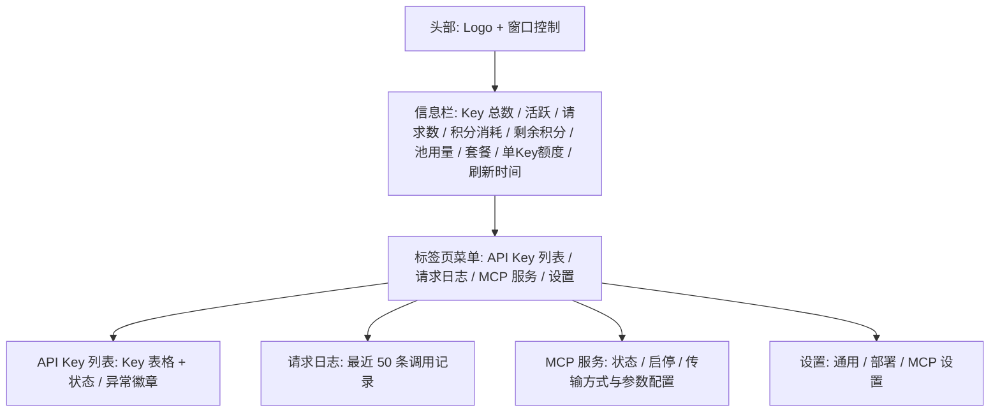
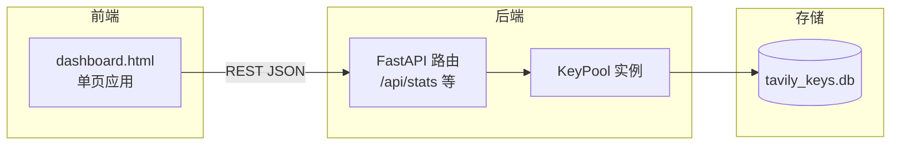
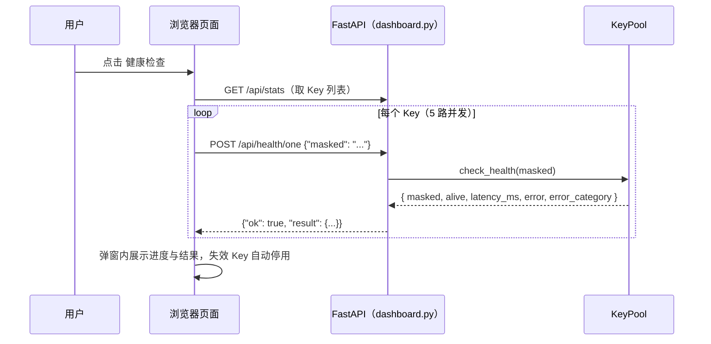

# Web Dashboard

> <cite>本文内容基于以下源码整理：[`dashboard.py`](file://app/dashboard.py) · [`dashboard.html`](file://app/dashboard.html) · [`README.md`](file://README.md)</cite>

## 目录

- [简介](#简介)
- [启动方式](#启动方式)
- [访问地址](#访问地址)
- [界面组成](#界面组成)
- [后端 API 概览](#后端-api-概览)
- [健康检查流程](#健康检查流程)
- [相关文档](#相关文档)

## 简介

Web Dashboard 是项目自带的浏览器管理界面，基于 FastAPI 构建，前端为单页应用。它让你在不接触命令行的情况下完成 Key 池的日常管理：

- 查看 Key 列表、状态与用量统计
- 批量添加、停用、启用、删除 API Key
- 查看最近请求日志与失败原因
- 一键触发全量健康检查

后端路由与接口逻辑集中在 [`dashboard.py`](file://app/dashboard.py)，页面结构、样式与交互逻辑全部内联在 [`dashboard.html`](file://app/dashboard.html) 中；启动方式与 systemd 自启说明可参考 [`README.md`](file://README.md)。

Dashboard 与 CLI、MCP Server 共享同一个 `KeyPool` 实例和 SQLite 数据库，关于 Key 轮询、健康检查与用量追踪的整体设计，可参阅 [核心功能](核心功能/核心功能.md) 与 [项目概述](项目概述/项目概述.md)。

页面提供「API Key 列表」「请求日志」「MCP 服务」「设置」四个标签页：API Key 列表展示 Key 状态、用量与异常徽章；请求日志展示最近 50 条调用记录；「MCP 服务」页可查看/启停 MCP 服务并配置其启动方式与网络参数；「设置」页可配置部署模式、绑定域名、监听地址、端口、访问令牌（`auth_token`）以及开机自启、托盘行为等通用设置。设置了访问令牌后，所有 `/api/*` 请求需携带 `X-Auth-Token` 请求头，未通过鉴权时页面会弹出登录层。

## 启动方式

### 使用启动脚本（推荐）

```bash
./scripts/run_dashboard.sh           # 默认端口 8000
./scripts/run_dashboard.sh 8080      # 指定端口
```

### 手动启动 uvicorn

```bash
uvicorn dashboard:app --host 0.0.0.0 --port 8000
```

### 直接运行 Python 模块

```bash
python dashboard.py
```

启动的 host/port 由 `data/config.json` 决定（默认 `127.0.0.1:8000`），对应 [`dashboard.py`](file://app/dashboard.py) 末尾的入口：

```python
if __name__ == "__main__":
    import uvicorn
    cfg = get_settings()
    uvicorn.run(app, host=cfg.get("host", "127.0.0.1"), port=int(cfg.get("port", 8000)), log_level="info")
```

依赖 `fastapi` 与 `uvicorn`，安装步骤见 [安装与配置](快速开始/安装与配置.md)。如需开机自启，项目已提供 systemd user service 配置，可参考 [启动服务](快速开始/启动服务.md)。

## 访问地址

启动成功后，浏览器访问：

- **本机访问**：`http://127.0.0.1:8000`
- **局域网访问**（以 `0.0.0.0` 绑定时）：`http://<服务器IP>:8000`

根路径 `/` 直接返回由模板渲染的页面：

```python
@app.get("/", response_class=HTMLResponse)
def index():
    return DASHBOARD_HTML
```

页面加载后会每 10 秒自动刷新一次统计数据（`setInterval(load, 10000)`），MCP 服务状态每 5 秒刷新一次（`setInterval(loadMcp, 5000)`），所有操作均通过 REST API 完成，无需刷新页面。

## 界面组成

页面采用深色主题，自上而下为：头部（Logo + 窗口控制）、单行信息栏（8 项聚合指标）、标签页菜单与内容区。内容区通过标签页切换四个面板：



### 顶部信息栏

头部下方是一条单行信息栏，展示 8 项全局指标与刷新时间，数据来自 `/api/stats`（聚合部分来自 `aggregate` 字段）：

| 指标 | 数据来源 | 说明 |
|---|---|---|
| Key 总数 | `total_keys` | Key 池总数 |
| 活跃 | `active_keys` | 当前活跃 Key 数 |
| 请求数 | `total_requests` | 累计请求数 |
| 积分消耗 | `total_credits` | 累计 Credits 消耗 |
| 剩余积分 | `aggregate.remaining` | 全池剩余总积分（存在耗尽 Key 时附加「(N 耗尽)」提示） |
| 池用量 | `aggregate.usage_pct` | 全池用量占比（官方额度未同步时显示「未同步」） |
| 套餐 | 各 Key `plan` 汇总 | 池内数量最多的套餐名，未知显示「未知」 |
| 单Key额度 | `credits_limit` / `plan_limit` | 单个 Key 的官方额度（未同步时按聚合额度换算） |

### 添加 API Key

点击标签页菜单栏右侧的 **添加 API Key** 按钮弹出添加弹窗：可逐行粘贴 Key（每行一个），也可从 `.txt` 文本文件批量导入。提交时前端将 Key 数组序列化为 JSON，发送至 `/api/keys/add`：

```javascript
const r = await fetch(BASE + '/api/keys/add', {
  method: 'POST',
  headers: { 'Content-Type': 'application/json' },
  body: JSON.stringify({ keys })
});
```

后端调用 `pool.add_keys_batch(keys)` 批量入库，并返回实际新增数量。

### API Key 列表

表格展示每个 Key 的状态与用量：

| 列 | 说明 |
|---|---|
| Key | 脱敏后的 Key（masked） |
| 状态 | 活跃 / 停用徽章，另有「耗尽」与异常徽章（近耗尽 / 疑似泄露 / 高错误率 / 静默 / 慢） |
| 请求数 | 累计请求次数 |
| 错误 | 累计错误次数 |
| 积分 | 已消耗 Credits |
| 用量 % | 用量进度条 + 百分比，按比例着色；官方额度未同步时显示「未同步」 |
| 最后使用 | 最后使用时间 |
| 操作 | 停用/启用、删除按钮 |

用量进度条颜色逻辑：

```javascript
const c = pct > 80 ? '#f87171' : pct > 50 ? '#fbbf24' : '#34d399';
```

超过 80% 显示红色，超过 50% 显示黄色，其余为绿色。操作按钮会调用 `/api/keys/deactivate`、`/api/keys/activate` 或 `/api/keys/remove`，其中停用时可附带原因（默认 `manual`）。

### 请求日志

「请求日志」标签页展示最近 50 条请求记录（`pool.get_recent_logs(50)`），包含时间、Key、接口、成功/失败徽章、积分消耗、延迟、请求 ID 与错误信息，失败记录以红色高亮错误列。积分列三态显示：失败显示 `-`；接口响应不含积分信息（如 Research）显示 `—` 并带悬停提示；其余显示实际积分。

### 健康检查 / 更新用量

标签页菜单栏右侧的 **健康检查** 与 **更新用量** 按钮分别弹出进度弹窗：健康检查并行（最多 5 路）调用 `POST /api/health/one` 逐 Key 探测并自动停用失效 Key；更新用量并行调用 `POST /api/keys/usage-sync/one` 从官方 `/usage` 同步各 Key 的 billing cycle 真实用量。两者均以进度条 + 逐 Key 列表展示结果。

## 后端 API 概览

Dashboard 前端依赖以下接口：

| 方法 | 路径 | 说明 |
|---|---|---|
| GET | `/` | 返回 Dashboard HTML 页面 |
| GET | `/logo.png` | 应用 Logo（顶部栏 / 登录层） |
| GET | `/favicon.ico` | 浏览器标签页图标 |
| GET | `/api/stats` | Key 统计（含 Key 列表、聚合容量、异常识别）+ 最近 50 条日志 |
| POST | `/api/keys/add` | 批量添加 Key |
| POST | `/api/keys/remove` | 删除指定 Key |
| POST | `/api/keys/deactivate` | 停用指定 Key |
| POST | `/api/keys/activate` | 启用指定 Key |
| POST | `/api/health` | 全量健康检查并返回结果 |
| POST | `/api/health/one` | 单个 Key 健康检查（面板弹窗逐 Key 使用） |
| GET | `/api/keys/anomalies` | 异常 Key 识别（泄露 / 耗尽 / 高错误率 / 静默 / 慢） |
| GET | `/api/usage/aggregate` | 全池聚合容量（剩余总积分等） |
| POST | `/api/keys/usage-sync` | 从官方同步所有 active Key 的真实用量 |
| POST | `/api/keys/usage-sync/one` | 更新单个 Key 官方用量（面板弹窗逐 Key 使用） |
| GET | `/api/settings` | 读取部署设置 |
| POST | `/api/settings` | 保存部署设置（非法值返回 400） |
| GET | `/api/autostart` | 读取开机自启状态 |
| POST | `/api/autostart` | 设置开机自启 |
| GET | `/api/mcp/status` | MCP 服务运行状态 |
| POST | `/api/mcp/start` | 启动 MCP 服务 |
| POST | `/api/mcp/stop` | 停止 MCP 服务 |

前后端交互的整体结构如下：



## 健康检查流程

点击标签页菜单栏右侧的 **健康检查** 按钮弹出健康检查弹窗。前端先拉取 `/api/stats` 获取 Key 列表，随后以 5 路并发逐 Key 调用 `POST /api/health/one`，弹窗内以进度条与逐 Key 状态列表实时展示结果；失效 Key 会被后端自动停用。结束后汇总显示「正常 / 失效 / 跳过」数量，存在失效时保留「重新检查」入口：



「更新用量」弹窗流程相同，区别在于逐 Key 调用 `POST /api/keys/usage-sync/one` 从官方 `/usage` 同步真实用量（成功时显示「用量 N / 上限 M」）。

## 相关文档

- [项目概述](项目概述/项目概述.md)
- [快速开始](快速开始/快速开始.md)
- [安装与配置](快速开始/安装与配置.md)
- [启动服务](快速开始/启动服务.md)
- [核心功能](核心功能/核心功能.md)