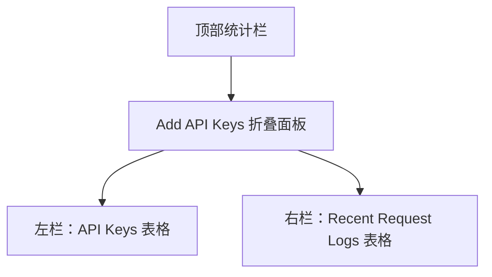
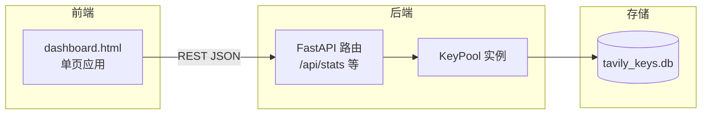
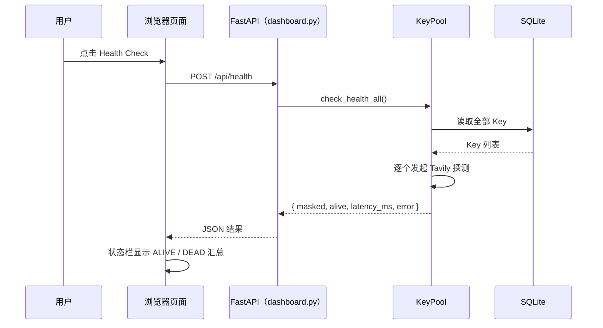

# Web Dashboard

> <cite>本文内容基于以下源码整理：[`dashboard.py`](file://app/dashboard.py) · [`dashboard.html`](file://dashboard.html) · [`README.md`](file://README.md)</cite>

## 目录

- [简介](#简介)
- [启动方式](#启动方式)
- [访问地址](#访问地址)
- [界面组成](#界面组成)
- [后端 API 概览](#后端-api-概览)
- [健康检查流程](#健康检查流程)
- [相关文档](#相关文档)

## 简介

Web Dashboard 是项目自带的浏览器管理界面，基于 FastAPI 构建，前端为单页应用。它让你在不接触命令行的情况下完成 Key 池的日常管理：

- 查看 Key 列表、状态与用量统计
- 批量添加、停用、启用、删除 API Key
- 查看最近请求日志与失败原因
- 一键触发全量健康检查

后端路由与接口逻辑集中在 [`dashboard.py`](file://app/dashboard.py)，页面结构、样式与交互逻辑全部内联在 [`dashboard.html`](file://dashboard.html) 中；启动方式与 systemd 自启说明可参考 [`README.md`](file://README.md)。

Dashboard 与 CLI、MCP Server 共享同一个 `KeyPool` 实例和 SQLite 数据库，关于 Key 轮询、健康检查与用量追踪的整体设计，可参阅 [核心功能](核心功能/核心功能.md) 与 [项目概述](项目概述/项目概述.md)。

页面提供「API Key 列表」「最近请求日志」「设置」三个标签页；「设置」页可配置部署模式、绑定域名、监听地址、端口与访问令牌（`auth_token`）。设置了访问令牌后，所有 `/api/*` 请求需携带 `X-Auth-Token` 请求头，未通过鉴权时页面会弹出登录层。

## 启动方式

### 使用启动脚本（推荐）

```bash
./scripts/run_dashboard.sh           # 默认端口 8000
./scripts/run_dashboard.sh 8080      # 指定端口
```

### 手动启动 uvicorn

```bash
uvicorn dashboard:app --host 0.0.0.0 --port 8000
```

### 直接运行 Python 模块

```bash
python dashboard.py
```

启动的 host/port 由 `config.json` 决定（默认 `127.0.0.1:8000`），对应 [`dashboard.py`](file://app/dashboard.py) 末尾的入口：

```python
if __name__ == "__main__":
    import uvicorn
    cfg = get_settings()
    uvicorn.run(app, host=cfg.get("host", "127.0.0.1"), port=int(cfg.get("port", 8000)), log_level="info")
```

依赖 `fastapi` 与 `uvicorn`，安装步骤见 [安装与配置](快速开始/安装与配置.md)。如需开机自启，项目已提供 systemd user service 配置，可参考 [启动服务](快速开始/启动服务.md)。

## 访问地址

启动成功后，浏览器访问：

- **本机访问**：`http://127.0.0.1:8000`
- **局域网访问**（以 `0.0.0.0` 绑定时）：`http://<服务器IP>:8000`

根路径 `/` 直接返回由模板渲染的页面：

```python
@app.get("/", response_class=HTMLResponse)
def index():
    return DASHBOARD_HTML
```

页面加载后会每 10 秒自动刷新一次统计数据（`setInterval(load, 10000)`），所有操作均通过 REST API 完成，无需刷新页面。

## 界面组成

页面采用深色主题，整体分为上下两栏布局：



### 顶部统计栏

头部展示四项全局指标，数据来自 `/api/stats`：

| 指标 | 字段 | 说明 |
|---|---|---|
| Keys | `total_keys` | Key 池总数 |
| Active | `active_keys` | 当前活跃 Key 数 |
| Requests | `total_requests` | 累计请求数 |
| Credits Today | `total_credits` | 今日 Credits 消耗 |

### 添加 Key 入口

点击 **Add API Keys** 展开输入区域，可批量粘贴 Key（每行一个）。提交时前端将 Key 数组序列化为 JSON，发送至 `/api/keys/add`：

```javascript
const r = await fetch(BASE + '/api/keys/add', {
  method: 'POST',
  headers: { 'Content-Type': 'application/json' },
  body: JSON.stringify({ keys })
});
```

后端调用 `pool.add_keys_batch(keys)` 批量入库，并返回实际新增数量。

### Key 列表（左栏）

以表格形式展示每个 Key 的状态与用量：

| 列 | 说明 |
|---|---|
| Key | 脱敏后的 Key（masked） |
| Status | Active / Off 徽章 |
| Requests | 累计请求次数 |
| Errors | 累计错误次数 |
| Credits | 已消耗 Credits |
| Usage % | 用量进度条，按比例着色 |
| Last Used | 最后使用时间 |
| Actions | 停用/启用、删除按钮 |

用量进度条颜色逻辑：

```javascript
const c = pct > 80 ? '#ef4444' : pct > 50 ? '#f59e0b' : '#22c55e';
```

超过 80% 显示红色，超过 50% 显示黄色，其余为绿色。操作按钮会调用 `/api/keys/deactivate`、`/api/keys/activate` 或 `/api/keys/remove`，其中停用时可附带原因（默认 `manual`）。

### 请求日志（右栏）

展示最近 50 条请求记录（`pool.get_recent_logs(50)`），包含时间、Key、Endpoint、成功/失败徽章、Credits 消耗、延迟与错误信息，失败记录以红色高亮错误列。

## 后端 API 概览

Dashboard 前端依赖以下接口：

| 方法 | 路径 | 说明 |
|---|---|---|
| GET | `/` | 返回 Dashboard HTML 页面 |
| GET | `/api/stats` | Key 统计 + 最近 50 条日志 |
| POST | `/api/keys/add` | 批量添加 Key |
| POST | `/api/keys/remove` | 删除指定 Key |
| POST | `/api/keys/deactivate` | 停用指定 Key |
| POST | `/api/keys/activate` | 启用指定 Key |
| POST | `/api/health` | 全量健康检查并返回结果 |
| GET | `/api/settings` | 读取部署设置（mode/domain/host/port/auth_token） |
| POST | `/api/settings` | 保存部署设置 |
前后端交互的整体结构如下：



## 健康检查流程

点击 **Health Check** 按钮后，前端调用 `/api/health`，后端对池内所有 Key 逐一发起探测请求，并将结果汇总显示在状态栏：



## 相关文档

- [项目概述](项目概述/项目概述.md)
- [快速开始](快速开始/快速开始.md)
- [安装与配置](快速开始/安装与配置.md)
- [启动服务](快速开始/启动服务.md)
- [核心功能](核心功能/核心功能.md)