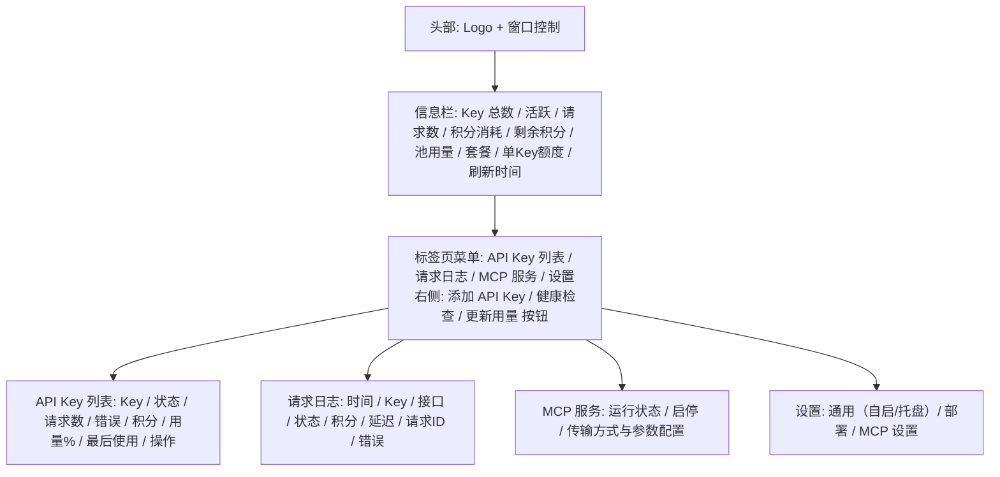
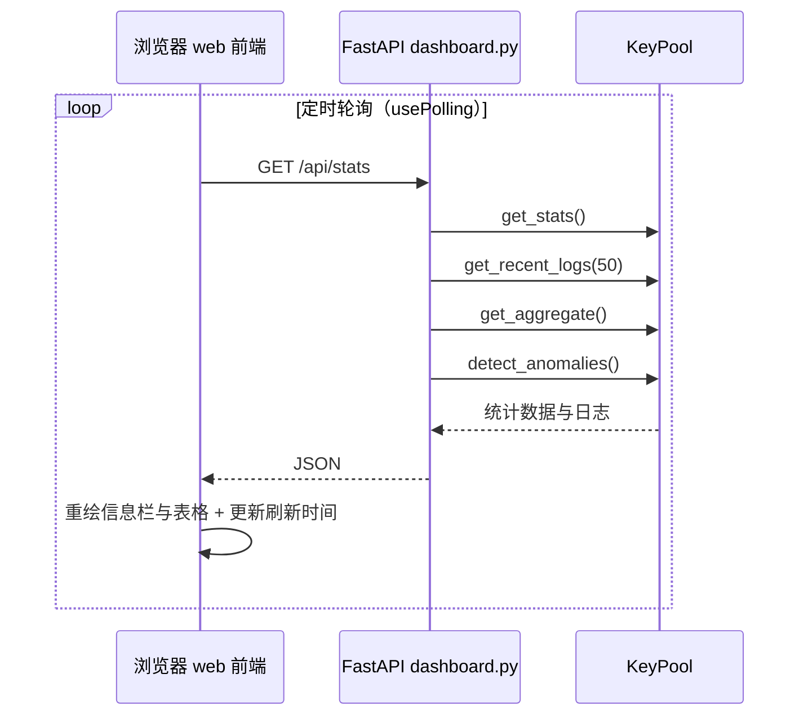

# 界面使用

<cite>本页内容依据以下源文件整理：前端源码 [file://web/src](file://web/src)（Vue 3 + Vite，构建产物 `web/dist/index.html`）与后端路由 [file://app/dashboard.py](file://app/dashboard.py)。</cite>

> 本文是 Web 控制台用户指南的操作篇，面向 Dashboard 使用者，逐一说明页面各区域的交互细节。项目整体介绍见 [项目概述](项目概述/项目概述.md)，启动方式见 [启动服务](快速开始/启动服务.md)。

## 目录

- [页面布局总览](#页面布局总览)
- [顶部状态栏](#顶部状态栏)
- [添加 API Key](#添加-api-key)
- [API Keys 表格](#api-keys-表格)
- [健康检查](#健康检查)
- [更新用量](#更新用量)
- [请求日志](#请求日志)
- [数据刷新机制](#数据刷新机制)
- [与后端 API 的对应关系](#与后端-api-的对应关系)

## 页面布局总览

Dashboard 是一个单页应用：前端为 Vue 3 源码（`web/src`，构建产物 `web/dist/index.html` 由后端 `/` 路由提供），`app/dashboard.py` 提供 FastAPI 后端路由。页面自上而下为头部、信息栏、标签页菜单与内容区，通过四个标签页切换面板：



对应的核心页面骨架如下（完整结构见 [file://web/src/App.vue](file://web/src/App.vue)）：

```html
<div class="header">
  <div class="brand">... Tavily Key Pool ...</div>
  <div class="header-right">... 窗口控制 ...</div>
</div>

<div class="info-bar">
  <!-- Key 总数 / 活跃 / 请求数 / 积分消耗 / 剩余积分 / 池用量 / 套餐 / 单Key额度 / 刷新时间 -->
</div>

<main class="content">
  <div class="tabs">
    <button class="tab active" data-tab="keys">API Key 列表</button>
    <button class="tab" data-tab="logs">请求日志</button>
    <button class="tab" data-tab="mcp">MCP 服务</button>
    <button class="tab" data-tab="settings">设置</button>
    <span class="tabs-actions">
      <!-- 添加 API Key / 健康检查 / 更新用量 按钮 -->
    </span>
  </div>
  <div class="tab-panel active" id="panel-keys">...</div>
  <div class="tab-panel" id="panel-logs">...</div>
  <div class="tab-panel" id="panel-mcp">...</div>
  <div class="tab-panel" id="panel-settings">...</div>
</main>
```

表格设置了 `position: sticky` 的列头，滚动长列表时表头始终可见；行悬停时背景高亮（`tr:hover`），便于阅读。

## 顶部状态栏

头部下方是一条单行信息栏（`#infoBar`），由 `load()` 调用 `GET /api/stats` 获取并渲染 8 项指标：

| 指标 | 数据来源 | 含义 |
|---|---|---|
| Key 总数 | `total_keys` | 池中 Key 总数 |
| 活跃 | `active_keys` | 当前处于激活状态的 Key 数量 |
| 请求数 | `total_requests` | 累计请求次数 |
| 积分消耗 | `total_credits` | 累计消耗的 Credits |
| 剩余积分 | `aggregate.remaining` | 全池剩余总积分（存在耗尽 Key 时附加「(N 耗尽)」提示） |
| 池用量 | `aggregate.usage_pct` | 全池用量占比（官方额度未同步时为「未同步」） |
| 套餐 | 各 Key `plan` 汇总 | 池内数量最多的套餐名，未知显示「未知」 |
| 单Key额度 | `credits_limit` / `plan_limit` | 单个 Key 的官方额度（未同步时按聚合额度换算） |

最右侧是刷新时间标记（`刷新于 <strong>HH:MM:SS</strong>`），每次数据拉取后更新，帮助你判断页面数据的新鲜度。

## 添加 API Key

点击标签页菜单栏右侧的「添加 API Key」按钮弹出添加弹窗（`#addKeyMask`），包含两个组件：

1. **粘贴 Key（必填）**：多行文本框，每行一个 Key，例如：
   ```
   tvly-xxxxxxxxxxxxx
   tvly-yyyyyyyyyyyyy
   ```
2. **导入 .txt 文件**：选择文本文件后内容追加到输入框（支持重复导入）。

点击「添加」按钮提交到后端：

```js
async function addKeys() {
  const raw = document.getElementById('addKeyInput').value.trim();
  if (!raw) return toast('请输入 API Key 或导入文件', 'error');
  const keys = raw.split('\n').map(s=>s.trim()).filter(Boolean);
  const d = await api('/api/keys/add', {
    method:'POST',
    body: JSON.stringify({keys})
  });
  toast(`已添加 ${d.added} 个 Key`, 'success');
  document.getElementById('addKeyInput').value = '';
  closeAddModal();
  load();
}
```

对应后端 [file://app/dashboard.py](file://app/dashboard.py) 的路由，批量添加由 `KeyPool.add_keys_batch(keys)` 完成：

```python
@app.post("/api/keys/add")
def api_keys_add(payload: dict = Body(...)):
    keys = payload.get("keys", [])
    added = pool.add_keys_batch(keys)
    return {"ok": True, "added": added}
```

操作成功后弹出「已添加 N 个 Key」轻提示（Toast），弹窗关闭并立即刷新。前端对所有文本都经过 `escapeHtml()` 转义，特殊字符不会破坏页面结构；重复的 Key 会被自动跳过。

## API Keys 表格

「API Key 列表」标签页的表格共 8 列，每行对应一个 Key：

| 列 | 渲染方式 | 说明 |
|---|---|---|
| Key | 等宽字体（`monospace`） | 只展示**掩码后的 Key**，完整 Key 永不出现在前端 |
| 状态 | 徽章 | 活跃 / 停用，另有「耗尽」与异常徽章（近耗尽 / 疑似泄露 / 高错误率 / 静默 / 慢） |
| 请求数 | 数字 | 累计请求次数 |
| 错误 | 数字 | 累计错误次数 |
| 积分 | 数字 | 该 Key 累计消耗 Credits（来自官方用量同步） |
| 用量 % | 进度条 + 百分比 | 颜色随使用率变化；官方额度未同步时显示「未同步」并提示点击「更新用量」 |
| 最后使用 | 短日期 | 格式 `MM-DD HH:MM`（zh-CN），无记录显示 `-` |
| 操作 | 操作按钮 | 停用/启用 + 删除 |

### 状态徽章

- `活跃`：`badge-active` 样式，绿色系徽章；`停用`：`badge-inactive` 样式，红色系徽章。
- `耗尽`：`badge-exhausted` 样式，橙色，提示官方额度已耗尽（月度重置后自动恢复）。
- 异常徽章：由 `/api/stats` 的 `anomalies` 字段生成，`exhausted` / `near_exhausted` / `suspected_leak` / `high_error_rate` / `stale` / `slow` 分别显示「耗尽 / 近耗尽 / 疑似泄露 / 高错误率 / 静默 / 慢」。

### 用量进度条

每行的用量 % 列包含一个进度条和百分比文本，进度条宽度按 `min(pct, 100)%` 截断，颜色分三档：

```js
const c = pct > 80 ? '#f87171' : pct > 50 ? '#fbbf24' : '#34d399';
```

- 使用率 **> 80%**：红色 `#f87171`，提醒接近额度上限
- 使用率 **> 50%**：橙色 `#fbbf24`
- 使用率 **≤ 50%**：绿色 `#34d399`

只有 Key 存在官方额度（`credits_limit` 或 `plan_limit` > 0）时才渲染进度条；否则显示「未同步」黄色提示，点击右上角「更新用量」从官方同步额度后才会出现百分比。进度条带 `transition: width .3s`，刷新时平滑过渡。

### 行内操作

每行末尾有两个按钮：

- **停用 / 启用**：根据当前状态切换。激活中的 Key 显示红色「停用」，点击后调用 `POST /api/keys/deactivate`（后端记录停用原因为 `"manual"`）；已停用的 Key 显示蓝色「启用」，点击后调用 `POST /api/keys/activate`。
- **删除**：点击后弹出确认弹窗 `确定删除 tvly-*** 吗？该操作不可撤销。`，确认后调用 `POST /api/keys/remove`，请求体只携带掩码 Key，删除后立即刷新列表。

所有操作按钮均通过 `fetch` 发送 JSON 请求，成功后触发 `load()` 重新拉取数据。

## 健康检查

「健康检查」按钮位于标签页菜单栏右侧（与「添加 API Key」「更新用量」并排），点击后弹出健康检查弹窗（`#healthMask`），流程为：

1. 弹窗内显示说明与进度条，点击「开始检查」；
2. 前端拉取 `GET /api/stats` 获取当前 Key 列表；
3. 以 **5 路并发** 逐 Key 调用 `POST /api/health/one`（请求体携带掩码）；
4. 弹窗列表实时更新每个 Key 的状态（等待 / 检查中 / 正常 / 失效 / 跳过），进度条随完成数推进；
5. 结束后汇总显示「检查完成：正常 N · 失效 N · 跳过 N」，全部正常时按钮变为「确定」，有失效时保留「重新检查」与「关闭」。

```js
async function runHealthNow() {
  // ... 获取 Key 列表后，以并发 5 逐个调用：
  const r = await api('/api/health/one', {method:'POST', body: JSON.stringify({masked: k.masked})});
  const res = r.result;
  // res.alive → 正常（显示延迟）；res.skipped → 跳过（已停用）；否则 → 失效（显示错误信息）
}
```

后端对失效 Key 会按错误类别自动停用（认证错误/空响应立即停用，临时错误连续失败 ≥ 2 次才停用），因此检查后列表中的状态会随之变化。关于探测逻辑的详细说明，参见 [Key 轮询与健康检查](核心功能/Key轮询与健康检查.md)。

## 更新用量

「更新用量」按钮同样位于标签页菜单栏右侧，点击后弹出更新用量弹窗（`#usageMask`），流程与健康检查一致：以 5 路并发逐 Key 调用 `POST /api/keys/usage-sync/one`，从 Tavily 官方 `/usage` 接口同步 billing cycle 真实用量（套餐、额度、research 用量等），成功后显示「用量 N / 上限 M」。额度同步后，信息栏的「剩余积分 / 池用量 / 套餐 / 单Key额度」与表格的用量进度条才会显示真实数据。

## 请求日志

「请求日志」标签页展示最近 50 条请求日志（由后端 `pool.get_recent_logs(50)` 提供），列结构如下：

| 列 | 渲染方式 | 说明 |
|---|---|---|
| 时间 | 短日期 | 请求时间，格式 `MM-DD HH:MM` |
| Key | 等宽字体 | 掩码后的 Key |
| 接口 | 普通文本 | 请求的 API 端点（如 search / extract / research） |
| 状态 | 徽章 | `成功` 绿底 / `失败` 红底 |
| 积分 | 三态显示 | 见下方 fmtCredits 规则 |
| 延迟 | 人类可读延迟 | `<1000ms` 显示毫秒，否则显示秒（如 `1.2s`） |
| 请求ID | 等宽字体 | 本次请求的 request_id（用于问题定位，可为空） |
| 错误 | 红色省略文本 | 错误消息截断为 80 字符，最大宽度 180px，超出省略 |

### 积分（Credits）列三态显示

由前端 `fmtCredits()` 实现：

```js
function fmtCredits(l) {
  if (!l.success) return '<span style="color:var(--text-3)">-</span>';
  if (l.usage_source === 'unknown') {
    return '<span style="color:var(--text-3);cursor:help" title="该接口响应不含积分信息，实际消耗以官方用量为准">—</span>';
  }
  return l.credits_consumed;
}
```

1. **请求失败**（`success = 0`）：显示 `-`（灰色），失败请求不消耗积分；
2. **接口响应不含积分信息**（`usage_source = 'unknown'`，如 Research 类接口，官方响应无 usage 字段）：显示 `—`（灰色），鼠标悬停提示「该接口响应不含积分信息，实际消耗以官方用量为准」，避免把「未知」误显示为「消耗 0」；
3. **其余情况**（`usage_source = 'response'`）：显示实际消耗的 `credits_consumed` 数值。

日志区域**没有手动刷新按钮**，依赖下方介绍的 10 秒自动轮询，以及每次操作后的显式刷新。

日志页支持按 状态 / 接口 / 来源 / 项目 / 时间范围 筛选、分页浏览与 **CSV 导出**；v0.10.0 起新增**「清理」按钮**——按当前筛选条件删除请求日志（无筛选 = 清空全部），点击后弹出确认弹窗并提示删除范围，确认后调用 `POST /api/logs/clear`，删除结果与用量趋势统计同步更新。日志保留策略（默认 90 天自动清理）见「用量追踪与日志」。

## 数据刷新机制

整个页面只有一条数据链路：前端调用 `GET /api/stats` 等接口 → 渲染信息栏与各面板。触发时机有四类：

1. **页面加载时**执行一次；
2. **定时轮询**（各视图经 `web/src/composables/usePolling.ts` 驱动：Keys/用量约 5 秒、日志 10 秒、统计 12 秒等）；
3. **每次操作后**（添加、删除、停用/激活、健康检查、更新用量）立即刷新；
4. **MCP / 代理服务状态**每 5 秒轮询一次（`McpView.vue` / `ProxyView.vue`）。



```python
@app.get("/api/stats")
def api_stats():
    stats = pool.get_stats()
    stats["logs"] = pool.get_recent_logs(50)
    stats["aggregate"] = pool.get_aggregate()
    stats["anomalies"] = pool.detect_anomalies()
    return stats
```

信息栏的 `刷新于` 时间随每次 `load()` 更新；若后端不可用，`load()` 会捕获异常并仅输出到浏览器控制台，页面不会白屏。

## 与后端 API 的对应关系

| UI 操作 | HTTP 端点 | KeyPool 方法 |
|---|---|---|
| 页面加载 / 10 秒自动刷新 | `GET /api/stats` | `get_stats()` + `get_recent_logs(50)` + `get_aggregate()` + `detect_anomalies()` |
| 点击 Add Keys | `POST /api/keys/add` | `add_keys_batch(keys)` |
| 点击 Remove | `POST /api/keys/remove` | `remove_key(masked)` |
| 点击 Deactivate | `POST /api/keys/deactivate` | `deactivate_key(masked, reason="manual")` |
| 点击 Activate | `POST /api/keys/activate` | `activate_key(masked)` |
| 健康检查弹窗（逐 Key） | `POST /api/health/one` | `check_health(masked)` |
| 更新用量弹窗（逐 Key） | `POST /api/keys/usage-sync/one` | `sync_usage_one(masked)` |
| 异常徽章 / 聚合指标 | `GET /api/keys/anomalies`、`GET /api/usage/aggregate` | `detect_anomalies()`、`get_aggregate()`（随 `/api/stats` 附带） |
| MCP 页状态 / 启停 | `GET /api/mcp/status`、`POST /api/mcp/start`、`POST /api/mcp/stop` | `mcp_manager.status()/start()/stop()` |
| 开机自启 | `GET/POST /api/autostart` | `autostart` 模块（注册表 Run 键） |
| 设置页读取 / 保存 | `GET/POST /api/settings` | `settings` 模块读写 data/config.json |
| 关于与更新 · 检查更新 | `GET /api/update/check?force=` | `updater.check_update()`（GitHub releases/latest） |
| 关于与更新 · 立即更新 | `POST /api/update/download`、`GET /api/update/status`、`POST /api/update/apply` | `updater.start_download()/get_download_status()/apply_update()`（仅打包版） |

所有接口均返回 JSON，完整路由定义见 [file://app/dashboard.py](file://app/dashboard.py)。「设置」标签页通过 `GET/POST /api/settings` 读写部署配置（部署模式 / 绑定域名 / 监听地址 / 端口 / 访问令牌）与通用设置（开机自启、启动/关闭/最小化时的托盘行为）；「MCP 服务」标签页通过 `/api/mcp/status|start|stop` 与 `/api/settings` 的 `mcp_*` 字段查看、启停并配置 MCP 服务（传输方式 / 监听地址 / 端口 / 访问令牌）。设置了访问令牌（`auth_token`）后，所有 `/api/*` 请求都需要携带 `X-Auth-Token` 请求头，未通过鉴权时前端会弹出登录层。

「设置 → 关于与更新」卡片（顺序：检查间隔 → 自动检查更新 → 当前版本+检查更新 → 更新公告 → 下载进度）从 GitHub 检查最新版本（`GET /api/update/check`，结果带进程内 TTL 缓存，「检查更新」按钮传 `force=1` 强制刷新）：「当前版本+检查更新」融合行为一栏——左侧显示当前版本号与**版本类型徽章**（正式版 / Beta 版，`check_update` 返回 `version_type`），右侧为「检查更新」按钮（发现新版本时追加「前往 GitHub」经 `_WindowApi.open_external` 用系统浏览器打开、「立即更新」打包版）；发现新版本时提供「查看更新公告」按钮，点击弹出**更新公告**弹窗（release notes，支持 Markdown 渲染，展示版本区间与发布说明）；「自动检查更新」开关（`update_check_enabled`）与「检查间隔」即时保存——间隔以 小时/日/星期/月 为单位（下拉切换自动换算，0 = 关闭自动检查）。仓库在 `data/config.json` 的 `update_repo` 中配置（默认 `zylyes/tavily-key`，留空禁用）。后台按间隔自动检查（`handle_auto_update`），发现新版本一律**仅通知**（托盘气泡 + Webhook，通知含更新公告摘要前 120 字，按版本去重），**不自动下载安装**——由用户手动点击「立即更新」。

**手动更新（仅打包版 Tavily.exe）**：发现新版本且为打包版时显示「立即更新」——确认弹窗 → `POST /api/update/download` 后台下载（release 附带打包产物 `Tavily-*-win64.zip`），`GET /api/update/status` 轮询进度条 → 校验大小与 zip 完整性并解压 → 点「重启应用」调 `POST /api/update/apply`：生成 `data/apply_update.bat` 结束当前实例、备份旧版到 `backup-old/`、复制新版 `Tavily.exe` 与 `_internal/`、启动新版本；**data/ 运行数据不替换不丢失**，MCP / 搜索代理随重启恢复，脚本输出写 `data/update_apply.log`。新版本启动时自动清理旧版备份与过期临时目录。源码运行（非打包版）仅显示「前往 GitHub」，不提供下载安装。

**更新公告**：手动更新完成后，新版本首次启动弹出「更新完成公告」（版本号 + 本次更新说明）——公告由 `apply_update` 写入 `data/last-update.json`，前端经 `GET /api/update/announcement` 一次性读取（读取后清除），仅展示一次。