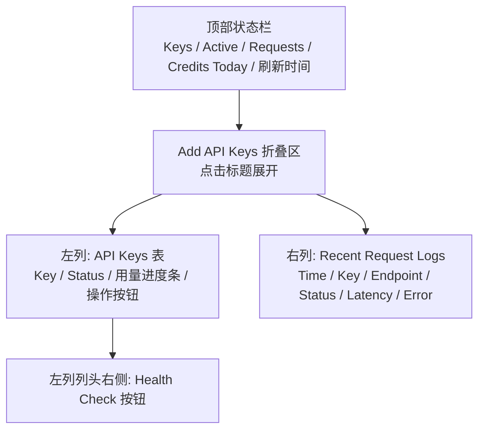
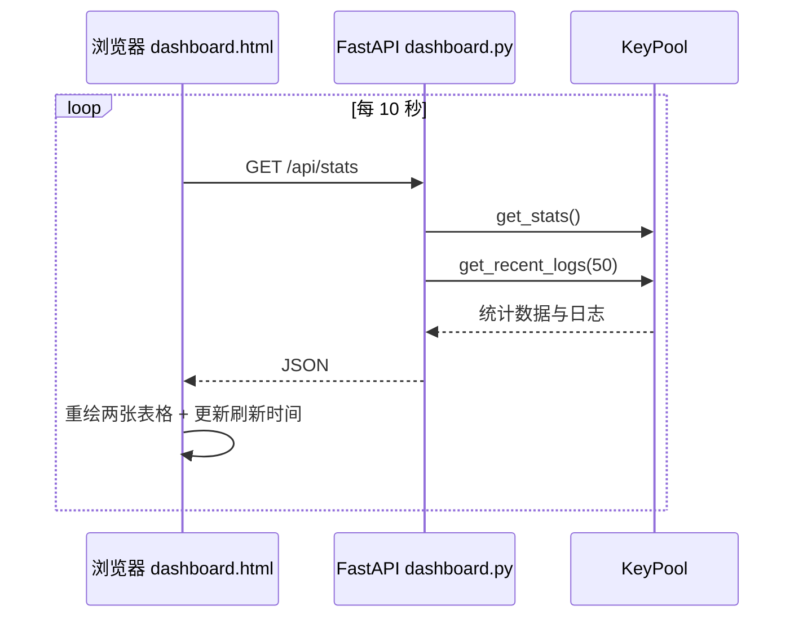

# 界面使用

<cite>本页内容依据以下源文件整理：前端页面 [file://dashboard.html](file://dashboard.html) 与后端路由 [file://app/dashboard.py](file://app/dashboard.py)。</cite>

> 本文是 Web 控制台用户指南的操作篇，面向 Dashboard 使用者，逐一说明页面各区域的交互细节。项目整体介绍见 [项目概述](项目概述/项目概述.md)，启动方式见 [启动服务](快速开始/启动服务.md)。

## 目录

- [页面布局总览](#页面布局总览)
- [顶部状态栏](#顶部状态栏)
- [添加 API Key](#添加-api-key)
- [API Keys 表格](#api-keys-表格)
- [健康检查](#健康检查)
- [请求日志](#请求日志)
- [数据刷新机制](#数据刷新机制)
- [与后端 API 的对应关系](#与后端-api-的对应关系)

## 页面布局总览

Dashboard 是一个单页应用：`dashboard.html` 负责全部 DOM 结构与前端交互，`dashboard.py` 提供 FastAPI 后端路由。页面采用「两列瀑布」布局，左列管理 Key，右列展示日志：



对应的核心 HTML 骨架如下（完整结构见 [file://dashboard.html](file://dashboard.html)）：

```html
<div class="header">
  <h1>Tavily API Key Pool</h1>
  <div class="stats-bar">
    <!-- Keys / Active / Requests / Credits Today / 刷新时间 -->
  </div>
</div>

<div class="add-bar">
  <div class="add-bar-toggle" id="addToggle" onclick="toggleAdd()">
    <span class="arrow">▶</span> Add API Keys
  </div>
  <div class="add-bar-body" id="addBody">
    <!-- 粘贴 Keys 的 textarea、Add Keys 按钮 -->
  </div>
</div>

<main class="waterfall">
  <!-- 左列: API Keys 表格 + Health Check 按钮 -->
  <!-- 右列: Recent Request Logs 表格 -->
</main>
```

两张表格都设置了 `position: sticky` 的列头，滚动长列表时表头始终可见；行悬停时背景高亮（`tr:hover`），便于阅读。

## 顶部状态栏

头部右侧的统计栏显示四个聚合指标，由 `load()` 调用 `GET /api/stats` 获取：

| 指标 | 显示字段 | 含义 |
|---|---|---|
| Keys | `total_keys` | 池中 Key 总数 |
| Active | `active_keys` | 当前处于激活状态的 Key 数量 |
| Requests | `total_requests` | 累计请求次数 |
| Credits Today | `total_credits` | 今日累计消耗的 Credits |

最右侧是刷新时间标记（`Refreshed <strong>HH:MM:SS</strong>`），每次数据拉取后更新，帮助你判断页面数据的新鲜度。

## 添加 API Key

点击「Add API Keys」折叠标题即可展开添加区域，标题旁的箭头 `▶` 会旋转 90° 变为展开状态（CSS `transition: transform .2s`，即切换 `.open` 类）。

展开后包含两个组件：

1. **Paste keys（必填）**：多行文本框，每行一个 Key，例如：
   ```
   tvly-xxxxxxxxxxxxx
   tvly-yyyyyyyyyyyyy
   ```
2. **Add Keys 按钮**：提交到后端。

前端提交逻辑：

```js
async function addKeys() {
  const raw = document.getElementById('keyInput').value.trim();
  if (!raw) return alert('Please enter API keys');
  const keys = raw.split('\n').map(s => s.trim()).filter(Boolean);
  const d = await api('/api/keys/add', {
    method: 'POST',
    body: JSON.stringify({ keys })
  });
  alert(`Added ${d.added} keys.`);
  // 清空输入框并刷新
  load();
}
```

对应后端 [file://app/dashboard.py](file://app/dashboard.py) 的路由，批量添加由 `KeyPool.add_keys_batch(keys)` 完成：

```python
@app.post("/api/keys/add")
def api_keys_add(payload: dict = Body(...)):
    keys = payload.get("keys", [])
    added = pool.add_keys_batch(keys)
    return {"ok": True, "added": added}
```

操作成功后弹出「Added N keys」提示，输入框被清空，列表立即刷新。前端对所有文本都经过 `escapeHtml()` 转义，特殊字符不会破坏页面结构。

## API Keys 表格

左列表格共有 8 列，每行对应一个 Key：

| 列 | 渲染方式 | 说明 |
|---|---|---|
| Key | 等宽字体（`monospace`） | 只展示**掩码后的 Key**，完整 Key 永不出现在前端 |
| Credits | 数字 | 该 Key 累计消耗 Credits |
| Usage % | 进度条 + 百分比 | 颜色随使用率变化，见下 |
| Last Used | 短日期 | 格式 `MM-DD HH:MM`（zh-CN），无记录显示 `-` |
| Actions | 操作按钮 | 停用/激活 + 删除 |

### 状态徽章

- `Active`：`badge-active` 样式，深绿背景（`#065f46`）+ 浅绿文字（`#6ee7b7`）。
- `Off`：`badge-inactive` 样式，深红背景（`#7f1d1d`）+ 浅红文字（`#fca5a5`）。

### 用量进度条

每行的 Usage % 列包含一个 5px 高的进度条和百分比文本，进度条宽度按 `min(pct, 100)%` 截断，颜色分三档：

```js
const c = pct > 80 ? '#ef4444' : pct > 50 ? '#f59e0b' : '#22c55e';
```

- 使用率 **> 80%**：红色 `#ef4444`，提醒接近额度上限
- 使用率 **> 50%**：橙色 `#f59e0b`
- 使用率 **≤ 50%**：绿色 `#22c55e`

进度条带 `transition: width .3s`，刷新时平滑过渡。

### 行内操作

每行末尾有两个按钮：

- **Deactivate / Activate**：根据当前状态切换。激活中的 Key 显示红色 `Deactivate`，点击后调用 `POST /api/keys/deactivate`（后端记录停用原因为 `"manual"`）；已停用的 Key 显示蓝色 `Activate`，点击后调用 `POST /api/keys/activate`。
- **Remove**：点击后弹出浏览器确认框 `Remove tvly-***?`，确认后调用 `POST /api/keys/remove`，请求体只携带掩码 Key，删除后立即刷新列表。

所有操作按钮均通过 `fetch` 发送 JSON 请求，成功后触发 `load()` 重新拉取数据。

## 健康检查

「Health Check」按钮位于左列列头右上角，与一个状态提示框（`#keyStatus`）并排。点击后：

1. 状态提示框先显示 `Checking...`；
2. 前端发送 `POST /api/health`；
3. 后端调用 `KeyPool.check_health_all()` 对池中所有 Key 做一次存活探测；

4. 前端将每个 Key 的探测结果拼接为 `masked: ALIVE/DEAD (延迟) [错误信息]`，用 ` | ` 分隔后显示在状态提示框中（超宽自动省略）。

```js
async function runHealth() {
  document.getElementById('keyStatus').textContent = 'Checking...';
  const r = await fetch(BASE + '/api/health', { method: 'POST' });
  const d = await r.json();
  const msgs = d.results.map(x =>
    `${x.masked}: ${x.alive ? 'ALIVE' : 'DEAD'}${x.latency_ms ? ' (' + x.latency_ms + 'ms)' : ''}${x.error ? ' [' + x.error + ']' : ''}`);
  document.getElementById('keyStatus').textContent = msgs.join(' | ');
  load();
}
```

健康检查完成后会自动刷新表格，因此执行一次后即可在列表中看到各 Key 状态的变化。关于探测逻辑的详细说明，参见 [Key 轮询与健康检查](核心功能/Key轮询与健康检查.md)。

## 请求日志

右列「Recent Request Logs」表格展示最近 50 条请求日志（由后端 `pool.get_recent_logs(50)` 提供），列结构如下：

| 列 | 渲染方式 | 说明 |
|---|---|---|
| Time | 短日期 | 请求时间，格式 `MM-DD HH:MM` |
| Key | 等宽字体 | 掩码后的 Key |
| Endpoint | 普通文本 | 请求的 API 端点 |
| Status | 徽章 | `OK` 绿底 / `FAIL` 红底 |
| Credits | 数字 | 本次消耗的 Credits |
| Latency | 人类可读延迟 | `<1000ms` 显示毫秒，否则显示秒（如 `1.2s`） |
| Error | 红色省略文本 | 错误消息截断为 80 字符，最大宽度 180px，超出省略 |

日志区域**没有手动刷新按钮**，依赖下方介绍的 10 秒自动轮询，以及每次操作后的显式刷新。

## 数据刷新机制

整个页面只有一条数据链路：前端 `load()` → `GET /api/stats` → 渲染两张表。触发时机有三类：

1. **页面加载时**执行一次；
2. **每 10 秒**自动轮询（`setInterval(load, 10000)`）；
3. **每次操作后**（添加、删除、停用/激活、健康检查）立即执行。



```python
@app.get("/api/stats")
def api_stats():
    stats = pool.get_stats()
    stats["logs"] = pool.get_recent_logs(50)
    return stats
```

顶部状态栏的 `Refreshed` 时间随每次 `load()` 更新；若后端不可用，`load()` 会捕获异常并仅输出到浏览器控制台，页面不会白屏。

## 与后端 API 的对应关系

| UI 操作 | HTTP 端点 | KeyPool 方法 |
|---|---|---|
| 页面加载 / 10 秒自动刷新 | `GET /api/stats` | `get_stats()` + `get_recent_logs(50)` |
| 点击 Add Keys | `POST /api/keys/add` | `add_keys_batch(keys)` |
| 点击 Remove | `POST /api/keys/remove` | `remove_key(masked)` |
| 点击 Deactivate | `POST /api/keys/deactivate` | `deactivate_key(masked, reason="manual")` |
| 点击 Activate | `POST /api/keys/activate` | `activate_key(masked)` |
| 点击 Health Check | `POST /api/health` | `check_health_all()` |
| 设置页读取 / 保存 | `GET/POST /api/settings` | `settings` 模块读写 config.json |

所有接口均返回 JSON，完整路由定义见 [file://app/dashboard.py](file://app/dashboard.py)。页面顶部的「设置」标签页即通过 `GET/POST /api/settings` 读写部署配置（部署模式 / 绑定域名 / 监听地址 / 端口 / 访问令牌）；设置了访问令牌（`auth_token`）后，所有 `/api/*` 请求都需要携带 `X-Auth-Token` 请求头，未通过鉴权时前端会弹出登录层。