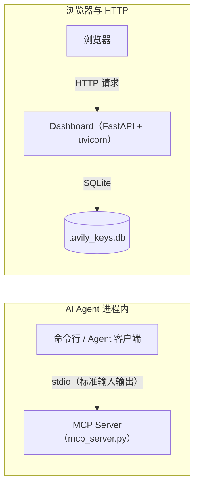
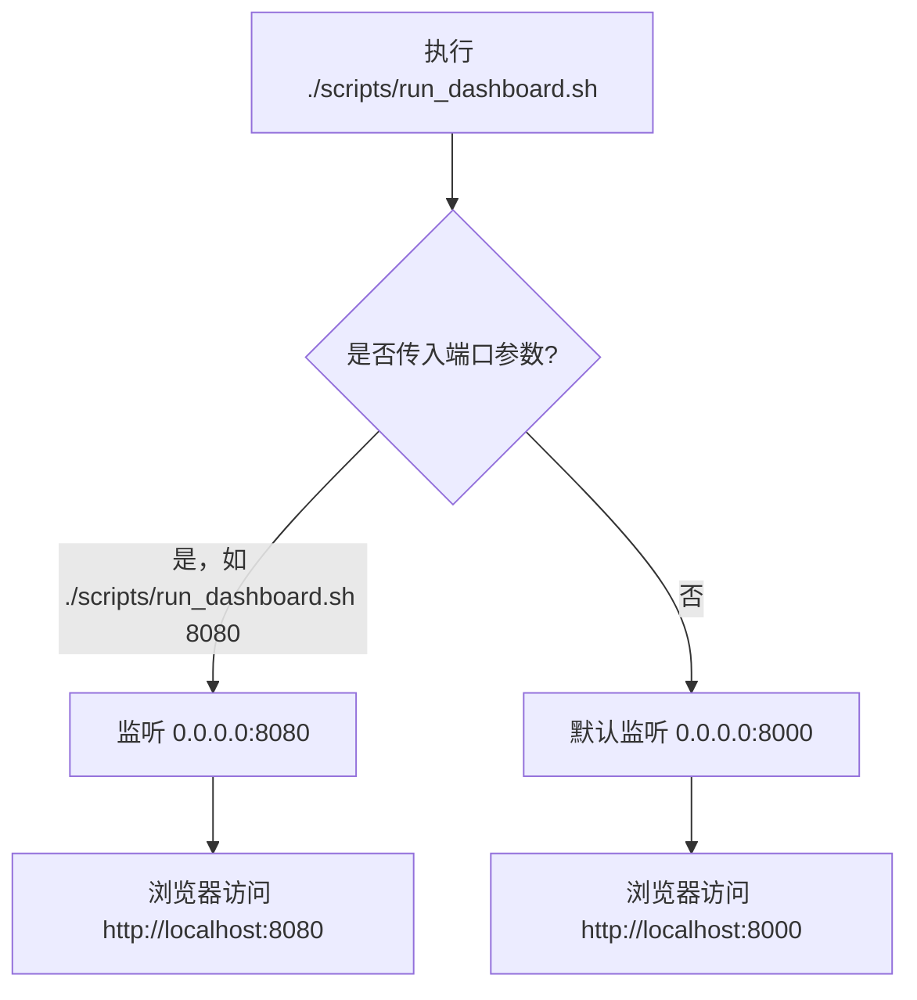

# 启动服务

<cite>本页内容整理自以下源文件：<br>[file://scripts/run_mcp.sh](file://scripts/run_mcp.sh) · [file://scripts/run_dashboard.sh](file://scripts/run_dashboard.sh) · [file://README.md](file://README.md)</cite>

## 目录

- [两种服务简介](#两种服务简介)
- [启动 MCP Server](#启动-mcp-server)
- [启动 Dashboard](#启动-dashboard)
- [端口与启动参数](#端口与启动参数)
- [后台运行与日志](#后台运行与日志)
- [开机自启](#开机自启)
- [常见问题](#常见问题)

## 两种服务简介

本项目包含两个可独立运行的进程，对应两个启动脚本：

| 服务 | 启动脚本 | 通信方式 | 用途 |
| --- | --- | --- | --- |
| MCP Server | [file://scripts/run_mcp.sh](file://scripts/run_mcp.sh) | stdio | 供 AI Agent 调用 tavily-search / extract / crawl / map / research 等工具，自动轮询 key |
| Dashboard | [file://scripts/run_dashboard.sh](file://scripts/run_dashboard.sh) | HTTP | Web 界面，展示 key 列表、请求日志、健康检查、用量统计 |

两者的本质区别在于**通信模式**：



- **MCP Server 走 stdio transport**：没有端口概念，由 AI Agent 进程拉起，通过标准输入/输出进行 JSON-RPC 通信，适合作为子进程被调用。
- **Dashboard 走 HTTP 模式**：基于 FastAPI + uvicorn，监听 `0.0.0.0`，通过浏览器访问。

## 启动 MCP Server

MCP Server 通过 [file://scripts/run_mcp.sh](file://scripts/run_mcp.sh) 启动，脚本内容如下：

```bash
#!/bin/bash
# Start Tavily MCP server (stdio transport)
# Usage: ./scripts/run_mcp.sh
SCRIPT_DIR="$(cd "$(dirname "$0")" && pwd)"
"$SCRIPT_DIR/.venv/bin/python3" "$SCRIPT_DIR/mcp_server.py"
```

脚本会先切换到自身所在目录，再使用项目虚拟环境（`.venv`）中的 Python 解释器运行 `mcp_server.py`，因此不依赖当前工作目录。

启动方式：

```bash
./scripts/run_mcp.sh
```

注意：

- 启动**不需要指定端口**，因为 MCP Server 通过 stdio 与调用方通信。
- 启动后通常没有明显的网络监听输出，这是正常现象。
- 前置条件：已按 [file://README.md](file://README.md) 完成依赖安装，且 `.venv` 已创建。

## 启动 Dashboard

Dashboard 通过 [file://scripts/run_dashboard.sh](file://scripts/run_dashboard.sh) 启动，脚本内容如下：

```bash
#!/bin/bash
# Start Tavily API Key Pool Dashboard
# Usage: ./scripts/run_dashboard.sh [port]
PORT=${1:-8000}
uvicorn dashboard:app --host 0.0.0.0 --port "$PORT"
```

启动方式：

```bash
./scripts/run_dashboard.sh          # 默认端口 8000
./scripts/run_dashboard.sh 8080     # 指定端口
```

也可以不使用脚本，手动以 uvicorn 启动（效果等同）：

```bash
uvicorn dashboard:app --host 0.0.0.0 --port 8000
```

启动成功后，在浏览器访问 `http://localhost:8000`（或服务器 IP + 端口）即可打开 Web 界面。

## 端口与启动参数



| 服务 | 命令行 | 默认端口 | 是否可指定端口 |
| --- | --- | --- | --- |
| MCP Server | `./scripts/run_mcp.sh` | 无（stdio） | 否 |
| Dashboard | `./scripts/run_dashboard.sh [port]` | 8000 | 是 |

Dashboard 监听 `0.0.0.0`，意味着局域网内其他机器也可通过服务器 IP 访问，具体端口映射请根据实际网络环境配置。

## 后台运行与日志

如需让服务在终端关闭后继续运行，可使用 `nohup` 配合后台任务：

```bash
# 后台运行 Dashboard，指定端口 8080，日志写入 dashboard.log
nohup ./scripts/run_dashboard.sh 8080 > dashboard.log 2>&1 &

# 查看实时日志
tail -f dashboard.log

# 查看进程
ps aux | grep uvicorn   # 或使用 pgrep -f uvicorn
```

对于 MCP Server，通常**不建议**手动后台运行——它应作为子进程由 AI Agent 客户端拉起，stdio 通道需要与调用方保持连接。如果确实需要独立测试，可临时前台运行观察输出：

```bash
./scripts/run_mcp.sh
```

## 开机自启

Dashboard 已提供 systemd user service 配置（见 [file://README.md](file://README.md)），文件位于 `~/.config/systemd/user/tavily-dashboard.service`，内容示例：

```ini
[Unit]
Description=Tavily API Key Pool Dashboard
After=network.target

[Service]
Type=simple
WorkingDirectory=/home/user/code/Tavily
Environment=PYTHONUNBUFFERED=1
ExecStart=/usr/bin/python3 -m uvicorn dashboard:app --host 0.0.0.0 --port 8000
Restart=on-failure
RestartSec=5

[Install]
WantedBy=default.target
```

启用自启：

```bash
systemctl --user daemon-reload
systemctl --user enable --now tavily-dashboard
systemctl --user status tavily-dashboard
```

MCP Server 没有自启配置，需要时手动执行 `./scripts/run_mcp.sh` 即可。注意自启配置中的 `WorkingDirectory` 与 `ExecStart` 路径需根据实际部署目录调整。

## 常见问题

**1. 端口被占用怎么办？**

使用其他端口启动，例如：

```bash
./scripts/run_dashboard.sh 9000
```

**2. 提示 `uvicorn: command not found`？**

说明当前环境未安装依赖或未激活虚拟环境，请确认已完成依赖安装，并检查 `PATH` 中是否包含项目虚拟环境路径。

**3. 启动 MCP Server 后看不到任何输出？**

正常现象。MCP Server 通过 stdio 通信，等待来自 AI Agent 的请求，不会主动输出日志。

**4. 数据库删除或损坏后如何恢复？**

SQLite 文件 `tavily_keys.db` 会在启动时自动重建，删除后重新启动服务即可，不影响功能（数据会清空）。