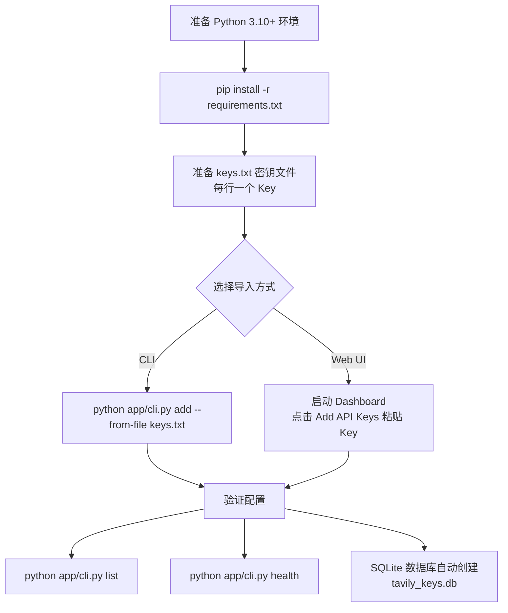
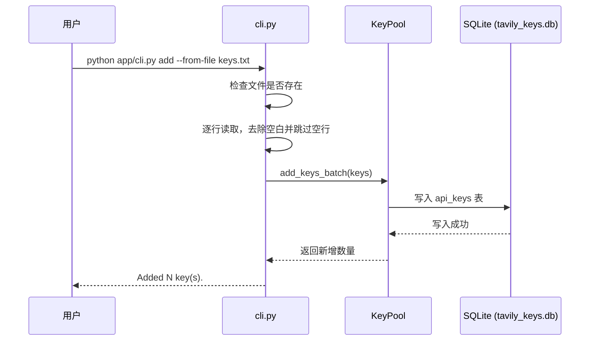

# 安装与配置

> <cite>本文内容基于以下源文件：[README.md](file://README.md)、[requirements.txt](file://requirements.txt)、[cli.py](file://app/cli.py)、[keys.txt](keys.txt)。</cite>

## 目录

- [环境要求](#环境要求)
- [安装依赖](#安装依赖)
- [准备 API Key 文件](#准备-api-key-文件)
- [导入 Key 到密钥池](#导入-key-到密钥池)
- [验证配置](#验证配置)
- [数据库自动初始化](#数据库自动初始化)
- [常见问题](#常见问题)
- [下一步](#下一步)

---

## 环境要求

| 项目 | 要求 |
| --- | --- |
| 操作系统 | Linux / macOS / Windows |
| Python | 3.10 及以上（`mcp>=1.0.0` 要求 Python 3.10+） |
| 网络 | 可访问 Tavily API 与 pip 软件源 |
| 前置条件 | 至少一个有效的 Tavily API Key |

推荐使用虚拟环境隔离项目依赖：

```bash
python3 -m venv .venv
source .venv/bin/activate        # Windows: .venv\Scripts\activate
```

---

## 安装依赖

在项目根目录执行（见 [README.md](file://README.md)）：

```bash
pip install -r requirements.txt
```

[requirements.txt](file://requirements.txt) 中各项依赖及其作用如下：

| 包 | 版本约束 | 作用 |
| --- | --- | --- |
| `tavily-python` | >=0.7.0 | Tavily 官方 Python 客户端，封装 search / extract / crawl / map / research 等 API |
| `mcp` | >=1.0.0 | Model Context Protocol 官方 SDK，用于构建 MCP Server，将 Tavily 工具暴露给 AI Agent |
| `fastapi` | >=0.115.0 | Web 框架，支撑 Dashboard 界面与 REST API |
| `uvicorn[standard]` | >=0.30.0 | ASGI 服务器，运行 FastAPI 应用（Dashboard 默认端口 8000） |
| `httpx` | >=0.27.0 | 异步 HTTP 客户端，用于健康检查探测等场景 |
| `aiofiles` | >=24.1.0 | 异步文件读写，供 Dashboard 读取 keys.txt 等文件 |
| `sqlite-utils` | >=3.37.0 | SQLite 工具库，简化 API Key 与请求日志的建表、读写操作 |

安装完成后可验证依赖是否就绪：

```bash
python -c "import tavily, mcp, fastapi, uvicorn; print('dependencies OK')"
```

输出 `dependencies OK` 即表示安装成功。

---

## 准备 API Key 文件

Key 池支持通过 [keys.txt](keys.txt) 文件批量导入 Key。文件格式要求：

- 每行一个 Key，首尾空白会被自动去除；
- 空行会被自动忽略（见 [cli.py](file://app/cli.py) 中 `cmd_add` 的实现逻辑）；
- 文件路径任意，导入时通过 `--from-file` 参数指定。

示例：

```
tvly-xxxxxxxxxxxxx
tvly-yyyyyyyyyyyyy
```

仓库不提供 keys.txt，请在项目根目录自行新建该文件（一行一个 Key）。该文件已被 .gitignore 忽略，不会提交到仓库。出于安全考虑，请勿在公开文档或代码仓库中提交真实 Key。

---

## 导入 Key 到密钥池

支持 CLI 与 Web UI 两种导入方式，整体流程如下：



### CLI 导入

```bash
python app/cli.py add --from-file keys.txt
```

预期输出：

```
Added 10 key(s).
```

执行过程（对应 [cli.py](file://app/cli.py) 中的 `cmd_add`）：



也可以直接在命令行追加 Key：

```bash
python app/cli.py add tvly-xxxxxxxxxxxxx tvly-yyyyyyyyyyyyy
```

### Web UI 导入

先启动 Dashboard，再在界面中点击 **Add API Keys**，将 Key 粘贴到输入框即可完成导入。Dashboard 启动方式参见《启动服务》章节。

---

## 验证配置

导入完成后，使用 [cli.py](file://app/cli.py) 内置命令验证 Key 是否可用：

```bash
python app/cli.py list                # 列出所有 Key
python app/cli.py list --active       # 仅查看活跃 Key
python app/cli.py health              # 健康检查，自动停用失效 Key
python app/cli.py stats               # 查看用量统计
```

`list` 输出示例（Key 以掩码形式显示，保护隐私）：

```
=== API Key Pool (ALL) ===
  + tvly-xxx****yyy | 0 reqs, 0.0 credits
  + tvly-xxx****zzz | 0 reqs, 0.0 credits
Total: 2 keys, 2 active
```

`health` 会对每个活跃 Key 发起真实探测，并自动停用失效 Key：

```
Running health checks on all active keys...
  ALIVE tvly-xxx****yyy (120ms)
  DEAD tvly-xxx****zzz [401 Unauthorized]
Result: 1 alive, 1 dead
```

---

## 数据库自动初始化

首次导入 Key 时，系统会在项目根目录自动创建 SQLite 数据库文件 `tavily_keys.db`，无需手动建库。数据库包含两张表：

| 表名 | 用途 |
| --- | --- |
| `api_keys` | Key 列表、用量、状态（活跃/停用） |
| `request_log` | 请求日志 |

删除该文件不影响功能，下次启动时会自动重建空库。

---

## 常见问题

| 问题 | 处理方式 |
| --- | --- |
| `pip install` 速度慢或超时 | 使用国内镜像源：`pip install -r requirements.txt -i https://pypi.tuna.tsinghua.edu.cn/simple` |
| 提示 `File not found: xxx` | `--from-file` 指定的路径不存在，检查文件路径是否正确 |
| 提示 `No keys provided.` | keys.txt 为空，或所有行均为空行 |
| 健康检查结果全部 DEAD | 检查 Key 是否有效、额度是否耗尽，可先用 `python app/cli.py activate tvly-xxx****yyy` 重新启用 |
| 误删 `tavily_keys.db` | 无需恢复，下次导入或启动时自动重建空库 |

---

## 下一步

配置完成后即可启动服务：运行 MCP Server 供 AI Agent 调用 Tavily 工具，或启动 Dashboard 进行可视化管理。具体步骤参见《启动服务》。