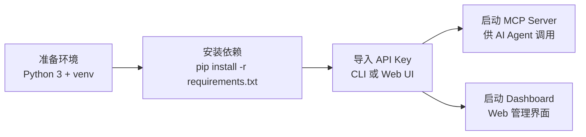

# 快速开始

<cite>本页内容基于以下源文件整理：[README.md](file://README.md)、[requirements.txt](file://requirements.txt)、[run_mcp.sh](file://scripts/run_mcp.sh)、[run_dashboard.sh](file://scripts/run_dashboard.sh)。</cite>

本页面向第一次使用 Tavily API Key Pool 的用户，提供从零开始的完整启动流程：**安装依赖 → 导入 API Key → 启动 MCP Server 与 Dashboard**。

## 目录

- [环境要求](#环境要求)
- [整体流程](#整体流程)
- [安装依赖](#安装依赖)
- [导入 API Key](#导入-api-key)
- [启动 MCP Server](#启动-mcp-server)
- [启动 Dashboard](#启动-dashboard)
- [验证安装](#验证安装)
- [下一步](#下一步)

## 环境要求

- **Python 3 环境**（`mcp>=1.0.0` 要求 Python 3.10 及以上版本）
- **pip 包管理器**
- **至少一个有效的 Tavily API Key**（以 `tvly-` 开头）
- **可访问外网**（需要调用 Tavily API）


## 整体流程



## 安装依赖

在项目根目录执行：

```bash
pip install -r requirements.txt
```

依赖清单（见 [requirements.txt](file://requirements.txt)）：

| 依赖包 | 版本要求 | 用途 |
|--------|----------|------|
| tavily-python | >=0.7.0 | Tavily API 客户端 |
| mcp | >=1.0.0 | MCP 协议支持 |
| fastapi | >=0.115.0 | Dashboard Web 框架 |
| uvicorn[standard] | >=0.30.0 | ASGI 服务器 |
| httpx | >=0.27.0 | HTTP 客户端 |
| aiofiles | >=24.1.0 | 异步文件操作 |
| sqlite-utils | >=3.37.0 | SQLite 数据库工具 |

> [!IMPORTANT]
> 启动脚本 [run_mcp.sh](file://scripts/run_mcp.sh) 固定使用项目目录下 `.venv` 中的 Python 解释器。建议先创建虚拟环境再安装依赖，否则脚本会因找不到 `.venv/bin/python3` 而失败：
>
> ```bash
> python3 -m venv .venv
> source .venv/bin/activate
> pip install -r requirements.txt
> ```

## 导入 API Key

将 API Key 按**一行一个**写入 `keys.txt`：

```text
tvly-xxxxxxxxxxxxx
tvly-yyyyyyyyyyyyy
```

### CLI 导入

```bash
python app/cli.py add --from-file keys.txt
```

### Web UI 导入

启动 Dashboard 后，在界面中点击 **"Add API Keys"**，直接粘贴 Key 即可（详见下文「启动 Dashboard」）。

## 启动 MCP Server

MCP Server 通过 **stdio 传输协议**与 AI Agent 通信，启动后供 Agent 客户端拉起调用：

```bash
./scripts/run_mcp.sh
```

启动后对外提供 `tavily-search`、`tavily-extract`、`tavily-crawl`、`tavily-map`、`tavily-research` 等工具，并在多个 Key 之间**自动轮询分发**请求。

> [!NOTE]
> 若执行 `./scripts/run_mcp.sh` 报错找不到解释器，请先按「安装依赖」一节创建 `.venv` 虚拟环境。该脚本内容如下（[run_mcp.sh](file://scripts/run_mcp.sh)）：
>
> ```bash
> SCRIPT_DIR="$(cd "$(dirname "$0")" && pwd)"
> "$SCRIPT_DIR/.venv/bin/python3" "$SCRIPT_DIR/mcp_server.py"
> ```

## 启动 Dashboard

Dashboard 提供 Web 管理界面，默认监听 **8000 端口**：

```bash
./scripts/run_dashboard.sh          # 默认端口 8000
./scripts/run_dashboard.sh 8080     # 指定端口
```

也可手动启动：

```bash
uvicorn dashboard:app --host 0.0.0.0 --port 8000
```

界面功能包括：**Key 列表、请求日志、健康检查、用量统计**。

> [!WARNING]
> [run_dashboard.sh](file://scripts/run_dashboard.sh) 默认将服务绑定到 `0.0.0.0`（所有网卡），生产环境请通过反向代理或防火墙限制访问范围，必要时可将 host 改为 `127.0.0.1`。

## 验证安装

服务启动后会**自动创建** SQLite 数据库文件 `tavily_keys.db`（含 `api_keys` 与 `request_log` 两张表），无需手动初始化。删除该文件不影响功能，下次启动会自动重建空库。

使用 CLI 快速验证整体状态：

```bash
python app/cli.py list              # 列出所有 key
python app/cli.py stats             # 用量统计
python app/cli.py health            # 健康检查，自动停用失效 key
python app/cli.py recent -n 20      # 最近 20 条请求日志
```

## 下一步

- 了解完整的 CLI 命令用法（Key 管理、统计、健康检查）——见《CLI 使用》章节。
- 使用 Dashboard 管理 Key、查看日志与用量统计——见《Web 控制台》章节。
- 配置 Dashboard 开机自启（systemd user service）——见 [README.md](file://README.md) 中的相关小节。