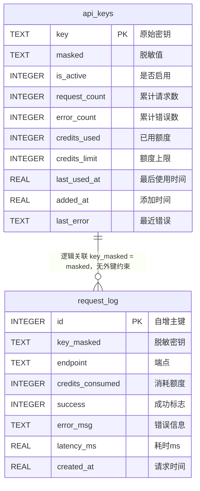
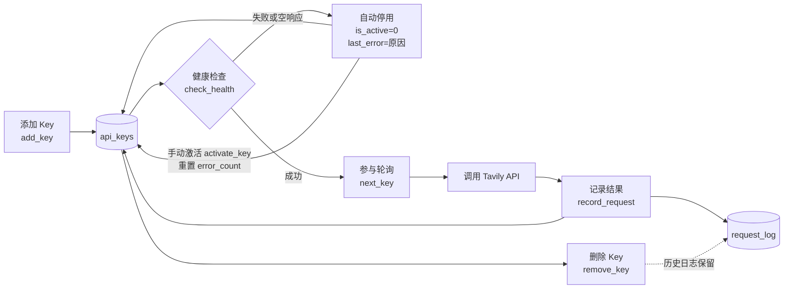

# 数据模型

<cite>源码参考：<a href="file://app/key_pool.py">key_pool.py</a> — Tavily API Key Pool 的 SQLite 持久化实现，包含建表、连接管理、Key 轮询、用量记录与健康检查逻辑。</cite>

Key 池的全部运行状态由 SQLite 数据库 `tavily_keys.db` 承载，共两张表：

- **`api_keys`**：密钥主表，保存原始密钥、脱敏值以及每个 Key 的累计用量、错误计数、启停状态等指标；
- **`request_log`**：请求流水表，记录每一次 Tavily API 调用的端点、耗时、成功与否及额度消耗，用于统计与审计。

本文属于架构设计主题下数据持久化层的说明，面向需要调试数据库或对 Key 池做二次开发的读者，重点讲解字段语义、建表逻辑、索引情况与连接管理方式。

## 目录

- [数据库文件与连接管理](#数据库文件与连接管理)
- [api_keys 表](#api_keys-表)
- [request_log 表](#request_log-表)
- [表关系 ER 图](#表关系-er-图)
- [建表 SQL 逻辑](#建表-sql-逻辑)
- [索引说明](#索引说明)
- [字段与业务逻辑的对应关系](#字段与业务逻辑的对应关系)
- [数据生命周期](#数据生命周期)
- [典型调试查询](#典型调试查询)

## 数据库文件与连接管理

数据库文件路径定义于 [key_pool.py](file://app/key_pool.py) 顶部：

```python
DB_PATH = Path(__file__).resolve().parent / "tavily_keys.db"
```

即 `key_pool.py` 所在目录下的 `tavily_keys.db`。开启 WAL 模式后，同目录还会出现 `tavily_keys.db-wal` 与 `tavily_keys.db-shm` 两个辅助文件，属正常现象，会随 checkpoint 自动收敛。

`KeyPool` 类采用**单例 + 线程本地连接**的方式访问数据库：

```python
class KeyPool:
    _instance = None          # 进程内单例
    _lock = threading.Lock()

    def _get_conn(self) -> sqlite3.Connection:
        # 每个线程持有独立连接，避免 SQLite 连接跨线程共享
        if not hasattr(self._local, "conn") or self._local.conn is None:
            self._local.conn = sqlite3.connect(self._db)
            self._local.conn.row_factory = sqlite3.Row
            self._local.conn.execute("PRAGMA journal_mode=WAL")
            self._local.conn.execute("PRAGMA busy_timeout=3000")
        return self._local.conn
```

关键设计：

| 机制 | 说明 |
|------|------|
| `threading.local()` | 每个线程独立创建连接，规避 SQLite 连接跨线程使用的限制 |
| `journal_mode=WAL` | 写事务不阻塞读，适合 MCP Server 多线程并发读写场景 |
| `busy_timeout=3000` | 遇到写锁竞争时最多等待 3 秒，避免立刻抛出 `database is locked` |
| `row_factory=sqlite3.Row` | 查询结果可按列名访问，代码可读性更好 |
| 单例 `KeyPool` | 进程内共享同一实例，轮询游标 `_next_index` 由独立锁保护 |

建表过程（`_init_db()`）使用独立的裸连接执行，不走线程本地连接；建表完成后立即 `commit` 并关闭。

## api_keys 表

`api_keys` 是 Key 池的主表，一行对应一个 Tavily API Key。建表语句见[建表 SQL 逻辑](#建表-sql-逻辑)。

| 字段 | 类型 | 约束 / 默认值 | 业务含义 |
|------|------|--------------|----------|
| `key` | TEXT | PRIMARY KEY | Tavily 原始 API Key，全表唯一 |
| `masked` | TEXT | NOT NULL | 脱敏后的展示值，用于日志与对外输出 |
| `is_active` | INTEGER | DEFAULT `1` | 是否参与轮询：`1`=启用，`0`=停用 |
| `request_count` | INTEGER | DEFAULT `0` | 累计请求次数（成功与失败均计入） |
| `error_count` | INTEGER | DEFAULT `0` | 累计失败次数 |
| `credits_used` | INTEGER | DEFAULT `0` | 已消耗的 Tavily 额度 |
| `credits_limit` | INTEGER | DEFAULT `0` | 额度上限；`0` 表示未配置上限 |
| `last_used_at` | REAL | DEFAULT `0` | 最近一次使用时间戳（Unix 秒） |
| `added_at` | REAL | NOT NULL | 入库时间戳（Unix 秒） |
| `last_error` | TEXT | DEFAULT `''` | 最近一次失败的简要原因 |

### 脱敏规则

`masked` 由原始 Key 经 `_mask()` 生成：

```python
def _mask(key: str) -> str:
    if key.startswith("tvly-"):
        return key[:12] + "****" + key[-4:]
    return key[:4] + "****" + key[-4:] if len(key) > 8 else "****"
```

- 以 `tvly-` 开头：保留前 12 位（含前缀）与后 4 位，如 `tvly-abc12345****abcd`；
- 其他长度大于 8 的 Key：保留前 4 位与后 4 位；
- 其余情况直接掩码为 `****`。

### 计算属性 usage_pct

`ApiKey.usage_pct` 是 Python 计算属性，**不落库**：

```python
@property
def usage_pct(self) -> float:
    if self.credits_limit <= 0:
        return 0.0
    return (self.credits_used / self.credits_limit) * 100
```

即 `credits_limit = 0` 时不限制额度，使用率视为 `0.0`；该值仅在 `get_stats()` 序列化时计算输出。

## request_log 表

`request_log` 是请求流水表，每次调用 Tavily API 都会追加一行；它只记录脱敏 Key（`key_masked`），不会泄露原始密钥。

| 字段 | 类型 | 约束 / 默认值 | 业务含义 |
|------|------|--------------|----------|
| `id` | INTEGER | PRIMARY KEY AUTOINCREMENT | 自增主键 |
| `key_masked` | TEXT | NOT NULL | 发起请求的 Key 的脱敏值，逻辑关联 `api_keys.masked` |
| `endpoint` | TEXT | NOT NULL | 调用的 Tavily 端点 |
| `credits_consumed` | INTEGER | DEFAULT `0` | 本次请求消耗的额度 |
| `success` | INTEGER | DEFAULT `1` | `1`=成功，`0`=失败 |
| `error_msg` | TEXT | DEFAULT `''` | 错误信息，写入时截断为前 500 字符 |
| `latency_ms` | REAL | DEFAULT `0.0` | 请求耗时（毫秒） |
| `created_at` | REAL | NOT NULL | 请求时间戳（Unix 秒） |

> 注意：`request_log.key_masked` 与 `api_keys.masked` 之间**没有外键约束**，仅是应用层的逻辑关联。删除某个 Key 时不会级联删除其历史日志，便于保留审计数据。

## 表关系 ER 图



## 建表 SQL 逻辑

建表在 `KeyPool._init_db()` 中完成，使用 `CREATE TABLE IF NOT EXISTS`，实例初始化时自动执行，无需手工迁移：

```sql
CREATE TABLE IF NOT EXISTS api_keys (
    key TEXT PRIMARY KEY,
    masked TEXT NOT NULL,
    is_active INTEGER DEFAULT 1,
    request_count INTEGER DEFAULT 0,
    error_count INTEGER DEFAULT 0,
    credits_used INTEGER DEFAULT 0,
    credits_limit INTEGER DEFAULT 0,
    last_used_at REAL DEFAULT 0,
    added_at REAL NOT NULL,
    last_error TEXT DEFAULT ''
);

CREATE TABLE IF NOT EXISTS request_log (
    id INTEGER PRIMARY KEY AUTOINCREMENT,
    key_masked TEXT NOT NULL,
    endpoint TEXT NOT NULL,
    credits_consumed INTEGER DEFAULT 0,
    success INTEGER DEFAULT 1,
    error_msg TEXT DEFAULT '',
    latency_ms REAL DEFAULT 0,
    created_at REAL NOT NULL
);
```

## 索引说明

当前两张表**只有主键隐式索引**，源码中未显式创建二级索引：

| 索引 | 所在表 | 来源 |
|------|--------|------|
| `sqlite_autoindex_api_keys_1` | api_keys | `key TEXT PRIMARY KEY` |
| `sqlite_autoindex_request_log_1` | request_log | `id INTEGER PRIMARY KEY AUTOINCREMENT` |

实际运行中的常见访问路径：

- `api_keys WHERE masked = ?` —— 全表扫描（Key 数量通常很小，可接受）；
- `api_keys WHERE is_active=1 ORDER BY last_used_at ASC` —— 全表扫描后排序；
- `request_log ORDER BY created_at DESC LIMIT ?` —— 全表扫描后排序。

`request_log` 会随运行时间持续增长。若二次开发中日志量较大，建议为 `request_log` 增加 `created_at`、`key_masked` 索引，并为 `api_keys.masked` 增加唯一索引（当前唯一性由应用逻辑保证）。

## 字段与业务逻辑的对应关系

### Key 轮询

轮询从启用 Key 中挑选，`is_active` 是过滤条件，`last_used_at` / `request_count` 决定优先级：

```python
# 轮询：按最久未使用排序，配合内存游标做 round-robin
SELECT key, masked FROM api_keys WHERE is_active=1 ORDER BY last_used_at ASC

# 最少使用优先：请求次数最少的 Key 排在最前
SELECT key, masked FROM api_keys WHERE is_active=1 ORDER BY request_count ASC, last_used_at ASC
```

### 健康检查与自动停用

`check_health()` 对启用中的 Key 发起轻量搜索探测：

- 探测失败或响应为空 → `deactivate_key(masked, reason)`，写入 `is_active=0`、`last_error=reason`（格式如 `health-check: timeout`、`health-check: empty response`）；
- 手动恢复 → `activate_key(masked)` 将 `is_active` 置回 `1`，同时重置 `error_count=0`。

### 用量记录

`record_request()` 每次调用后按下面逻辑更新数据：

```python
# 所有请求都递增请求数并刷新最后使用时间
UPDATE api_keys SET request_count=request_count+1, last_used_at=? WHERE masked=?

# 成功：累加额度
UPDATE api_keys SET credits_used=credits_used+? WHERE masked=?

# 失败：累加错误数并记录错误信息（截断 500 字符）
UPDATE api_keys SET error_count=error_count+1, last_error=? WHERE masked=?

# 同时写入流水
INSERT INTO request_log
    (key_masked, endpoint, credits_consumed, success, error_msg, latency_ms, created_at)
VALUES (?, ?, ?, ?, ?, ?, ?)
```

### 状态汇总

`get_stats()` 基于两表聚合：`api_keys` 计算总数、启用数、总请求 / 总错误 / 总额度；`request_log` 按 `endpoint + success` 统计最近 24 小时的成功 / 失败次数。

## 数据生命周期



## 典型调试查询

以下 SQL 可直接在 `sqlite3` 命令行或任意 SQLite 客户端中执行。

```sql
-- 查看所有 Key 的状态与用量（含本地化时间）
SELECT masked, is_active, request_count, error_count,
       credits_used, credits_limit,
       datetime(added_at, 'unixepoch', 'localtime') AS added_time
FROM api_keys
ORDER BY added_at DESC;

-- 查看最近 20 条请求日志
SELECT datetime(created_at, 'unixepoch', 'localtime') AS request_time,
       key_masked, endpoint, success, latency_ms, error_msg
FROM request_log
ORDER BY created_at DESC
LIMIT 20;

-- 统计近 24 小时各端点成功/失败次数
SELECT endpoint, success, COUNT(*) AS cnt
FROM request_log
WHERE created_at > (strftime('%s', 'now') - 86400)
GROUP BY endpoint, success;

-- 找出最近 1 小时内频繁失败的 Key（便于定位被限流或失效的 Key）
SELECT key_masked, COUNT(*) AS failures
FROM request_log
WHERE success = 0 AND created_at > (strftime('%s', 'now') - 3600)
GROUP BY key_masked
ORDER BY failures DESC;
```