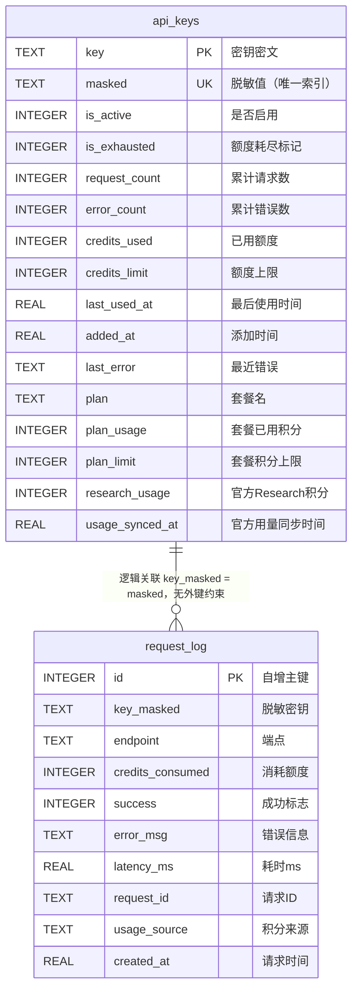
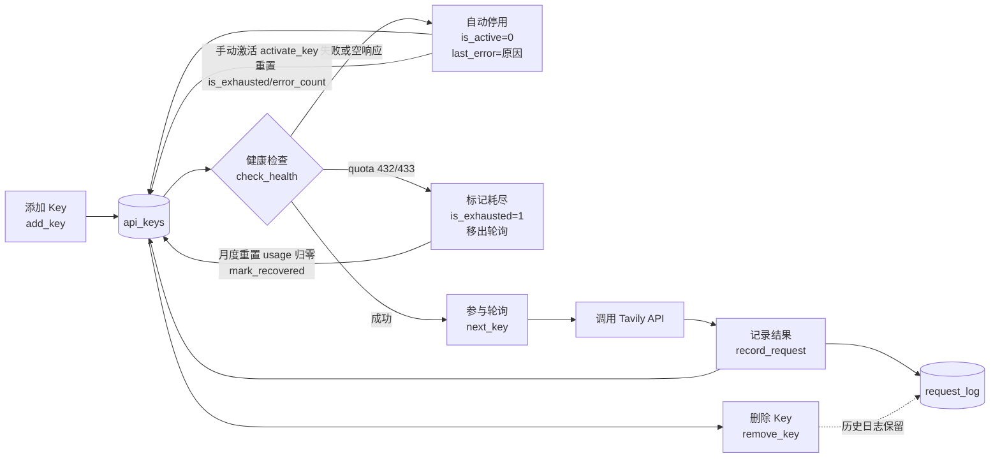

# 数据模型

<cite>源码参考：<a href="file://app/key_pool.py">key_pool.py</a> — Tavily API Key Pool 的 SQLite 持久化实现，包含建表、连接管理、Key 轮询、用量记录与健康检查逻辑。</cite>

Key 池的全部运行状态由 SQLite 数据库 `tavily_keys.db` 承载，共两张表：

- **`api_keys`**：密钥主表，保存加密后的密钥、脱敏值以及每个 Key 的累计用量、错误计数、启停/耗尽状态、官方套餐用量（`plan_*`、`research_usage`）等指标；
- **`request_log`**：请求流水表，记录每一次 Tavily API 调用的端点、耗时、成功与否、额度消耗、`request_id` 及积分来源（`usage_source`），用于统计与审计。

本文属于架构设计主题下数据持久化层的说明，面向需要调试数据库或对 Key 池做二次开发的读者，重点讲解字段语义、建表逻辑、索引情况与连接管理方式。

## 目录

- [数据库文件与连接管理](#数据库文件与连接管理)
- [api_keys 表](#api_keys-表)
- [request_log 表](#request_log-表)
- [表关系 ER 图](#表关系-er-图)
- [建表 SQL 逻辑](#建表-sql-逻辑)
- [索引说明](#索引说明)
- [字段与业务逻辑的对应关系](#字段与业务逻辑的对应关系)
- [数据生命周期](#数据生命周期)
- [典型调试查询](#典型调试查询)

## 数据库文件与连接管理

数据库文件路径定义于 [key_pool.py](file://app/key_pool.py) 顶部：

```python
DB_PATH = runtime_dir() / "tavily_keys.db"
```

路径由 `app/paths.py` 的 `runtime_dir()` 统一管理，位于 `data/` 目录（开发时为项目根目录下的 `data/`，打包后为 exe 同目录下的 `data/`）。开启 WAL 模式后，`data/` 目录下还会出现 `tavily_keys.db-wal` 与 `tavily_keys.db-shm` 两个辅助文件，属正常现象，会随 checkpoint 自动收敛。

`KeyPool` 类采用**单例 + 线程本地连接**的方式访问数据库：

```python
class KeyPool:
    _instance = None          # 进程内单例
    _lock = threading.Lock()

    def _get_conn(self) -> sqlite3.Connection:
        # 每个线程持有独立连接，避免 SQLite 连接跨线程共享
        if not hasattr(self._local, "conn") or self._local.conn is None:
            self._local.conn = sqlite3.connect(self._db)
            self._local.conn.row_factory = sqlite3.Row
            self._local.conn.execute("PRAGMA journal_mode=WAL")
            self._local.conn.execute("PRAGMA busy_timeout=3000")
        return self._local.conn
```

关键设计：

| 机制 | 说明 |
|------|------|
| `threading.local()` | 每个线程独立创建连接，规避 SQLite 连接跨线程使用的限制 |
| `journal_mode=WAL` | 写事务不阻塞读，适合 MCP Server 多线程并发读写场景 |
| `busy_timeout=3000` | 遇到写锁竞争时最多等待 3 秒，避免立刻抛出 `database is locked` |
| `row_factory=sqlite3.Row` | 查询结果可按列名访问，代码可读性更好 |
| 单例 `KeyPool` | 进程内共享同一实例，轮询游标 `_next_index` 由独立锁保护 |

建表过程（`_init_db()`）使用独立的裸连接执行，不走线程本地连接；建表完成后立即 `commit` 并关闭。

## api_keys 表

`api_keys` 是 Key 池的主表，一行对应一个 Tavily API Key。建表语句见[建表 SQL 逻辑](#建表-sql-逻辑)。

| 字段 | 类型 | 约束 / 默认值 | 业务含义 |
|------|------|--------------|----------|
| `key` | TEXT | PRIMARY KEY | Tavily API Key 的密文（加密存储，同一 Key 每次加密结果不同，唯一性由 `masked` 唯一索引兜底）；旧库明文首次访问时自动加密迁移 |
| `masked` | TEXT | NOT NULL, UNIQUE | 脱敏后的展示值，用于日志与对外输出，兼作重复检测依据 |
| `is_active` | INTEGER | DEFAULT `1` | 是否参与轮询：`1`=启用，`0`=停用 |
| `is_exhausted` | INTEGER | DEFAULT `0` | 额度耗尽标记（432/433 触发）：`1`=移出轮询但保留，月度重置后自动恢复 |
| `request_count` | INTEGER | DEFAULT `0` | 累计请求次数（成功与失败均计入） |
| `error_count` | INTEGER | DEFAULT `0` | 累计失败次数 |
| `credits_used` | INTEGER | DEFAULT `0` | 已消耗的 Tavily 额度（本地累计；同步官方 `/usage` 后为官方值） |
| `credits_limit` | INTEGER | DEFAULT `0` | 额度上限；`0` 表示未配置上限（同步后可能为官方 limit 或账户套餐额度） |
| `last_used_at` | REAL | DEFAULT `0` | 最近一次使用时间戳（Unix 秒） |
| `added_at` | REAL | NOT NULL | 入库时间戳（Unix 秒） |
| `last_error` | TEXT | DEFAULT `''` | 最近一次失败的简要原因 |
| `plan` | TEXT | DEFAULT `''` | 官方账户当前套餐名（来自 `/usage` 的 `account.current_plan`） |
| `plan_usage` | INTEGER | DEFAULT `0` | 套餐周期内已用积分（`account.plan_usage`） |
| `plan_limit` | INTEGER | DEFAULT `0` | 套餐积分上限（`account.plan_limit`） |
| `research_usage` | INTEGER | DEFAULT `0` | 官方 Research 积分消耗（`key.research_usage`）。Research 响应不含 usage，本地无法统计，此字段供 suspected_leak 对账时扣除 |
| `usage_synced_at` | REAL | DEFAULT `0` | 最近一次成功同步官方 `/usage` 的时间戳（Unix 秒） |

### 脱敏规则

`masked` 由原始 Key 经 `_mask()` 生成：

```python
def _mask(key: str) -> str:
    if key.startswith("tvly-"):
        return key[:12] + "****" + key[-4:]
    return key[:4] + "****" + key[-4:] if len(key) > 8 else "****"
```

- 以 `tvly-` 开头：保留前 12 位（含前缀）与后 4 位，如 `tvly-abc12345****abcd`；
- 其他长度大于 8 的 Key：保留前 4 位与后 4 位；
- 其余情况直接掩码为 `****`。

### 计算属性 effective_limit 与 usage_pct

`ApiKey.effective_limit` 与 `ApiKey.usage_pct` 均为 Python 计算属性，**不落库**：

```python
@property
def effective_limit(self) -> int:
    """有效积分上限：优先 key 自身额度；无限额（credits_limit<=0）时回退账户套餐额度。"""
    if self.credits_limit > 0:
        return self.credits_limit
    return self.plan_limit

@property
def usage_pct(self) -> float:
    limit = self.effective_limit
    if limit <= 0:
        return 0.0
    return (self.credits_used / limit) * 100
```

即 `effective_limit` 优先取 Key 自身额度，`credits_limit = 0`（未配置/官方返回 null）时回退套餐额度 `plan_limit`，保证「用量 % / 剩余积分」始终有可计算的分母；两者均为 `0` 时使用率视为 `0.0`。该值仅在 `get_stats()` 序列化时计算输出。

## request_log 表

`request_log` 是请求流水表，每次调用 Tavily API 都会追加一行；它只记录脱敏 Key（`key_masked`），不会泄露原始密钥。

| 字段 | 类型 | 约束 / 默认值 | 业务含义 |
|------|------|--------------|----------|
| `id` | INTEGER | PRIMARY KEY AUTOINCREMENT | 自增主键 |
| `key_masked` | TEXT | NOT NULL | 发起请求的 Key 的脱敏值，逻辑关联 `api_keys.masked` |
| `endpoint` | TEXT | NOT NULL | 调用的 Tavily 端点（如 `search`、`research`、`research-status`） |
| `credits_consumed` | INTEGER | DEFAULT `0` | 本次请求消耗的额度（响应 `usage.credits` 回写；`unknown`/`none` 时为 `0`） |
| `success` | INTEGER | DEFAULT `1` | `1`=成功，`0`=失败 |
| `error_msg` | TEXT | DEFAULT `''` | 错误信息，写入时截断为前 500 字符 |
| `latency_ms` | REAL | DEFAULT `0.0` | 请求耗时（毫秒） |
| `request_id` | TEXT | DEFAULT `''` | Tavily 请求 ID（写入时截断 200 字符），用于问题定位；Research 任务可凭此轮询结果 |
| `usage_source` | TEXT | DEFAULT `''` | 积分来源标记（写入时截断 20 字符）：`response`=响应含 usage / `unknown`=响应不含 usage（Research 系列）/ `none`=失败请求 |
| `created_at` | REAL | NOT NULL | 请求时间戳（Unix 秒） |

> 注意：`request_log.key_masked` 与 `api_keys.masked` 之间**没有外键约束**，仅是应用层的逻辑关联。删除某个 Key 时不会级联删除其历史日志，便于保留审计数据。
>
> `usage_source` 三值语义：`response` 表示本次请求响应携带 `usage` 字段，`credits_consumed` 为官方实际消耗；`unknown` 表示响应不含 `usage`（Tavily Research 系列官方响应无此字段），本地记 `0`，真实消耗以官方 `/usage` 的 `research_usage` 为准；`none` 表示请求失败、无消耗。

## 表关系 ER 图



## 建表 SQL 逻辑

建表在 `KeyPool._init_db()` 中完成，使用 `CREATE TABLE IF NOT EXISTS`，实例初始化时自动执行，无需手工迁移：

```sql
CREATE TABLE IF NOT EXISTS api_keys (
    key TEXT PRIMARY KEY,
    masked TEXT NOT NULL,
    is_active INTEGER DEFAULT 1,
    is_exhausted INTEGER DEFAULT 0,
    request_count INTEGER DEFAULT 0,
    error_count INTEGER DEFAULT 0,
    credits_used INTEGER DEFAULT 0,
    credits_limit INTEGER DEFAULT 0,
    last_used_at REAL DEFAULT 0,
    added_at REAL NOT NULL,
    last_error TEXT DEFAULT '',
    plan TEXT DEFAULT '',
    plan_usage INTEGER DEFAULT 0,
    plan_limit INTEGER DEFAULT 0,
    research_usage INTEGER DEFAULT 0,
    usage_synced_at REAL DEFAULT 0
);

CREATE TABLE IF NOT EXISTS request_log (
    id INTEGER PRIMARY KEY AUTOINCREMENT,
    key_masked TEXT NOT NULL,
    endpoint TEXT NOT NULL,
    credits_consumed INTEGER DEFAULT 0,
    success INTEGER DEFAULT 1,
    error_msg TEXT DEFAULT '',
    latency_ms REAL DEFAULT 0,
    request_id TEXT DEFAULT '',
    usage_source TEXT DEFAULT '',
    created_at REAL NOT NULL
);
```

### 自动迁移（_ensure_columns）

`CREATE TABLE IF NOT EXISTS` 只能保证**新库**拿到完整结构，旧库（如 0.1.0 版）缺少新增列。`_init_db()` 在建表后调用 `_ensure_columns()`，用 `ALTER TABLE ADD COLUMN` 为旧库自动补齐缺失列，全程幂等：

```python
def _ensure_columns(conn, table: str, cols: dict[str, str]):
    """旧库迁移：为表补充缺失的列（ALTER TABLE ADD COLUMN，容忍失败）。"""
    existing = {r[1] for r in conn.execute(f"PRAGMA table_info({table})")}
    for name, ddl in cols.items():
        if name not in existing:
            try:
                conn.execute(f"ALTER TABLE {table} ADD COLUMN {name} {ddl}")
            except sqlite3.Error:  # noqa: BLE001
                pass
```

- 先经 `PRAGMA table_info` 读取已有列，**只补缺失列**，重复启动不报错（幂等）；
- 旧库首次启动自动补齐 `api_keys` 的 `is_exhausted`/`plan`/`plan_usage`/`plan_limit`/`research_usage`/`usage_synced_at` 与 `request_log` 的 `request_id`/`usage_source`，无需手工迁移或重建表；
- 单个列补充失败（如并发竞态）仅忽略，不影响其他列与整体启动。

之后尝试创建 `idx_api_keys_masked` 唯一索引（见[索引说明](#索引说明)）。

## 索引说明

两张表除主键隐式索引外，`api_keys.masked` 还建有**唯一索引** `idx_api_keys_masked`：

| 索引 | 所在表 | 来源 |
|------|--------|------|
| `sqlite_autoindex_api_keys_1` | api_keys | `key TEXT PRIMARY KEY` |
| `idx_api_keys_masked` | api_keys | `CREATE UNIQUE INDEX`（`masked` 唯一） |
| `sqlite_autoindex_request_log_1` | request_log | `id INTEGER PRIMARY KEY AUTOINCREMENT` |

`idx_api_keys_masked` 的由来：自 v0.2.0 起 `api_keys.key` 改为存储密文（加密后同一 Key 每次密文不同），主键不再能承担唯一性检测，因此以 `masked`（明文不变）作为重复检测的兜底约束；历史数据若存在重复 masked（理论不会）则创建失败并忽略。

实际运行中的常见访问路径：

- `api_keys WHERE masked = ?` —— 命中 `idx_api_keys_masked` 唯一索引；
- `api_keys WHERE is_active=1 AND is_exhausted=0 ORDER BY last_used_at ASC` —— 全表扫描后排序（Key 数量通常很小，可接受）；
- `request_log ORDER BY created_at DESC LIMIT ?` —— 全表扫描后排序。

`request_log` 会随运行时间持续增长。若二次开发中日志量较大，建议为 `request_log` 增加 `created_at`、`key_masked` 索引。

## 字段与业务逻辑的对应关系

### Key 轮询

轮询从启用且未耗尽的 Key 中挑选，`is_active` 与 `is_exhausted` 是过滤条件，`last_used_at` 决定排序，round-robin 游标在内存维护（`_next_index`）；`least-used` 策略则按近 24h 请求数排序：

```python
# 轮询候选集：启用且未耗尽的 Key，按最久未使用排序，内存游标做 round-robin
SELECT key, masked FROM api_keys
WHERE is_active=1 AND is_exhausted=0
ORDER BY last_used_at ASC

# least-used 策略：近 24h 请求最少的 Key 排在最前（子查询统计 request_log）
SELECT k.key, k.masked,
       (SELECT COUNT(*) FROM request_log r
        WHERE r.key_masked = k.masked AND r.created_at > ?) AS today_count
FROM api_keys k
WHERE k.is_active = 1 AND k.is_exhausted = 0
ORDER BY today_count ASC, k.last_used_at ASC
```

### 健康检查与自动停用

`check_health()` 对启用中的 Key 发起轻量搜索探测（最多 5 并发）：

- 认证错误（401/403）→ `deactivate_key(masked, reason)`，写入 `is_active=0`、`last_error=reason`（格式如 `health-check auth: ...`）；
- 探测失败或响应为空 → 停用，`last_error` 格式如 `health-check: timeout`、`health-check: empty response`；
- 额度耗尽（432/433）→ `mark_exhausted(masked, ...)`，写入 `is_exhausted=1`、`last_error=reason`（格式如 `health-check quota: ...`），月度重置后自动恢复；
- 其他临时错误（超时/网络抖动）→ 累计 `error_count`，连续失败 ≥ 2 次才停用（`health-check consecutive: ...`），避免单次抖动误伤整个池；
- 手动恢复 → `activate_key(masked)` 将 `is_active` 置回 `1`，同时重置 `is_exhausted=0`、`error_count=0`。

### 用量记录

`record_request()` 每次调用后按下面逻辑更新数据（v0.3.2 签名含 `request_id` 与 `usage_source`）：

```python
def record_request(self, masked: str, endpoint: str, latency_ms: float, success: bool,
                   credits: int = 0, error_msg: str = "", request_id: str = "",
                   usage_source: str = ""):
    """记录一次请求。usage_source：response/unknown/none（见 request_log 表注释）。"""
    now = time.time()
    conn = self._get_conn()
    # 所有请求都递增请求数并刷新最后使用时间
    conn.execute(
        "UPDATE api_keys SET request_count=request_count+1, last_used_at=? WHERE masked=?",
        (now, masked),
    )
    if success:
        # 成功：累加额度（usage_source='response' 时才是官方实际消耗）
        conn.execute(
            "UPDATE api_keys SET credits_used=credits_used+? WHERE masked=?",
            (credits, masked),
        )
    else:
        # 失败：累加错误数并记录错误信息（截断 500 字符）
        conn.execute(
            "UPDATE api_keys SET error_count=error_count+1, last_error=? WHERE masked=?",
            (error_msg[:500], masked),
        )
        cat = _classify_error(error_msg)
        if cat == "quota":
            # 额度耗尽：移出轮询（月度重置后自动恢复），请求层已自动切换其他 key
            self.mark_exhausted(masked, f"quota: {error_msg[:200]}")
        elif cat == "auth":
            conn.execute("UPDATE api_keys SET is_active=0 WHERE masked=?", (masked,))

    # 同时写入流水（request_id 截断 200、usage_source 截断 20 字符）
    conn.execute(
        "INSERT INTO request_log (key_masked, endpoint, credits_consumed, success, error_msg, latency_ms, request_id, usage_source, created_at) VALUES (?,?,?,?,?,?,?,?,?)",
        (masked, endpoint, credits, 1 if success else 0, error_msg[:500], latency_ms, request_id[:200], usage_source[:20], now),
    )
    conn.commit()
```

要点：

- `usage_source` 由调用方（MCP Server）传入：`response`（响应含 usage）、`unknown`（Research 响应不含 usage，本地记 0）、`none`（失败请求）；
- 失败时先经 `_classify_error()` 分类：`quota`（432/433 等）→ `mark_exhausted` 移出轮询；`auth`（401/403 等）→ 直接停用；`rate`/`other` 仅记录错误计数。

### 状态汇总

`get_stats()` 基于两表聚合：`api_keys` 计算总数、启用数、总请求 / 总错误 / 总额度，每个 Key 经 `_apikey_to_dict()` 序列化为完整字典（含 `is_exhausted`、`plan`、`plan_usage`、`plan_limit`、`research_usage`、`usage_synced_at`）；`request_log` 按 `endpoint + success` 统计最近 24 小时的成功 / 失败次数。

v0.3.2 另提供两个补充视图与官方用量同步：

- `get_aggregate()`：全池聚合容量——`total_keys` / `active_keys` / `exhausted_count` / `total_limit` / `total_used` / `remaining` / `usage_pct`；
- `detect_anomalies()`：结合本地调用记录与官方用量识别异常 Key——`exhausted`、`near_exhausted`、`suspected_leak`、`high_error_rate`、`stale`、`slow`（阈值见配置 `anomaly_thresholds`）；
- `sync_usage()` / `sync_usage_one(masked)`：请求 Tavily 官方 `/usage`（8 并发，TTL 缓存默认 60s），回写 `credits_used`、`credits_limit`、`plan`、`plan_usage`、`plan_limit`、`research_usage`、`usage_synced_at`；Key 自身无 limit（官方返回 null）时回退账户套餐额度；检测到月度重置（exhausted Key 的 usage 归零/低于 limit）自动恢复。

## 数据生命周期



## 典型调试查询

以下 SQL 可直接在 `sqlite3` 命令行或任意 SQLite 客户端中执行。

```sql
-- 查看所有 Key 的状态与用量（含本地化时间）
SELECT masked, is_active, is_exhausted, request_count, error_count,
       credits_used, credits_limit, plan, plan_usage, plan_limit,
       datetime(added_at, 'unixepoch', 'localtime') AS added_time
FROM api_keys
ORDER BY added_at DESC;

-- 查看最近 20 条请求日志
SELECT datetime(created_at, 'unixepoch', 'localtime') AS request_time,
       key_masked, endpoint, success, latency_ms, credits_consumed,
       usage_source, request_id, error_msg
FROM request_log
ORDER BY created_at DESC
LIMIT 20;

-- 按积分来源统计请求分布（response / unknown / none）
SELECT endpoint, usage_source, COUNT(*) AS cnt
FROM request_log
GROUP BY endpoint, usage_source;

-- 统计近 24 小时各端点成功/失败次数
SELECT endpoint, success, COUNT(*) AS cnt
FROM request_log
WHERE created_at > (strftime('%s', 'now') - 86400)
GROUP BY endpoint, success;

-- 找出最近 1 小时内频繁失败的 Key（便于定位被限流或失效的 Key）
SELECT key_masked, COUNT(*) AS failures
FROM request_log
WHERE success = 0 AND created_at > (strftime('%s', 'now') - 3600)
GROUP BY key_masked
ORDER BY failures DESC;
```