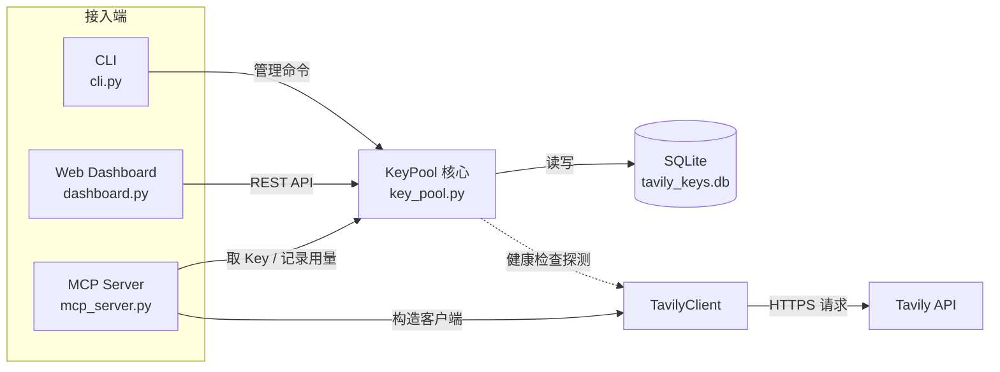
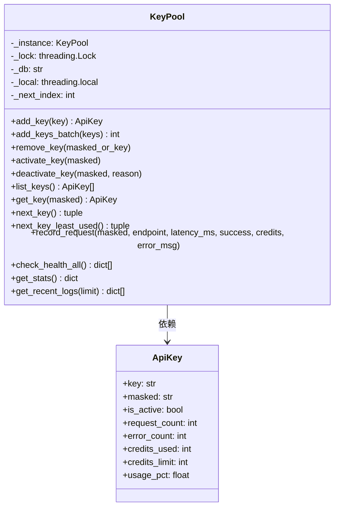
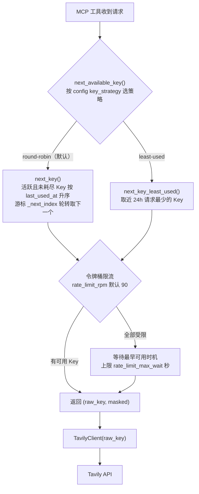

# 架构设计

> <cite>本文档依据以下源文件整理：<a href="file://app/key_pool.py">key_pool.py</a>、<a href="file://app/cli.py">cli.py</a>、<a href="file://app/dashboard.py">dashboard.py</a>、<a href="file://app/mcp_server.py">mcp_server.py</a>。</cite>

## 目录

- [总体架构](#总体架构)
- [核心模块 KeyPool](#核心模块-keypool)
- [接入端一 CLI](#接入端一-cli)
- [接入端二 Dashboard](#接入端二-dashboard)
- [接入端三 MCP Server](#接入端三-mcp-server)
- [数据流](#数据流)
- [关键设计决策](#关键设计决策)
- [扩展点与注意事项](#扩展点与注意事项)

## 总体架构

系统采用「单例核心 + 多接入端」结构：`KeyPool` 是唯一持有 API Key 明文并访问 SQLite 的模块，CLI、Web Dashboard、MCP Server 三个接入端都通过它完成 Key 管理与用量记录。CLI 与 Dashboard 是管理面，MCP Server 是数据面——后者是唯一真正向 Tavily API 发起业务请求的模块。



各模块定位：

| 模块 | 源文件 | 定位 | 职责 |
|---|---|---|---|
| KeyPool | [key_pool.py](file://app/key_pool.py) | 核心层 | Key 生命周期管理、SQLite 持久化、负载均衡选 Key、用量记录、健康检查 |
| CLI | [cli.py](file://app/cli.py) | 管理端 | 命令行批量增删 Key、查看统计 / 日志 / 健康状态 |
| Dashboard | [dashboard.py](file://app/dashboard.py) | 管理端 | FastAPI 网页可视化，提供 REST API 与浏览器界面 |
| MCP Server | [mcp_server.py](file://app/mcp_server.py) | 数据面 | 将搜索 / 提取 / 爬取等能力封装为 MCP 工具，自动取 Key 并回写用量 |

三个接入端均以 `pool = KeyPool()` 方式获取全局唯一实例，因此无论从哪个端操作，看到的都是同一份数据；MCP 每次调用写入的用量记录，也能立即在 Dashboard 与 CLI 中查询到。

## 核心模块 KeyPool

### 单例与线程模型

KeyPool 使用双重检查锁实现进程内单例：

```python
class KeyPool:
    _instance = None
    _lock = threading.Lock()

    def __new__(cls, db_path: str | None = None):
        if cls._instance is None:
            with cls._lock:
                if cls._instance is None:
                    cls._instance = super().__new__(cls)
        return cls._instance
```

SQLite 连接对象不能跨线程共享，因此 KeyPool 利用 `threading.local` 为每个线程维护独立连接，并统一设置 `PRAGMA journal_mode=WAL` 与 `PRAGMA busy_timeout=3000`，兼顾并发读写性能与锁等待：

```python
def _get_conn(self) -> sqlite3.Connection:
    if not hasattr(self._local, "conn") or self._local.conn is None:
        self._local.conn = sqlite3.connect(self._db)
        self._local.conn.row_factory = sqlite3.Row
        self._local.conn.execute("PRAGMA journal_mode=WAL")
        self._local.conn.execute("PRAGMA busy_timeout=3000")
    return self._local.conn
```

### 对外能力



核心方法分组：

| 分组 | 方法 | 说明 |
|---|---|---|
| Key CRUD | add_key / add_keys_batch / remove_key | 添加、批量添加、删除；自动生成 masked 脱敏 |
| 状态管理 | activate_key / deactivate_key | 启用 / 停用 Key，停用可记录原因 |
| 负载均衡 | next_key / next_key_least_used | 轮询与最少使用两种选 Key 策略，仅返回活跃 Key |
| 用量记录 | record_request | 更新计数与积分，并写入 request_log |
| 健康检查 | check_health / check_health_all | 真实探测，失败自动停用 |
| 统计查询 | get_stats / get_recent_logs | 汇总统计与最近请求日志 |

### SQLite 持久化

数据库文件默认位于 `data/` 目录下的 `tavily_keys.db`（路径由 `app/paths.py` 的 `runtime_dir()` 统一管理），包含两张表：

- `api_keys`：Key 主表。`key` 列保存明文（仅在进程内使用），对外展示统一使用 `masked` 脱敏列。
- `request_log`：请求流水。记录每次请求使用的 Key（脱敏）、endpoint、成功与否、耗时、消耗积分。

`get_stats()` 基于这两张表聚合出总请求数、总错误数、总积分消耗、活跃 Key 数，以及最近 24 小时按 endpoint 与成功 / 失败分组的统计。表结构的字段细节参见「数据模型」文档。

## 接入端一 CLI

[cli.py](file://app/cli.py) 是所有接入端中最薄的一层：它只负责解析 `argparse` 子命令，把参数原样转交 KeyPool，并把结果格式化输出。所有命令共享模块级 `pool = KeyPool()` 单例。

典型实现：

```python
from key_pool import KeyPool

pool = KeyPool()

def cmd_add(args):
    keys = args.keys
    if args.from_file:
        fpath = Path(args.from_file)
        if not fpath.exists():
            print(f"File not found: {args.from_file}")
            sys.exit(1)
        keys = [line.strip() for line in fpath.read_text().splitlines() if line.strip()]
    n = pool.add_keys_batch(keys)
    print(f"Added {n} key(s).")
```

子命令与 KeyPool 方法一一对应：

| CLI 子命令 | KeyPool 方法 | 用途 |
|---|---|---|
| add | add_keys_batch | 命令行或文件批量添加 Key |
| remove | remove_key | 删除 Key（支持 masked 或明文） |
| list | list_keys | 列出全部 / 仅活跃 Key |
| activate / deactivate | activate_key / deactivate_key | 启停 Key |
| stats | get_stats | 输出 JSON 统计 |
| recent | get_recent_logs | 查看最近请求日志 |
| health | check_health_all | 探测所有活跃 Key，自动停用失效 Key |

## 接入端二 Dashboard

[dashboard.py](file://app/dashboard.py) 基于 FastAPI，在导入时定位新前端构建产物 `web/dist/index.html`（Vue 3 + Vite；打包后从资源目录 `_MEIPASS/web/dist` 读取，缺失则导入失败、不静默回退旧前端），通过 `/` 路由返回页面、`/api/*` 端点与浏览器交互。它同样只是 KeyPool 的薄封装——每个 API 端点直接调用对应 KeyPool 方法：

```python
app = FastAPI(title="Tavily Key Pool Dashboard")
pool = KeyPool()

@app.get("/api/stats")
def api_stats():
    stats = pool.get_stats()
    stats["logs"] = pool.get_recent_logs(50)
    return stats
```

主要端点：

| 端点 | 方法 | 对应 KeyPool 调用 |
|---|---|---|
| / | GET | 返回 Dashboard HTML 页面 |
| /api/stats | GET | get_stats + get_recent_logs(50) |
| /api/keys/add | POST | add_keys_batch |
| /api/keys/remove | POST | remove_key |
| /api/keys/deactivate | POST | deactivate_key |
| /api/keys/activate | POST | activate_key |
| /api/health | POST | check_health_all |
| /api/settings | GET/POST | 读取 / 保存 data/config.json 部署设置 |

## 接入端三 MCP Server

[mcp_server.py](file://app/mcp_server.py) 是把 KeyPool 能力接入 LLM 生态的关键模块。它通过 `FastMCP` 注册 7 个工具：`tavily_search`、`tavily_extract`、`tavily_crawl`、`tavily_map`、`tavily_research`、`tavily_research_status`（业务工具）与 `tavily_pool_status`（池状态查询）。

所有业务工具遵循统一的三段式流程：

1. **取 Key**：`_get_client()` 调用 `pool.next_available_key()` 从 KeyPool 选取一个可用 Key（选 Key 策略与令牌桶限流在 KeyPool 内部按配置完成），构造 `TavilyClient`；
2. **调用**：调用对应 Tavily API；
3. **记录**：无论成功失败，都通过 `_record()` 回写用量。

```python
def _get_client() -> tuple[TavilyClient, str]:
    """取一个可用 key（未耗尽、未超限流）；全部受限时内部短暂等待。"""
    result = pool.next_available_key()
    if result is None:
        raise RuntimeError("No active API keys in pool. Add keys via CLI or dashboard.")
    raw, masked = result
    client = TavilyClient(raw)
    _apply_default_timeout(client)   # 注入默认 60s 超时，防止无限挂起
    return client, masked
```

```python
def _record(masked: str, endpoint: str, start: float, success: bool,
            credits: int = 0, error_msg: str = ""):
    latency = (time.time() - start) * 1000
    pool.record_request(masked, endpoint, latency, success, credits, error_msg)
```

选 Key 策略由 `data/config.json` 的 `key_strategy` 配置项控制（`round-robin` 轮询 / `least-used` 最少使用，非法值回退默认轮询），无需改代码；`next_available_key()` 内部在选定候选后还会应用令牌桶限流。选 Key 逻辑：



成功时从响应中的 `usage.credits` 读取实际积分消耗；若响应未携带 usage（Research 系列官方响应无此字段），本地记 0 并标记 `usage_source='unknown'`，实际消耗以官方 `/usage` 的 `research_usage` 为准（不再按搜索深度估算）。

## 数据流

一次典型请求（以 MCP 的搜索工具为例）与两类辅助流程的数据流向如下：

```mermaid
sequenceDiagram
    participant End as CLI / Dashboard / MCP 工具
    participant KP as KeyPool
    participant DB as SQLite
    participant TC as TavilyClient
    participant API as Tavily API

    Note over End,API: 数据面：MCP 工具请求
    End->>KP: next_available_key()（key_strategy + 令牌桶限流）
    KP->>DB: SELECT 活跃 Key 列表
    DB-->>KP: 候选 Key
    KP-->>End: (raw_key, masked)
    End->>TC: TavilyClient(raw_key)
    TC->>API: search / extract / crawl / map / research
    API-->>TC: 结果与 usage 计费
    TC-->>End: 响应 JSON
    End->>KP: record_request(masked, endpoint, latency, success, credits)
    KP->>DB: UPDATE api_keys + INSERT request_log

    Note over End,API: 管理面：CLI / Dashboard
    End->>KP: add / list / deactivate / get_stats
    KP->>DB: INSERT / SELECT / UPDATE
    DB-->>KP: 数据
    KP-->>End: 结果

    Note over End,API: 健康检查
    End->>KP: check_health_all()
    KP->>TC: TavilyClient(key).search("test", max_results=1)
    TC->>API: 轻量探测
    API-->>TC: 成功或异常
    KP->>DB: 失败则 UPDATE is_active=0
```

要点：

- **明文 Key 只出现在两条路径**：从 SQLite 读出、进入 `TavilyClient`；除此之外界面、CLI 输出、日志、MCP 返回中一律使用 `masked`。
- **用量数据单向流动**：KeyPool 负责写入，CLI / Dashboard 负责读取展示，MCP Server 通过 `record_request` 追加流水。
- **失败自动收敛**：健康检查发现失效 Key 会直接置为 `is_active=0`，后续 `next_key` / `next_key_least_used` 不再选中它。

## 关键设计决策

### 为什么选择 SQLite

- **零运维**：单文件数据库，无需独立服务，随项目部署即用；
- **并发可控**：WAL 模式允许读写并发，`busy_timeout=3000` 避免多端同时写入时报锁；
- **查询能力强**：负载均衡与统计都依赖 SQL 排序 / 聚合（如 `ORDER BY last_used_at`、按 endpoint 分组统计 24h 数据），SQLite 开箱即用。

### 为什么采用轮询分发

- **公平且简单**：`next_key()` 先按 `last_used_at` 升序取「最久未用」的 Key 集合，再用进程内游标 `_next_index` 在这组 Key 间轮转，兼顾最近最少使用与绝对公平，且无需额外依赖；从未使用过的 Key（`last_used_at` 为 0）天然排在前面，新 Key 会被优先预热；
- **失败容忍**：只查询 `is_active=1` 的 Key，失效 Key 自动被排除；
- **可替换策略**：`next_key_least_used()` 提供按近 24h 请求数排序的变体，MCP Server 通过 `data/config.json` 的 `key_strategy` 配置项一行切换，无需改代码。

### 为什么 KeyPool 是单例

三个接入端运行在同一进程时共享同一实例，才能保证：`_next_index` 轮询游标全局唯一、SQLite 初始化只执行一次、所有端看到一致的 Key 状态。CLI 单独运行时也建立同一个单例，互不干扰。

### 为什么每线程独立 SQLite 连接

Python 的 `sqlite3` 连接默认不能跨线程共享。Dashboard（FastAPI 多线程）与 MCP Server 并发调用时，`threading.local` 保证每个线程拿到自己的连接，配合 WAL 与 busy_timeout 解决并发写冲突。

### 为什么对外只暴露脱敏 Key

`_mask()` 将 `tvly-` 前缀的 Key 处理为「前 12 位 + `****` + 后 4 位」的形式。界面、CLI 输出、请求日志、MCP 返回全部使用 `masked`，明文只存在于 SQLite 与运行期 `TavilyClient` 中，降低日志泄露风险。

## 扩展点与注意事项

- **新增接入端**：任何新端只需 `from key_pool import KeyPool; pool = KeyPool()`，即可复用全部能力，无需了解 SQLite 细节。
- **替换存储层**：SQLite 访问全部收敛在 KeyPool 内部（`_get_conn` / `_init_db` / 各 CRUD 方法），更换存储后端只需修改 [key_pool.py](file://app/key_pool.py)。
- **健康检查有真实成本**：`check_health()` 会真实调用一次 basic 搜索，每个 Key 消耗约 1 积分，不宜高频执行。
- **多进程部署注意**：轮询游标 `_next_index` 是进程内状态，多进程部署时各进程独立轮转，可能出现短暂重复选 Key；若需严格全局均衡，可将选 Key 逻辑下沉到 SQL 层实现。
- **MCP 工具返回错误不抛异常**：`tavily_*` 工具捕获异常后返回 JSON 错误串，便于 LLM 理解，但调用方需自行判断 `error` 字段。