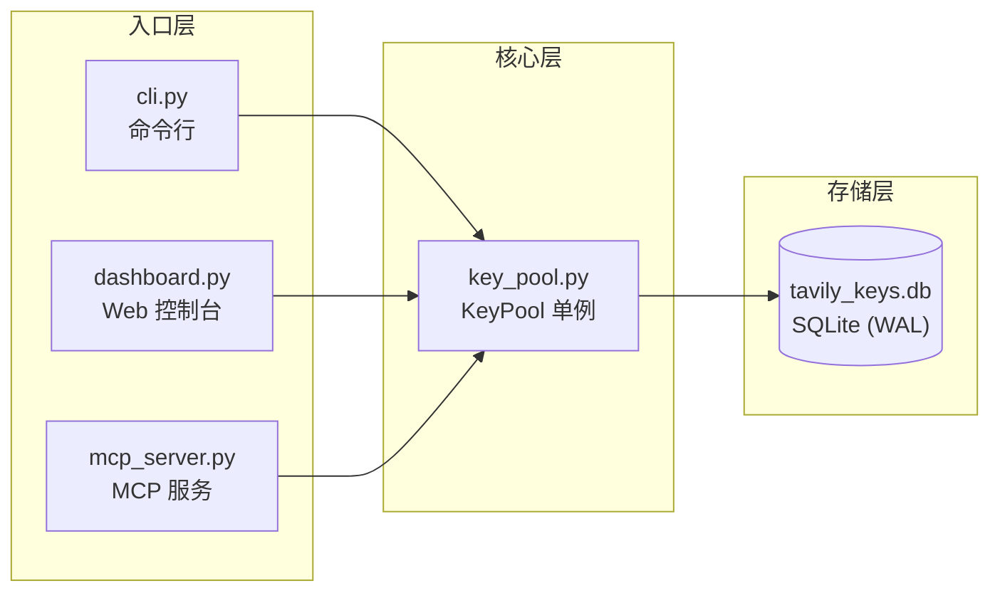
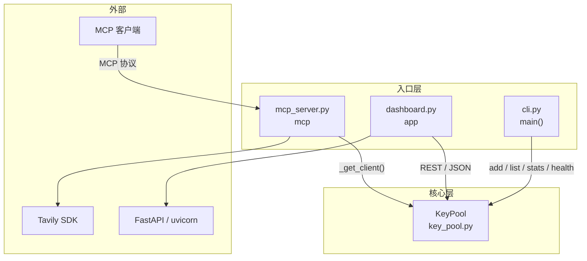
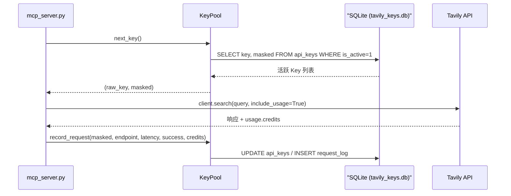

# 模块划分

> <cite>本文档对应源码：[key_pool.py](file://app/key_pool.py)、[cli.py](file://app/cli.py)、[dashboard.py](file://app/dashboard.py)、[mcp_server.py](file://app/mcp_server.py)</cite>

## 目录

- [总览](#overview)
- [key_pool.py：核心数据层](#key-pool)
- [cli.py：命令行入口](#cli)
- [dashboard.py：Web 控制台](#dashboard)
- [mcp_server.py：MCP 工具服务](#mcp-server)
- [模块间调用关系](#relationships)
- [数据传递方式](#data-flow)
- [扩展与注意事项](#extensions)

## 总览 {#overview}

本项目（参见[项目概述](../项目概述/项目概述.md)）由四个 Python 文件组成，整体呈「一个核心 + 三个入口」的结构：

| 文件 | 角色 | 关键对象 | 外部依赖 |
| --- | --- | --- | --- |
| [key_pool.py](file://app/key_pool.py) | 核心数据层：Key 存取、轮询、用量记录、健康检查 | `KeyPool` 单例 | `sqlite3`、`threading` |
| [cli.py](file://app/cli.py) | 命令行入口：批量增删查、统计、健康检查 | `main()` / `cmd_*` | `argparse` |
| [dashboard.py](file://app/dashboard.py) | Web 入口：FastAPI 控制台与 REST API | `app` | `fastapi`、`uvicorn` |
| [mcp_server.py](file://app/mcp_server.py) | 工具入口：通过 MCP 协议暴露 Tavily 能力 | `mcp` | `mcp`、`tavily` |

`key_pool.py` 是所有上层模块唯一的数据访问点；`cli.py`、`dashboard.py`、`mcp_server.py` 三者互不直接调用，只通过 `KeyPool` 共享状态。

### 职责边界

- **key_pool.py**：只负责数据持久化与 Key 生命周期管理，不暴露任何网络接口，也不知道 CLI / HTTP / MCP 的存在；
- **cli.py**：只做参数解析与结果打印，不包含任何业务逻辑，全部委托给 `KeyPool`；
- **dashboard.py**：只提供 Web 展示与管理入口，不做 Key 轮询与健康判定；
- **mcp_server.py**：只负责将 Tavily SDK 包装为 MCP 工具，不做持久化与 Key 管理。



## key_pool.py：核心数据层 {#key-pool}

`key_pool.py` 是整个项目的基石，负责：

- 基于 SQLite 持久化 API Key（表 `api_keys`）与请求日志（表 `request_log`）；
- 提供线程安全的 Key 增删改查与启停用；
- 按轮询（round-robin）或最少使用（least-used）策略选出下一个 Key；
- 记录每次请求的延迟、成功与否、积分消耗；
- 主动健康检查，自动停用失败的 Key。

### 单例与线程安全

`KeyPool` 通过 `__new__` 实现进程内单例，并用 `threading.Lock` 双重检查保证线程安全：

```python
class KeyPool:
    _instance = None
    _lock = threading.Lock()

    def __new__(cls, db_path: str | None = None):
        if cls._instance is None:
            with cls._lock:
                if cls._instance is None:
                    cls._instance = super().__new__(cls)
        return cls._instance
```

数据库连接使用 `threading.local()` 按线程隔离，每个线程首次使用时建立独立连接，并通过 `PRAGMA journal_mode=WAL` 与 `PRAGMA busy_timeout=3000` 支持多进程并发读写。

### 对外核心接口

| 方法 | 作用 |
| --- | --- |
| `add_keys_batch(keys)` | 批量添加 Key，自动跳过重复项 |
| `list_keys()` / `get_key(masked)` | 查询 Key 列表 / 单个 Key |
| `deactivate_key(masked, reason)` / `activate_key(masked)` | 停用 / 启用 Key |
| `next_key()` | 轮询选择下一个活跃 Key |
| `next_key_least_used()` | 选择剩余额度最多的 Key（同额度随机打散） |
| `record_request(...)` | 记录一次请求的用量、延迟、错误 |
| `check_health_all()` | 探测全部活跃 Key，自动停用异常 Key |
| `get_stats()` / `get_recent_logs(limit)` | 汇总统计 / 最近请求日志 |

### 关键设计点

- **Key 脱敏**：通过 `_mask()` 生成 `tvly-XXXX****XXXX` 形式的掩码，统计与日志只暴露掩码；原始 Key 仅在实际调用时由 `next_key()` / `next_key_least_used()` 返回，且不会进入日志表。
- **负载均衡**：`next_key()` 先按 `last_used_at` 升序取活跃且未耗尽的 Key，再用 `_next_index` 做轮询游标；`next_key_least_used()` 则取近 24h 请求最少的 Key；上层统一经 `next_available_key()` 按 `key_strategy` 配置选择策略并做令牌桶限流。
- **健康检查**：`check_health()` 用 `TavilyClient` 发起轻量搜索探测，失败即调用 `deactivate_key()`，并把原因截断后写入 `last_error` 字段。

## cli.py：命令行入口 {#cli}

`cli.py` 是基于 `argparse` 的命令行工具，入口为 `main()`，启动时直接创建全局 `pool = KeyPool()`：

```python
from key_pool import KeyPool

pool = KeyPool()

def cmd_list(args):
    keys = pool.list_keys()
    ...
```

子命令与 `KeyPool` 方法的对应关系：

| 子命令 | 处理函数 | 调用的 KeyPool 方法 |
| --- | --- | --- |
| `add` | `cmd_add` | `add_keys_batch` |
| `remove` | `cmd_remove` | `remove_key` |
| `list` | `cmd_list` | `list_keys` |
| `deactivate` / `activate` | `cmd_deactivate` / `cmd_activate` | `deactivate_key` / `activate_key` |
| `stats` | `cmd_stats` | `get_stats` |
| `recent` | `cmd_recent` | `get_recent_logs` |
| `health` | `cmd_health` | `check_health_all` |

`cmd_add` 支持从文件批量导入 Key：

```python
if args.from_file:
    fpath = Path(args.from_file)
    keys = [line.strip() for line in fpath.read_text().splitlines() if line.strip()]
```

CLI 只做参数解析与结果打印，不包含任何业务逻辑，全部委托给 `KeyPool`。

## dashboard.py：Web 控制台 {#dashboard}

`dashboard.py` 基于 FastAPI 提供 Web 界面与 REST API，全局对象为 `app`：

```python
from fastapi import FastAPI
from key_pool import KeyPool

app = FastAPI(title="Tavily Key Pool Dashboard")
pool = KeyPool()
```

新前端构建产物在导入期定位一次（打包后从资源目录 `_MEIPASS/web/dist` 读取），缺失时导入直接失败：

```python
def _web_dist() -> Path:
    """新前端（web/，Vite 构建产物）目录：含 index.html，打包后位于
    _MEIPASS/web/dist（见 Tavily.spec datas）；开发时为项目根下的
    web/dist（本文件在 app/ 下，项目根是其父目录的父目录）。

    index.html 缺失时直接抛错：新前端是唯一前端，不静默回退旧版。
    """
    if getattr(sys, "frozen", False):
        dist = Path(sys._MEIPASS) / "web" / "dist"
    else:
        dist = Path(__file__).resolve().parent.parent / "web" / "dist"
    index = dist / "index.html"
    if not index.is_file():
        raise FileNotFoundError(...)
    return dist

_WEB_DIST = _web_dist()
```

### 暴露的路由

| 方法与路径 | 功能 | 数据来源 |
| --- | --- | --- |
| `GET /` | 返回 Dashboard 页面 | `web/dist/index.html`（每次现读） |
| `GET /api/stats` | 统计 + 最近 50 条日志 | `get_stats()` + `get_recent_logs(50)` |
| `POST /api/keys/add` | 批量添加 Key | `add_keys_batch` |
| `POST /api/keys/remove` | 删除 Key | `remove_key` |
| `POST /api/keys/deactivate` | 停用 Key | `deactivate_key` |
| `POST /api/keys/activate` | 启用 Key | `activate_key` |
| `POST /api/health` | 触发全量健康检查 | `check_health_all()` |
| `GET/POST /api/settings` | 读取 / 保存部署设置（data/config.json） | `settings` 模块 |

前端与后端通过 JSON 交互，例如添加 Key：

```python
@app.post("/api/keys/add")
def api_keys_add(payload: dict = Body(...)):
    keys = payload.get("keys", [])
    added = pool.add_keys_batch(keys)
    return {"ok": True, "added": added}
```

`if __name__ == "__main__"` 分支从 `data/config.json` 读取 host/port（由 `settings` 模块提供）并通过 `uvicorn.run(app, host=..., port=...)` 启动服务。

## mcp_server.py：MCP 工具服务 {#mcp-server}

`mcp_server.py` 通过 MCP（Model Context Protocol）把 Tavily 的能力暴露给 AI 客户端，全局对象为 `mcp`（`FastMCP` 实例）：

```python
from mcp.server.fastmcp import FastMCP
from key_pool import KeyPool, _mask

mcp = FastMCP("Tavily Web Search", ...)
pool = KeyPool()
# 选 Key 策略由 data/config.json 的 key_strategy 配置（round-robin | least-used）
```

### 工具执行链路

每个工具的执行流程完全一致：

1. `_get_client()` 调用 `pool.next_available_key()`（选 Key 策略与限流由 `data/config.json` 的 `key_strategy` / `rate_limit_rpm` 配置控制）取出一个 Key，构造 `TavilyClient`；
2. 调用对应的 Tavily SDK 方法；
3. 从响应的 `usage` 字段解析消耗的积分；
4. `_record()` 调用 `pool.record_request()` 写入用量；
5. 成功或异常均以 JSON 字符串返回给 MCP 客户端。

```python
def _get_client() -> tuple[TavilyClient, str]:
    """取一个可用 key（未耗尽、未超限流）；全部受限时内部短暂等待。"""
    result = pool.next_available_key()
    if result is None:
        raise RuntimeError("No active API keys in pool. Add keys via CLI or dashboard.")
    raw, masked = result
    client = TavilyClient(raw)
    _apply_default_timeout(client)   # 注入默认 60s 超时，防止无限挂起
    return client, masked
```

策略切换无需改代码：`KeyPool.next_available_key()` 内部按 `key_strategy`（`round-robin` / `least-used`，非法值回退轮询）选候选 Key，再按 `rate_limit_rpm`（默认 90）令牌桶限流——跳过速率受限的 Key，全部受限时等待最早可用时机（上限 `rate_limit_max_wait` 秒）。

异常处理采用「降级而非抛出」的策略：任何工具失败都会把错误信息与 `key_used`（掩码）一起序列化返回，同时记录失败日志：

```python
except Exception as e:
    _record(masked, "search", t0, False, 0, str(e))
    return json.dumps({"error": str(e), "key_used": masked})
```

### 暴露的工具

| 工具 | 底层 SDK 方法 | 计费端点 |
| --- | --- | --- |
| `tavily_search` | `client.search` | `search` |
| `tavily_extract` | `client.extract` | `extract` |
| `tavily_crawl` | `client.crawl` | `crawl` |
| `tavily_map` | `client.map` | `map` |
| `tavily_research` | `client.research` | `research` |
| `tavily_research_status` | `client.get_research` | 不消耗配额（查询已提交任务） |
| `tavily_pool_status` | — | 直接返回 `pool.get_stats()` |

其中 `tavily_pool_status` 与 `tavily_research_status` 不消耗外部 API 配额：前者用于让 AI 客户端了解当前 Key 池的健康与用量情况；后者用于查询异步研究任务的状态与结果（任务与提交时的 key 绑定，映射持久化于 `data/research_keys.json`）。

## 模块间调用关系 {#relationships}



一次 MCP 搜索请求的完整时序：



## 数据传递方式 {#data-flow}

- **进程内**：三个入口各自持有独立的 `KeyPool` 单例，调用方通过方法参数直接传递 Key、错误信息等数据，返回值使用 Python 对象（`ApiKey`、`dict`、`list`）。
- **跨进程**：单例只保证进程内唯一，进程间的一致性由 SQLite 数据库文件保证——CLI 添加的 Key 立即可被 dashboard 或 mcp_server 看到，因为三者读写的是同一张表。
- **对外接口**：
  - CLI：终端文本（子命令 + 参数 → 打印结果）；
  - Dashboard：HTTP + JSON（前端页面与 `/api/*` 路由交互）；
  - MCP Server：JSON 字符串（所有工具统一 `json.dumps(..., ensure_ascii=False, indent=2)` 返回）。

## 扩展与注意事项 {#extensions}

- **新增入口模块**：只需 `from key_pool import KeyPool` 并复用公开方法，无需修改核心层；注意单例是进程级的，新入口进程需要独立初始化。
- **新增 MCP 工具**：在 `mcp_server.py` 中定义 `@mcp.tool()` 函数，按「`_get_client()` → 调用 SDK → `_record()`」三步模板编写即可，`endpoint` 参数决定了日志中的统计口径。
- **切换负载均衡策略**：修改 `data/config.json` 的 `key_strategy` 配置项为 `"least-used"` 或 `"round-robin"` 即可，无需改代码。
- **数据库并发**：多进程同时读写依赖 WAL 模式与 busy_timeout，不要随意改动这两条 PRAGMA；若部署多副本，需确保 `DB_PATH` 指向共享存储。
- **仪表盘前端**：`dashboard.py` 在导入时校验新前端构建产物 `web/dist/index.html`（打包后从资源目录 `_MEIPASS/web/dist` 读取），该文件缺失时导入直接失败（抛 `FileNotFoundError`），服务无法启动；旧版 `app/dashboard.html` 已归档至 `docs/archive/dashboard-legacy.html`，不再作为回退。