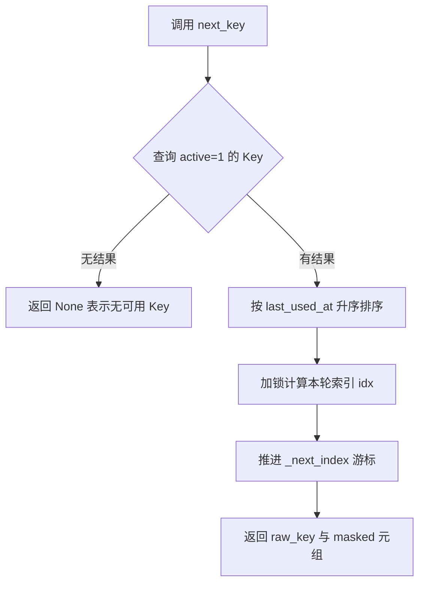
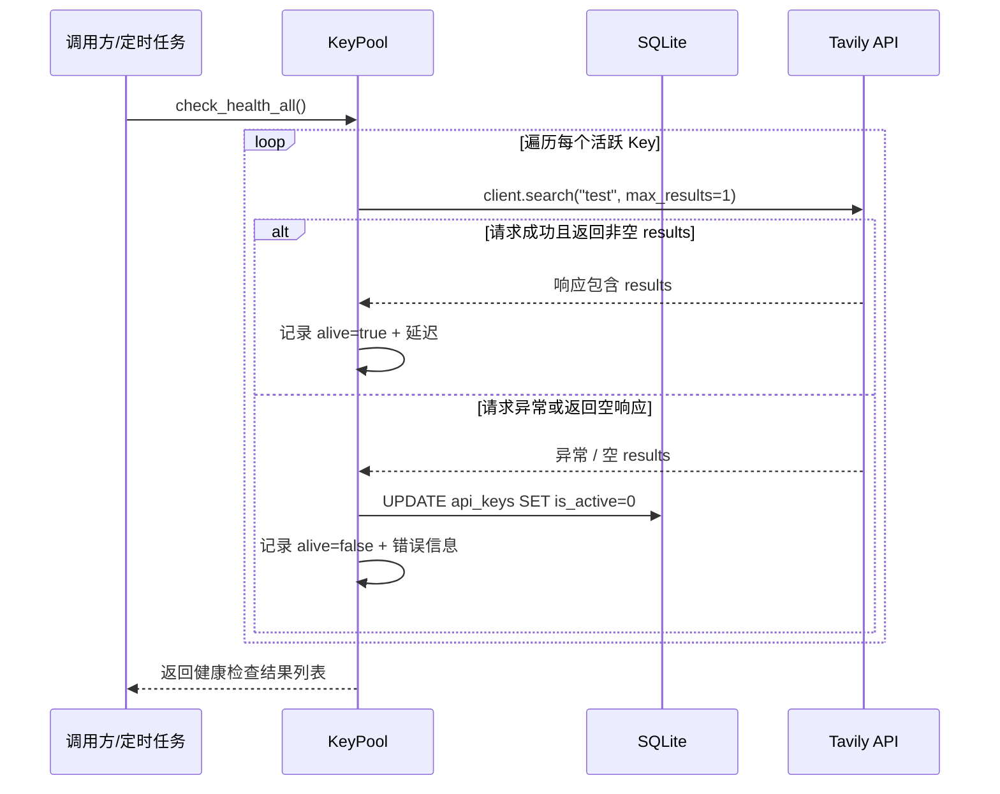
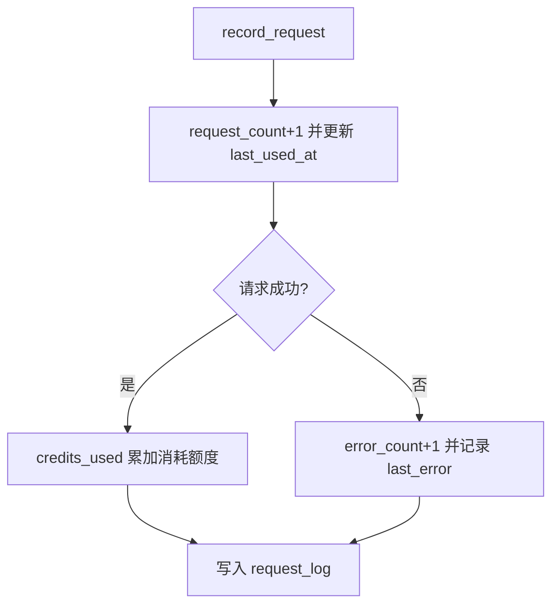
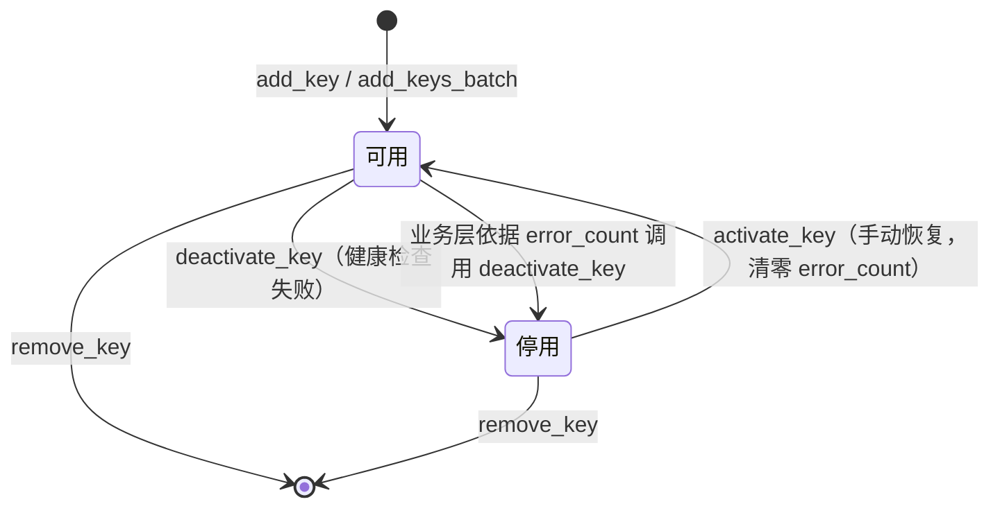

# Key 轮询与健康检查

> <cite>本文档基于 [`key_pool.py`](file://app/key_pool.py) 源码撰写。文中所引用的类、方法与代码片段均出自该文件。</cite>

## 目录

- [概述](#概述)
- [核心数据结构](#核心数据结构)
  - [ApiKey 数据类](#apikey-数据类)
  - [数据库表结构](#数据库表结构)
- [轮询算法](#轮询算法)
  - [最近未用优先的轮询调度](#最近未用优先的轮询调度)
  - [最少使用优先](#最少使用优先)
- [并发控制](#并发控制)
- [健康检查](#健康检查)
  - [检查流程](#检查流程)
  - [自动停用与恢复](#自动停用与恢复)
- [请求记录与失败处理](#请求记录与失败处理)
- [异常识别与本地-官方对账](#异常识别与本地-官方对账)
- [Key 生命周期状态图](#key-生命周期状态图)
- [完整调用示例](#完整调用示例)
- [相关命令入口](#相关命令入口)

## 概述

当系统持有多个 Tavily API Key 时，如果所有请求都固定命中同一个 Key，很容易触发配额上限或速率限制。`KeyPool` 正是为解决这一问题而设计：它以 SQLite 为存储后端，持久化每个 Key 的元数据、使用量、额度消耗与错误状态，并通过**轮询算法**在活跃 Key 之间均匀分发请求。与此同时，`KeyPool` 内置**健康检查**机制，用真实但轻量的探测请求识别失效 Key，并自动将其停用，避免后续请求继续打到坏 Key 上。

`KeyPool` 的核心职责：

| 职责 | 对应方法 |
| --- | --- |
| Key 注册与删除 | `add_key` / `add_keys_batch` / `remove_key` |
| 可用 Key 选择 | `next_key` / `next_key_least_used` |
| 请求结果回写 | `record_request` |
| 健康探测与自动停用 | `check_health` / `check_health_all` |
| 手动恢复 | `activate_key` |
| 统计与日志 | `get_stats` / `get_recent_logs` |
| 官方用量同步与对账 | `sync_usage` / `detect_anomalies` / `get_aggregate` |

## 核心数据结构

### ApiKey 数据类

`ApiKey` 是单个 Key 在内存中的映射对象，每个字段对应数据库 `api_keys` 表中的一列：

```python
@dataclass
class ApiKey:
    key: str           # 原始 Key（仅内存中持有）
    masked: str        # 脱敏后的展示值，如 tvly-xxxxxxxx****abcd
    is_active: bool    # 是否可用
    request_count: int # 累计请求次数
    error_count: int   # 累计错误次数
    credits_used: int  # 已消耗额度
    credits_limit: int # 额度上限
    last_used_at: float  # 最近使用时间戳
    added_at: float      # 添加时间戳
    last_error: str      # 最近一次错误信息

    @property
    def usage_pct(self) -> float:
        """额度使用百分比，credits_limit <= 0 时返回 0"""
        if self.credits_limit <= 0:
            return 0.0
        return (self.credits_used / self.credits_limit) * 100
```

其中 `masked` 由 `_mask()` 函数生成：`tvly-` 开头的 Key 保留前 12 位与后 4 位，其余 Key 保留前 4 位与后 4 位，中间以 `****` 代替。脱敏值用于日志、界面展示与作为业务层引用的稳定标识。

### 数据库表结构

`KeyPool` 使用 SQLite 存储，默认数据库文件为 `data/` 目录下的 `tavily_keys.db`（路径由 `app/paths.py` 的 `runtime_dir()` 统一管理），并开启 WAL 模式以提升并发读写性能。两张核心表：

- `api_keys`：Key 主表，`key` 为唯一主键（存密文），`is_active` 以 0/1 表示停用/启用，`is_exhausted` 标记额度耗尽（移出轮询但保留，月度重置后自动恢复），并保存账户套餐（`plan` 系列）与官方用量同步信息（`research_usage` / `usage_synced_at`）。
- `request_log`：请求日志表，记录每次请求的端点、成功与否、延迟、消耗额度、`request_id` 与积分来源 `usage_source`，供统计与审计使用。

```sql
CREATE TABLE IF NOT EXISTS api_keys (
    key TEXT PRIMARY KEY,
    masked TEXT NOT NULL,
    is_active INTEGER DEFAULT 1,
    is_exhausted INTEGER DEFAULT 0,
    request_count INTEGER DEFAULT 0,
    error_count INTEGER DEFAULT 0,
    credits_used INTEGER DEFAULT 0,
    credits_limit INTEGER DEFAULT 0,
    last_used_at REAL DEFAULT 0,
    added_at REAL NOT NULL,
    last_error TEXT DEFAULT '',
    plan TEXT DEFAULT '',
    plan_usage INTEGER DEFAULT 0,
    plan_limit INTEGER DEFAULT 0,
    research_usage INTEGER DEFAULT 0,
    usage_synced_at REAL DEFAULT 0
);

CREATE TABLE IF NOT EXISTS request_log (
    id INTEGER PRIMARY KEY AUTOINCREMENT,
    key_masked TEXT NOT NULL,
    endpoint TEXT NOT NULL,
    credits_consumed INTEGER DEFAULT 0,
    success INTEGER DEFAULT 1,
    error_msg TEXT DEFAULT '',
    latency_ms REAL DEFAULT 0,
    request_id TEXT DEFAULT '',
    usage_source TEXT DEFAULT '',
    created_at REAL NOT NULL
);
```

`CREATE TABLE IF NOT EXISTS` 只能保证**新库**拿到完整结构；旧库（如 0.1.0 版）缺少新增列时，`_init_db()` 会调用 `_ensure_columns()` 用 `ALTER TABLE ADD COLUMN` 自动补齐缺失列（幂等、容忍失败），无需手工迁移或重建表。完整的建表与自动迁移说明见 [数据模型](file://docs/wiki/架构设计/数据模型.md)。

## 轮询算法

`KeyPool` 提供两种 Key 选择策略。两者都只查询活跃 Key（`is_active=1` 且未耗尽 `is_exhausted=0`），保证已停用或额度耗尽的 Key 永远不会被选中；当没有活跃 Key 时均返回 `None`，调用方需要自行处理该分支（例如抛出明确的业务异常或进入重试等待）。

### 最近未用优先的轮询调度

`next_key()` 是默认的轮询入口。它先按 `last_used_at ASC` 排序，使最久未使用的 Key 排在最前，再通过内部游标 `_next_index` 做轮询，兼顾"均匀分发"与"冷却优先"：

```python
def next_key(self) -> tuple[str, str] | None:
    """Return (raw_key, masked) of next key via round-robin among active keys."""
    conn = self._get_conn()
    rows = conn.execute(
        "SELECT key, masked FROM api_keys WHERE is_active=1 AND is_exhausted=0 ORDER BY last_used_at ASC"
    ).fetchall()
    if not rows:
        return None
    with self._index_lock:
        idx = self._next_index % len(rows)
        self._next_index = (idx + 1) % len(rows)
    row = rows[idx]
    return (row["key"], row["masked"])
```



### 最少使用优先

`next_key_least_used()` 按 `request_count ASC, last_used_at ASC` 排序，总是返回累计请求次数最少的 Key，适合更严格的"按量分摊"场景：

```python
def next_key_least_used(self) -> tuple[str, str] | None:
    """Return key with fewest requests today."""
    conn = self._get_conn()
    rows = conn.execute(
        "SELECT key, masked FROM api_keys WHERE is_active=1 AND is_exhausted=0 ORDER BY request_count ASC, last_used_at ASC"
    ).fetchall()
    if not rows:
        return None
    row = rows[0]
    return (row["key"], row["masked"])
```

## 并发控制

`KeyPool` 是进程级单例（`__new__` 中使用双重检查锁），并为多线程并发调用做了以下设计：

- **线程隔离连接**：通过 `threading.local()` 为每个线程维护独立的 SQLite 连接，避免连接对象跨线程共享；
- **轮询游标锁**：`_index_lock` 保护 `_next_index` 的读取与自增，防止多线程下重复选中同一个 Key；
- **写并发兜底**：每个连接设置 `PRAGMA busy_timeout=3000`，写冲突时等待而不是立刻抛错；
- **WAL 模式**：读写互不阻塞，适合"一写多读"的 Key 分发场景。

```python
self._local = threading.local()
self._next_index = 0
self._index_lock = threading.Lock()

def _get_conn(self) -> sqlite3.Connection:
    if not hasattr(self._local, "conn") or self._local.conn is None:
        self._local.conn = sqlite3.connect(self._db)
        self._local.conn.row_factory = sqlite3.Row
        self._local.conn.execute("PRAGMA journal_mode=WAL")
        self._local.conn.execute("PRAGMA busy_timeout=3000")
    return self._local.conn
```

## 健康检查

### 检查流程

`check_health()` 会对指定 Key（或全部 Key）发起一次真实但轻量的搜索请求来探活。它使用 `TavilyClient.search("test", max_results=1, search_depth="basic", timeout=5)` 构造探测请求，并依据响应中是否存在非空 `results` 判断 Key 是否存活：

```python
def check_health(self, key_masked: str | None = None) -> list[dict]:
    """Probe one or all active keys with a lightweight search. Auto-deactivate dead keys."""
    results = []
    keys = [self.get_key(key_masked)] if key_masked else self.list_keys()
    for k in keys:
        if not k or not k.is_active:
            continue
        try:
            from tavily import TavilyClient
            t0 = time.time()
            client = TavilyClient(k.key)
            resp = client.search("test", max_results=1, search_depth="basic", timeout=5)
            elapsed = (time.time() - t0) * 1000
            ok = "results" in resp and len(resp.get("results", [])) > 0
            if ok:
                results.append({"masked": k.masked, "alive": True, "latency_ms": round(elapsed)})
            else:
                results.append({"masked": k.masked, "alive": False, "error": "empty response"})
                self.deactivate_key(k.masked, "health-check: empty response")
        except Exception as e:
            err = str(e)
            results.append({"masked": k.masked, "alive": False, "error": err})
            self.deactivate_key(k.masked, f"health-check: {err[:200]}")
    return results
```

`check_health_all()` 是 `check_health()` 的无参封装，用于一键探测全部 Key。返回列表中的每一项包含 `masked`、`alive`、`latency_ms` 或 `error` 字段，调用方可以据此生成告警或展示面板。



### 自动停用与恢复

健康检查发现异常后会自动停用 Key，停用原因写入 `last_error` 字段，便于事后排查：

```python
def deactivate_key(self, masked: str, reason: str = ""):
    conn = self._get_conn()
    conn.execute(
        "UPDATE api_keys SET is_active=0, last_error=? WHERE masked=?",
        (reason, masked),
    )
    conn.commit()
```

被停用的 Key 不会再出现在 `next_key()` / `next_key_least_used()` 的候选集中。手动恢复调用 `activate_key()`，同时将 `error_count` 清零，重新参与轮询：

```python
def activate_key(self, masked: str):
    conn = self._get_conn()
    conn.execute("UPDATE api_keys SET is_active=1, error_count=0 WHERE masked=?", (masked,))
    conn.commit()
```

## 请求记录与失败处理

每次外部请求完成后，调用方应通过 `record_request()` 回写结果。它同时更新 Key 的使用统计，并追加一条请求日志：

```python
def record_request(self, masked: str, endpoint: str, latency_ms: float, success: bool,
                   credits: int = 0, error_msg: str = ""):
    now = time.time()
    conn = self._get_conn()
    conn.execute(
        "UPDATE api_keys SET request_count=request_count+1, last_used_at=? WHERE masked=?",
        (now, masked),
    )
    if success:
        conn.execute(
            "UPDATE api_keys SET credits_used=credits_used+? WHERE masked=?",
            (credits, masked),
        )
    else:
        conn.execute(
            "UPDATE api_keys SET error_count=error_count+1, last_error=? WHERE masked=?",
            (error_msg[:500], masked),
        )
    conn.execute(
        "INSERT INTO request_log (key_masked, endpoint, credits_consumed, success, error_msg, latency_ms, created_at) VALUES (?,?,?,?,?,?,?)",
        (masked, endpoint, credits, 1 if success else 0, error_msg[:500], latency_ms, now),
    )
    conn.commit()
```

失败处理要点：

- **成功**：`credits_used` 累加实际消耗额度，用于后续的额度占比统计；
- **失败**：`error_count + 1`，并把截断到 500 字符的错误信息写入 `last_error`；
- 无论成功与否，都会写入一条 `request_log` 记录，供 `get_stats()` 按端点聚合最近 24 小时的成功/失败分布。



需要特别说明：`record_request` 本身**不会**自动停用 Key，它只负责累计错误与记录日志；真正的自动停用逻辑发生在 `check_health` 中。如果希望实现"连续 N 次失败即自动禁用"，可以在业务层基于 `get_key().error_count` 判断后主动调用 `deactivate_key`。

## 异常识别与本地-官方对账

`KeyPool` 结合本地 `request_log` 调用记录与 Tavily 官方 `/usage` 用量（由 `sync_usage()` 定期同步并落库），通过 `detect_anomalies()` 识别以下 6 类异常。阈值由 `config.json` 的 `anomaly_thresholds` 配置（`error_rate` / `leak_diff_credits` / `stale_days` / `slow_ratio`）：

| 异常类别 | 识别条件 | 说明 |
| --- | --- | --- |
| `exhausted`（额度耗尽） | `is_exhausted`（官方 usage ≥ limit，已触发 432） | 已移出轮询；新计费周期 usage 归零后由 `sync_usage()` 自动恢复 |
| `near_exhausted`（近耗尽） | 官方 `usage_pct` ≥ 90% | 提示补充额度或更换 Key |
| `suspected_leak`（疑似泄露） | 官方用量明显大于本地可对账积分（差值 ≥ `leak_diff_credits`，默认 50） | 见下方对账公式 |
| `high_error_rate`（高错误率） | 近 24h 服务器错误率 > `error_rate`（默认 0.3） | 仅统计服务器/Key 侧错误（quota/auth/rate/5xx/超时等），忽略客户端请求错误（HTTP 400/参数校验，`request_log.is_client_error=1`），分子分母均排除；附带最主要服务器错误类别（quota/auth/rate/bad_request/other） |
| `stale`（静默失效） | active 但近 `stale_days`（默认 7）天无本地调用 | 疑似被外部使用或已无人使用 |
| `slow`（延迟异常） | 近 24h 平均延迟 > 池内均值 × `slow_ratio`（默认 2.0）且 > 100ms | 疑似网络路径异常 |

**suspected_leak 对账公式**：

```
官方总用量 − 官方 research_usage − 本地可对账积分 ≥ leak_diff_credits → 疑似泄露
```

- 官方总用量：`api_keys.credits_used`（来自 `/usage` 同步的 `key.usage`）；
- 官方 `research_usage`：Research 消耗只存在于官方 `/usage`（一次 4~250 积分），本地响应永远记 0，必须先扣除，否则正常使用 research 也会被误报为泄露；
- 本地可对账积分：`_local_credits()` 统计 `request_log` 中 `success=1` 且 `usage_source != 'unknown'` 的 `credits_consumed` 之和——排除 Research（`unknown`）记录，避免本地累计系统性偏低。

```python
# key_pool.py — 本地可对账积分：仅统计接口明确返回 usage 的成功请求
def _local_credits(self, masked: str) -> float:
    """Research API 响应不含 usage，本地永远记 0，若计入会让本地累计
    系统性偏低、误报 suspected_leak，因此排除 usage_source='unknown'。"""
    row = conn.execute(
        "SELECT COALESCE(SUM(credits_consumed),0) AS c FROM request_log "
        "WHERE key_masked=? AND success=1 AND usage_source != 'unknown'",
        (masked,),
    ).fetchone()
    return float(row["c"] or 0)
```

**落地形态**：

- **Web Dashboard**：异常 Key 以标记形式展示，并可按异常类别筛选（`/api/keys/anomalies`）；
- **MCP 工具**：`tavily_pool_status` 返回的 `anomalies` 字段携带异常摘要；
- **CLI**：`python app/cli.py audit` 列出当前全部异常 Key。

## Key 生命周期状态图



## 完整调用示例

下面是一个典型的请求处理流程：轮询取 Key → 调用 Tavily → 回写记录 → 定期健康检查。

```python
from key_pool import KeyPool

pool = KeyPool()

# 1. 初始化：批量注册 Key
pool.add_keys_batch([
    "tvly-xxxxxxxxxxxxxxxxxxxxkey1",
    "tvly-yyyyyyyyyyyyyyyyyyyykey2",
    "tvly-zzzzzzzzzzzzzzzzzzzzkey3",
])

# 2. 每次请求：取 Key、执行搜索、回写结果
selected = pool.next_available_key()   # 按 config key_strategy 选取：未耗尽、未超限流
if selected is None:
    raise RuntimeError("没有可用的活跃 Key")
raw_key, masked = selected
print(f"本次使用 Key: {masked}")

try:
    resp = tavily_client.search("量子计算", max_results=5)
    pool.record_request(masked, "search", latency_ms=320.5,
                        success=True, credits=1, usage_source="response")
except Exception as e:
    pool.record_request(masked, "search", latency_ms=0,
                        success=False, error_msg=str(e), usage_source="none")

# 3. 定时任务：健康检查并自动停用失效 Key
health_results = pool.check_health_all()
for r in health_results:
    if not r["alive"]:
        print(f"Key {r['masked']} 已停用: {r['error']}")
    else:
        print(f"Key {r['masked']} 存活，延迟 {r['latency_ms']}ms")

# 4. 查看整体统计
stats = pool.get_stats()
print(f"活跃 Key: {stats['active_keys']}/{stats['total_keys']}")
print(f"最近 24h 请求分布: {stats['recent_24h']}")
```

## 相关命令入口

本文所述能力在项目其他模块中的使用方式：

- **CLI 命令**：Key 管理命令（添加、删除、激活、停用）与统计健康命令（健康检查、统计概览）直接封装了 `KeyPool` 的上述方法；
- **Web Dashboard**：界面与 API 层通过 `get_stats()` / `check_health()` 展示 Key 状态与健康结果；「API Key 列表」顶部展示按天用量趋势（`get_usage_trend()`）；
- **异常通知（v0.5.0）**：Dashboard 后台线程按 `notify_interval_minutes`（默认 5 分钟）周期调用 `notify.check_and_notify()`，对 `detect_anomalies()` 的新增异常推送 Webhook（`notify_webhook`，POST JSON）与 Windows 托盘气泡（`notify_tray`）；同一 (key, flag) 一小时内只通知一次；池内所有 Key 均不可用时触发**池空告警**（半小时去重）；
- **MCP 工具集**：工具调用层使用 `next_available_key()`（按 `key_strategy` 策略选取并做令牌桶限流）完成请求分发，并用 `record_request()` 回写每次调用的成败、耗时与 `usage_source`。

> <cite>更多实现细节请直接阅读源码：[`key_pool.py`](file://app/key_pool.py)</cite>