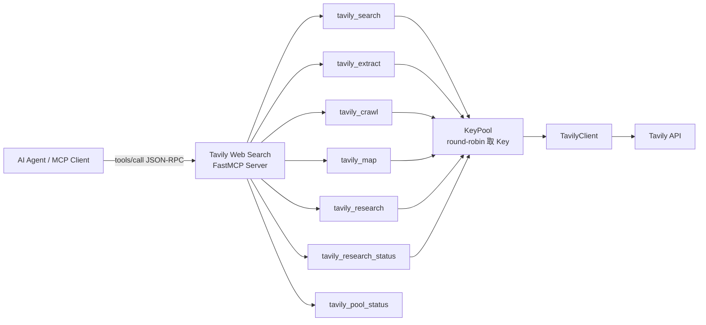
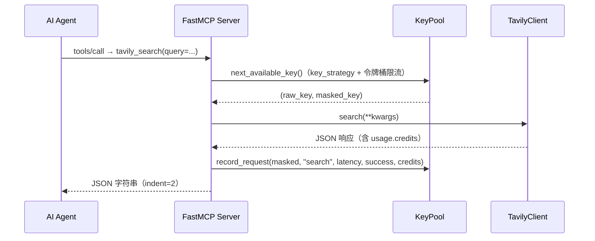

# MCP 工具集

<cite>来源：[mcp_server.py](file://app/mcp_server.py)</cite>

## 目录

- [概述](#概述)
- [工具总览](#工具总览)
- [tavily_search（网络搜索）](#tavily_search网络搜索)
- [tavily_extract（内容提取）](#tavily_extract内容提取)
- [tavily_crawl（网站爬取）](#tavily_crawl网站爬取)
- [tavily_map（站点地图）](#tavily_map站点地图)
- [tavily_research（深度研究）](#tavily_research深度研究)
- [tavily_research_status（任务状态查询）](#tavily_research_status任务状态查询)
- [tavily_pool_status（密钥池状态）](#tavily_pool_status密钥池状态)
- [MCP 协议调用方式](#mcp-协议调用方式)
- [公共行为与错误处理](#公共行为与错误处理)

## 概述

本服务是名为 **Tavily Web Search** 的 MCP Server，基于 `FastMCP` 框架构建，对外暴露 7 个工具，供 AI Agent 通过 MCP 协议发现和调用。所有工具均通过 Tavily Python SDK（`TavilyClient`）与 Tavily API 通信，API Key 由 KeyPool 统一托管，默认采用 round-robin 轮询策略选取。

```python
mcp = FastMCP(
    "Tavily Web Search",
    instructions="Use this server to search the web, extract content from URLs, "
                 "crawl websites, map site structures, and conduct AI-powered research.",
)
```

工具通过 `@mcp.tool()` 装饰器注册，函数名即 MCP 工具名。所有工具统一返回 `json.dumps(..., ensure_ascii=False, indent=2)` 序列化后的 JSON 字符串；调用失败时返回包含 `error` 与 `key_used` 字段的 JSON，便于在服务端追踪具体 Key 的问题。



## 工具总览

| MCP 工具名 | 功能 | 底层 TavilyClient 方法 | 耗时特征 |
|---|---|---|---|
| `tavily_search` | 网络搜索，返回带相关性评分的结构化结果 | `client.search()` | 秒级 |
| `tavily_extract` | 从 URL 提取纯净正文（支持 JS 渲染页面） | `client.extract()` | 秒级，每 URL 可设超时 |
| `tavily_crawl` | 从起始 URL 爬取多页面内容 | `client.crawl()` | 数十秒 |
| `tavily_map` | 快速发现站点 URL 结构，比爬取更快 | `client.map()` | 秒级 |
| `tavily_research` | AI 深度研究，生成带引用的综合报告 | `client.research()` | 30–120 秒 |
| `tavily_research_status` | 查询异步研究任务的状态与结果 | `client.get_research()` | 秒级 |
| `tavily_pool_status` | 查询 API Key 池状态与用量统计 | 无（直接读取 KeyPool） | 毫秒级 |

## tavily_search（网络搜索）

核心搜索工具，返回 LLM 优化的搜索结果（标题、正文片段、相关性评分、URL），支持 `general`、`news`、`finance` 三种主题以及时间范围过滤。

### 参数

| 参数 | 类型 | 默认值 | 说明 |
|---|---|---|---|
| `query` | str | 必填 | 搜索查询语句 |
| `search_depth` | str | `"basic"` | `basic`（1 积分）、`advanced`（2 积分）或低延迟档 `fast`/`ultra-fast`；advanced 返回更相关的来源 |
| `topic` | str | `"general"` | `general`、`news` 或 `finance` |
| `time_range` | str | `""` | `day`/`week`/`month`/`year` 或简写 `d`/`w`/`m`/`y` |
| `start_date` | str | `""` | `YYYY-MM-DD` 格式，返回该日期之后的结果 |
| `end_date` | str | `""` | `YYYY-MM-DD` 格式，返回该日期之前的结果 |
| `max_results` | int | `5` | 返回结果数量，范围 0–20 |
| `chunks_per_source` | int | `3` | 每个来源的最大内容块数（1–3），适用于 `advanced`/`basic`/`fast` 深度（官方 2026-07 起 basic 同样返回 reranked chunks） |
| `include_images` | bool | `False` | 结果中包含图片 |
| `include_image_descriptions` | bool | `False` | 附带图片描述 |
| `include_answer` | bool \| str | `False` | 生成 LLM 综合回答：`true`/`basic` 快速、`advanced` 更详细；字符串布尔（true/false/1/0/yes/no/on/off，任意大小写）自动归一化 |
| `include_raw_content` | bool \| str | `False` | 返回清洗后的 HTML/Markdown 原文：`true`/`markdown` 输出 Markdown、`text` 输出纯文本；字符串布尔自动归一化 |
| `include_domains` | list[str] | `None` | 限定搜索的域名列表（最多 300 个） |
| `exclude_domains` | list[str] | `None` | 排除的域名列表（最多 150 个） |
| `country` | str | `""` | 优先返回该国家的结果（仅 `topic=general` 时生效）。支持两位 ISO 码（`us`）或完整国家名（`united states`），自动归一化为官方完整国家名；池内 Key 格式要求不一致时自动切换格式并换 key 重试（客户端无需关心） |
| `exact_match` | bool | `False` | 仅返回包含精确短语的结果 |
| `include_favicon` | bool | `False` | 返回站点 favicon URL |
| `auto_parameters` | bool | `False` | 由 Tavily 根据查询意图自动调优参数 |
| `include_usage` | bool | `True` | 响应中包含积分用量（默认开启，便于追踪） |

### 底层实现

调用 `TavilyClient.search(**kwargs)`，并按需附加 `time_range`、`start_date`、`end_date`、`include_domains`、`exclude_domains`、`country` 等可选参数。积分直接取响应中的 `usage.credits`（`include_usage=True` 时返回，basic 1 / advanced 2），**不做估算**——响应缺失 usage 时标记 `usage_source='unknown'`（如 Research 系列），面板显示「—」而非「0」：

```python
resp = client.search(**kwargs)
credits, has_usage = _usage_credits(resp)   # (积分, 响应是否含 usage)
source = "response" if has_usage else "unknown"
```

### 返回示例

```json
{
  "query": "MCP 协议是什么",
  "results": [
    {
      "title": "Model Context Protocol — 官方文档",
      "url": "https://modelcontextprotocol.io/",
      "content": "MCP 是一种开放协议，用于连接 AI 模型与外部数据源……",
      "score": 0.982,
      "published_date": "2025-01-15"
    }
  ],
  "answer": "MCP（Model Context Protocol）是……",
  "usage": {
    "credits": 1
  }
}
```

> 提示：当 `include_answer=True` 时，响应中会附加 `answer` 字段；当 `include_images=True` 时，会附加 `images` 数组。

### 适用场景

- 需要实时、带来源引用的通用网络检索
- 新闻、财经主题的时效性查询（配合 `time_range`）
- 限定或排除特定域名的合规检索（`include_domains` / `exclude_domains`）

## tavily_extract（内容提取）

从 1–20 个 URL 中提取干净正文，支持 JavaScript 渲染页面。`format` 可选 `markdown` 或 `text`。

### 参数

| 参数 | 类型 | 默认值 | 说明 |
|---|---|---|---|
| `urls` | list[str] | 必填 | 要提取的 URL 列表（最多 20 个） |
| `extract_depth` | str | `"basic"` | `basic`（每 5 个 URL 消耗 1 积分）或 `advanced`（每 5 个 URL 消耗 2 积分） |
| `format` | str | `"markdown"` | `markdown` 或 `text` |
| `include_images` | bool | `False` | 提取页面内图片 |
| `include_favicon` | bool | `False` | 返回站点 favicon URL |
| `include_usage` | bool | `True` | 响应中包含积分用量 |
| `query` | str | `""` | 用户意图描述，用于对内容块重排序 |
| `chunks_per_source` | int | `3` | 每个来源的内容块数（1–5），**需配合 `query` 使用** |
| `timeout` | float | `30.0` | 每个 URL 的最大提取秒数（1–60） |

### 底层实现

调用 `TavilyClient.extract(**kwargs)`。`query` 仅在非空时写入参数，同时才会携带 `chunks_per_source`；`timeout` 为非空时传入：

```python
kwargs = {
    "urls": urls,
    "extract_depth": extract_depth,
    "format": format,
    "include_images": include_images,
    "include_favicon": include_favicon,
    "include_usage": include_usage,
}
if query:
    kwargs["query"] = query
    kwargs["chunks_per_source"] = chunks_per_source
if timeout:
    kwargs["timeout"] = timeout
```

### 返回示例

```json
{
  "results": [
    {
      "url": "https://example.com/article",
      "raw_content": "# 标题\n\n正文内容……",
      "images": []
    }
  ],
  "failed_results": [],
  "usage": {
    "credits": 1
  }
}
```

### 适用场景

- 对搜索结果中的页面做二次内容抽取
- 抓取动态渲染（JS）页面的正文
- 为 RAG 流水线提供干净的 Markdown 文本

## tavily_crawl（网站爬取）

从起始 URL 出发，沿链接逐层爬取多个页面并提取内容。与 `tavily_map` 相比，crawl 会实际抓取页面正文，而不仅是发现 URL。

### 参数

| 参数 | 类型 | 默认值 | 说明 |
|---|---|---|---|
| `url` | str | 必填 | 爬取的起始 URL |
| `max_depth` | int | `2` | 跟随链接的层级深度 |
| `limit` | int | `10` | 最大爬取页面数 |
| `instructions` | str | `""` | 自然语言指令，用于语义聚焦 |
| `chunks_per_source` | int | `3` | 每个来源的内容块数（1–5），**需配合 `instructions` 使用** |
| `include_images` | bool | `False` | 提取页面内图片 |
| `include_favicon` | bool | `False` | 返回 favicon URL |
| `include_usage` | bool | `True` | 响应中包含积分用量 |
| `select_paths` | list[str] | `None` | 正则表达式，仅爬取匹配的路径 |
| `exclude_paths` | list[str] | `None` | 正则表达式，排除匹配的路径 |
| `timeout` | float | `60.0` | 整个爬取过程的超时秒数（10–60） |

### 底层实现

调用 `TavilyClient.crawl(**kwargs)`。`instructions` 非空时才会附带 `chunks_per_source`；`select_paths` / `exclude_paths` 用于正则过滤，例如只爬取 `/docs` 下的文档页：

```python
resp = client.crawl(
    url="https://example.com",
    max_depth=2,
    limit=10,
    select_paths=["^/docs/.*"],
    exclude_paths=["^/login"],
)
```

### 返回示例

```json
{
  "url": "https://example.com",
  "pages_crawled": 8,
  "results": [
    {
      "url": "https://example.com/",
      "raw_content": "……"
    }
  ],
  "usage": {
    "credits": 40
  }
}
```

### 适用场景

- 整站文档、博客的内容采集
- 站点规模不大但需要逐页正文的场景
- 用 `select_paths`/`exclude_paths` 精确控制采集范围

## tavily_map（站点地图）

快速发现并列出站点内的 URL 结构，比爬取更轻量、更快。适合先探测站点布局，再决定对哪些页面执行 `tavily_extract`。

### 参数

| 参数 | 类型 | 默认值 | 说明 |
|---|---|---|---|
| `url` | str | 必填 | 起始 URL |
| `max_depth` | int | `2` | 探索的链接深度 |
| `limit` | int | `100` | 最多发现的 URL 数量 |
| `instructions` | str | `""` | 自然语言指令，过滤符合条件的页面 |
| `select_paths` | list[str] | `None` | 正则表达式，包含匹配的路径 |
| `exclude_paths` | list[str] | `None` | 正则表达式，排除匹配的路径 |
| `include_usage` | bool | `True` | 响应中包含积分用量 |
| `timeout` | float | `60.0` | 超时秒数（10–60） |

### 底层实现

调用 `TavilyClient.map(**kwargs)`，仅发现 URL，不抓取正文：

```python
resp = client.map(
    url="https://example.com",
    max_depth=2,
    limit=100,
)
```

### 返回示例

```json
{
  "url": "https://example.com",
  "urls": [
    "https://example.com/",
    "https://example.com/docs",
    "https://example.com/blog"
  ],
  "usage": {
    "credits": 1
  }
}
```

### 适用场景

- 爬虫任务前的站点结构探测
- 快速生成站点 URL 清单
- 与 `tavily_extract` 组合：先 map 后 extract，避免无差别爬取

## tavily_research（深度研究）

AI 驱动的深度研究工具：自动收集来源、交叉分析，并生成带引用的综合报告。耗时约 30–120 秒，适合复杂问题。

> **注意**：`tavily-python` 0.7.x 起，`research()` 改为**异步任务式 API**——`research(input=...)` 提交任务并返回 `request_id`，服务端内部轮询 `get_research(request_id)` 直到任务完成，最终返回带引用的报告。

### 参数

| 参数 | 类型 | 默认值 | 说明 |
|---|---|---|---|
| `input` | str | 必填 | 研究问题或主题 |
| `model` | str | `"auto"` | `auto`、`mini` 或 `pro`（更全面的分析） |
| `citation_format` | str | `"numbered"` | 引用格式：`numbered`、`mla`、`apa` 或 `chicago` |
| `include_domains` | list[str] | `None` | 来源域名的软性偏好（最多 20 个） |
| `exclude_domains` | list[str] | `None` | 硬性屏蔽的域名（最多 20 个） |
| `wait` | bool | `True` | `True`：等待报告完成并返回最终报告；`False`：提交后立即返回 `request_id`，配合 `tavily_research_status` 查询 |
| `timeout` | float | 按 model | 等待报告的最大秒数（总时长 deadline）。缺省按 `model` 计算：`mini`/`auto` 300s、`pro` 900s（对齐官方 mini 5min / pro 15min）。**下限保护（v0.9.1）**：显式传入值若低于模型默认（如客户端默认 120s），自动提升到默认值——research 生成报告通常需 1-5 分钟，过小的 timeout 会在完成前被掐断；提升时响应附带 `timeout_raised: {requested, applied, note}` 字段注明实际生效值 |
| `poll_interval` | float | `2.0` | 状态轮询间隔（秒） |
| `output_length` | str | `"standard"` | 报告长度：`short` / `standard` / `long`（v0.4.1） |
| `output_schema` | dict | `None` | JSON Schema 结构化输出：`content` 返回对象而非 Markdown，AI Agent 直接消费无需解析报告（v0.4.1）。流式 delta 为对象时直接返回；传非 dict 返回友好错误 |
| `max_sources` | int | `None` | 使用的来源数上限（3–10，越界返回友好错误） |
| `max_subsources` | int | `None` | 每个来源的子来源数上限（1–8，越界返回友好错误） |

> **会话 / 项目归属（v0.4.1）**：`config.json` 的 `mcp_human_id` / `mcp_project_id`（可选，面板「MCP 服务」设置页可配）经 SDK 原生参数转发 `X-Human-Id` / `X-Project-ID` 头，便于 Tavily 侧会话分析与按项目归类用量；留空则不发送。

> **配置热刷新（v0.7.0）**：`mcp_token`（Bearer 鉴权）、`mcp_default_parameters`（默认参数，面板「MCP 服务」设置页可配，含「推荐预设」按钮一键填入官方建议值）、`mcp_human_id` / `mcp_project_id` 与 `endpoint_rpm` 限流参数均支持**热刷新**——面板修改后约 1 秒内生效，**无需重启 MCP 子进程**。仅 `mcp_transport` / `mcp_host` / `mcp_port` 变更需重启（无法热绑定端口）。

> **流式超时（v0.4.0）**：`wait=true` 主路径走官方强制流式（`stream=true`）。三段式超时对齐官方 tavily-mcp——连接/头部 30s、单 chunk 读超时放宽到 300s（容忍报告生成阶段数分钟静默期）、整体 deadline 受 `timeout` 约束；流中途超时/读异常返回部分内容（`status=timeout/error`）并**不回退**重新提交（防重复任务双倍消耗），仅提交阶段失败才回退「提交 + 轮询」。

> **任务状态查询**：`wait=false` 提交后可用 `tavily_research_status(request_id)` 查询任务状态与结果。任务与提交时的 key 绑定（Tavily 任务按 key 隔离），状态查询优先使用同一 key，该 key 失效/耗尽时才回退轮询；key 映射持久化于 `data/research_keys.json`，MCP 服务重启后仍可查询。

### 底层实现

`wait=true`（默认）时以 SDK 原生流式（`stream=True`，官方 API 已强制流式）为主路径：直接消费 SSE 流按块组装报告，减少一次无效请求；流式失败时才回退「提交任务 + 轮询」（`research()` 提交拿到 `request_id`，再循环 `get_research()` 直到 `status` 为 `completed`，或失败/超时）。`wait=false` 时提交后立即返回 `request_id`：

```python
# wait=true 主路径（0.3.1+）：原生流式，逐块组装报告
gen = client.research(
    input="2025 年 AI Agent 发展趋势",
    model="pro",
    citation_format="numbered",
    include_domains=["arxiv.org", "openai.com"],
    stream=True,
)
# 服务端内部：解析 SSE data: 块，拼接 choices[0].delta.content

# 流式失败的回退路径：提交任务 → 轮询直到 status == "completed"
resp = client.research(input=..., model=..., citation_format=...)
request_id = resp["request_id"]
result = client.get_research(request_id)
```

### 返回示例

```json
{
  "request_id": "…",
  "status": "completed",
  "content": "……（引用 12 个来源的深度分析报告）",
  "sources": [
    {
      "title": "……",
      "url": "https://……"
    }
  ]
}
```

### 适用场景

- 需要多源交叉验证的复杂调研问题
- 生成带引用的研究报告或综述
- Agent 无法在单次搜索中完成的综合分析

> 注意：该工具耗时较长（30–120 秒），Agent 调用时应设置足够的超时，避免中断。

## tavily_research_status（任务状态查询）

查询之前 `tavily_research(wait=false)` 提交的研究任务状态与结果，入参为必填的 `request_id`，配合实现「提交 → 查询」两步式深度研究。

### 参数

| 参数 | 类型 | 默认值 | 说明 |
|---|---|---|---|
| `request_id` | str | 必填 | `tavily_research`（`wait=false`）返回的任务 ID |

### 底层实现

调用 `TavilyClient.get_research(request_id)`。Tavily 任务按 key 隔离，查询优先使用提交任务时的同一 Key，该 Key 失效/耗尽时才回退轮询取 Key（详见 [tavily_research](#tavily_research深度研究) 的任务状态说明）。返回响应含 `status`（`completed`/`failed`/`error`/`cancelled`）与任务结果。

## tavily_pool_status（密钥池状态）

无参数工具，直接读取 KeyPool 统计信息，返回活跃 Key 数量、各 Key 的用量、延迟与近期活动。适用于运维排查与健康检查。

```python
@mcp.tool()
async def tavily_pool_status() -> str:
    """Get API key pool status — active keys, usage stats, anomalies, aggregate capacity."""

    def _impl() -> str:
        stats = pool.get_stats()
        stats["aggregate"] = pool.get_aggregate()
        stats["anomalies"] = pool.detect_anomalies()
        return json.dumps(stats, ensure_ascii=False, indent=2)

    return await anyio.to_thread.run_sync(_impl)
```

返回内容由 `KeyPool.get_stats()` 提供，包括但不限于：Key 掩码、请求计数、成功率、累计积分、平均延迟等；并附加两项：

- `aggregate`（`get_aggregate()`）：全池聚合容量——总/活跃/耗尽 Key 数、总积分上限、已用总积分、剩余积分与用量占比；
- `anomalies`（`detect_anomalies()`）：异常 Key 摘要——额度耗尽/近耗尽、疑似泄露、高错误率、静默失效、延迟异常。

## MCP 协议调用方式

### 工具发现

AI Agent 可通过 `tools/list` 发现全部工具及其 JSON Schema 参数定义：

```json
{
  "jsonrpc": "2.0",
  "id": 1,
  "method": "tools/list",
  "params": {}
}
```

### 工具调用

通过 `tools/call` 发起调用，`name` 为工具名，`arguments` 为参数字典：

```json
{
  "jsonrpc": "2.0",
  "id": 2,
  "method": "tools/call",
  "params": {
    "name": "tavily_search",
    "arguments": {
      "query": "Tavily MCP Server",
      "search_depth": "advanced",
      "max_results": 5,
      "include_answer": true
    }
  }
}
```

### Python 客户端示例

```python
import asyncio
from mcp import ClientSession, StdioServerParameters
from mcp.client.stdio import stdio_client

async def main():
    server = StdioServerParameters(
        command="python",
        args=["mcp_server.py"],
    )
    async with stdio_client(server) as (read, write):
        async with ClientSession(read, write) as session:
            await session.initialize()

            # 列出所有工具
            tools = await session.list_tools()
            for tool in tools.tools:
                print(tool.name, tool.description)

            # 调用搜索工具
            result = await session.call_tool(
                "tavily_search",
                {"query": "MCP protocol", "max_results": 3},
            )
            print(result.content[0].text)

asyncio.run(main())
```

### 一次调用的完整时序



## 公共行为与错误处理

所有工具定义于 [mcp_server.py](file://app/mcp_server.py)，共享以下机制：

### Key 获取

每个工具调用开始时通过 `_get_client()` 从 KeyPool 取 Key，策略由 `config.json` 的 `key_strategy` 配置控制（`round-robin` 轮询 / `least-used` 最少使用，非法值回退默认轮询）：

```python
def _get_client() -> tuple[TavilyClient, str]:
    """取一个可用 key（未耗尽、未超限流）；全部受限时内部短暂等待。"""
    result = pool.next_available_key()
    if result is None:
        raise RuntimeError("No active API keys in pool. Add keys via CLI or dashboard.")
    raw, masked = result
    client = TavilyClient(raw)
    _apply_default_timeout(client)   # 注入默认 60s 超时，防止无限挂起
    return client, masked
```

- `round-robin`（默认）：`next_key()` 按 `last_used_at` 排序后轮询，仅取未停用、未耗尽且令牌充足的 Key
- `least-used`：`next_key_least_used()` 选取累计请求次数最少的 Key
- **令牌桶限流**：每个 Key 按 `rate_limit_rpm`（默认 90，官方 dev 100 RPM 留 10% 余量）限速，受限自动切换其他 Key；全部受限时等待最早可用时机（上限 `rate_limit_max_wait` 秒）
- **自动重试**：工具调用统一经 `_run_with_retry` 执行——`quota`（额度耗尽）/`auth`（认证失效）类错误自动换 Key 重试（最多 2 次）；`country` 参数格式不兼容（`Invalid country`）时自动在「完整国家名 ↔ 两位 ISO 码」间切换并换 Key 重试，客户端无需关心池内差异
- KeyPool 中没有任何可用 Key 时抛出 `RuntimeError`，该异常发生在工具内部的 `try/except` 之外，会直接冒泡到 MCP 调用层

### 用量记录

每个工具调用后通过 `_record()` 写入一条调用记录，供统计与健康检查使用：

```python
pool.record_request(masked, endpoint, latency, success, credits, error_msg)
```

记录的端点名分别为 `search`、`extract`、`crawl`、`map`、`research`；延迟以毫秒计。积分取响应中的 `usage.credits`（search/extract/crawl/map），Research 系列官方响应不含 usage，记为 `usage_source='unknown'`、积分 0，实际消耗以官方 `/usage` 对账。

### 错误返回格式

每个工具体内部使用 `try/except` 包裹 SDK 调用，捕获异常后返回统一结构，调用方可通过 `error` 字段判断失败原因、通过 `key_used` 定位具体 Key：

```json
{
  "error": "Tavily API returned 429 ...",
  "key_used": "tvly-****abcd"
}
```

### 与相邻主题的关系

- **Key 轮询与健康检查**：`_get_client()` 与 `_record()` 的行为由 KeyPool 实现，限流熔断、健康判定均在 KeyPool 内部完成
- **用量追踪与日志**：每次调用的积分、延迟、成功与否经 `_record()` 落库，`tavily_pool_status` 工具可直接读取这些统计数据