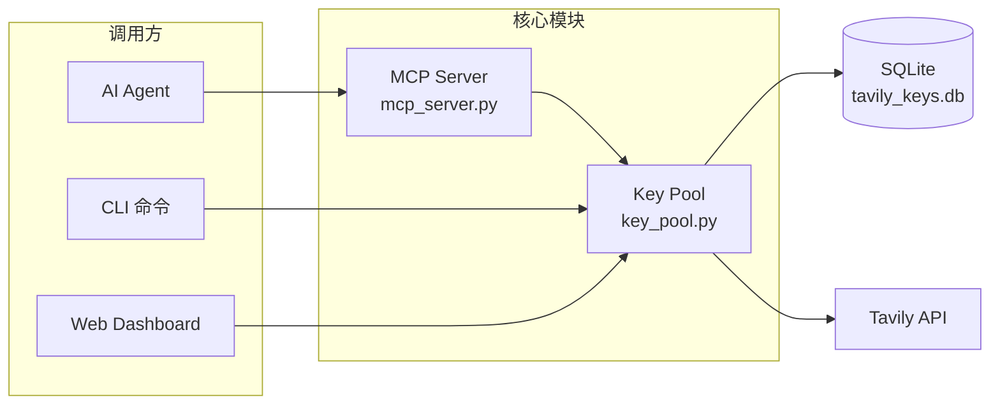
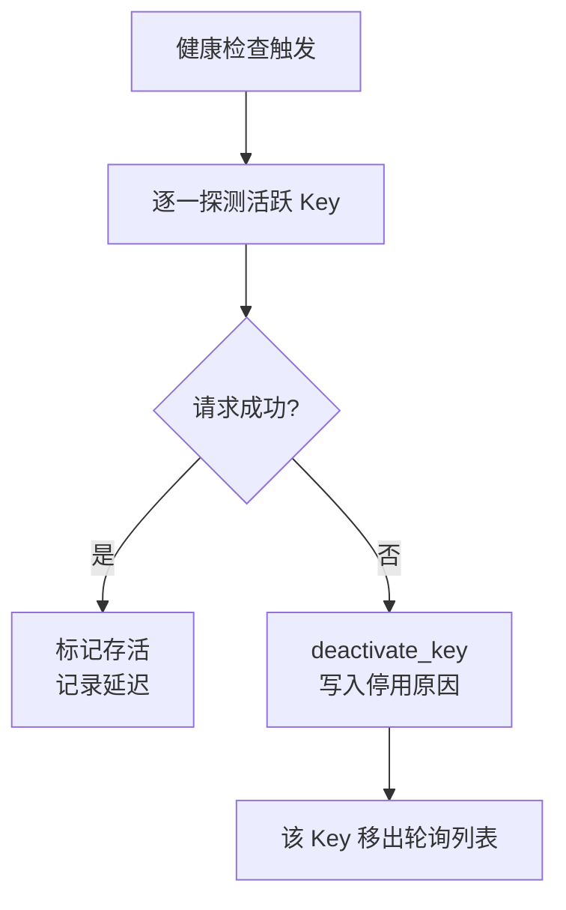
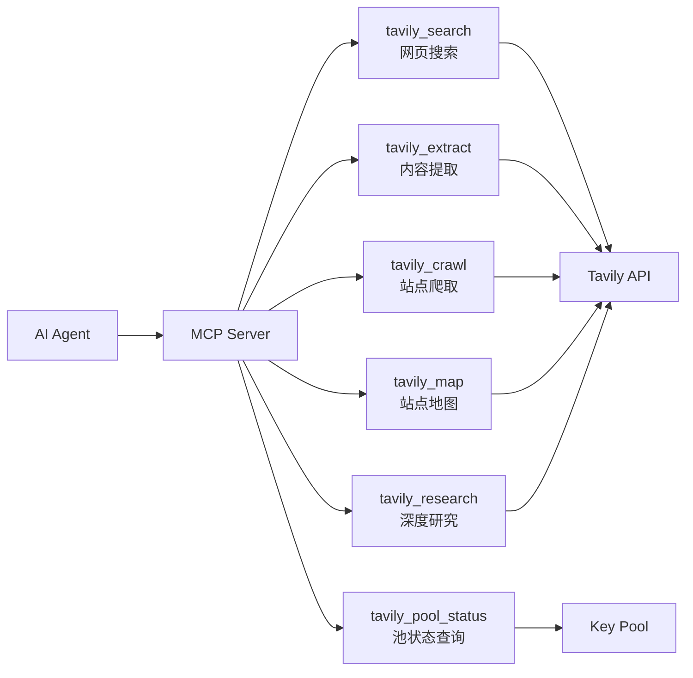

# 核心功能

> <cite>源码出处：<a href="file://app/key_pool.py">key_pool.py</a>（Key 池核心逻辑）、<a href="file://app/mcp_server.py">mcp_server.py</a>（MCP 服务与工具定义）、<a href="file://README.md">README.md</a>（使用说明）</cite>

## 目录

- [功能总览](#功能总览)
- [Key 自动轮询](#key-自动轮询)
- [失效自动停用](#失效自动停用)
- [用量统计](#用量统计)
- [请求日志](#请求日志)
- [MCP 工具集](#mcp-工具集)
- [数据存储](#数据存储)
- [功能触发方式速查](#功能触发方式速查)

## 功能总览

本项目围绕 **Tavily API Key 池** 构建，核心目标是通过多个 API Key 的自动轮询与健康管理，提升 Tavily 搜索服务的可用性、降低单 Key 额度耗尽的风险，并将这些能力以 MCP（Model Context Protocol）工具的形式开放给 AI Agent 调用。



主要功能模块：

| 功能 | 作用 | 关键位置 |
| ---- | ---- | -------- |
| Key 自动轮询 | 在多个活跃 Key 之间分发请求，避免单个 Key 过载 | <a href="file://app/key_pool.py">key_pool.py</a> 的 `next_key()` / `next_key_least_used()` |
| 失效自动停用 | 健康检查探测失败或请求报错时自动停用 Key | <a href="file://app/key_pool.py">key_pool.py</a> 的 `check_health()` |
| 用量统计 | 按 Key 统计请求数、错误数、额度消耗 | <a href="file://app/key_pool.py">key_pool.py</a> 的 `get_stats()` |
| 请求日志 | 记录每次请求的端点、耗时、是否成功 | <a href="file://app/key_pool.py">key_pool.py</a> 的 `record_request()` |
| MCP 工具集 | 对外提供搜索、提取、爬取、研究等工具 | <a href="file://app/mcp_server.py">mcp_server.py</a> 的 `@mcp.tool()` 函数 |

## Key 自动轮询

**作用**：当池中配置了多个 Tavily API Key 时，每次请求都会按策略选取一个活跃 Key，避免单个 Key 的额度被集中消耗。

**典型场景**：团队共享一组 Key；或单个 Key 有每日额度上限，需要分散流量。

支持两种轮询策略（在 <a href="file://app/mcp_server.py">mcp_server.py</a> 中通过 `KEY_STRATEGY` 切换）：

- `round-robin`（默认）：轮询所有活跃 Key，`next_key()` 按 `last_used_at` 排序后循环取用；
- `least-used`：`next_key_least_used()` 每次选择请求次数最少的 Key。

```python
# mcp_server.py — 每次工具调用前获取客户端和 Key
KEY_STRATEGY = "round-robin"  # 可选 "least-used"

def _get_client() -> tuple[TavilyClient, str]:
    if KEY_STRATEGY == "least-used":
        result = pool.next_key_least_used()
    else:
        result = pool.next_key()
    if result is None:
        raise RuntimeError("No active API keys in pool. Add keys via CLI or dashboard.")
    raw, masked = result
    return TavilyClient(raw), masked
```

池中没有活跃 Key 时会抛出错误，该错误在工具层被捕获，以 JSON 错误信息返回给调用方。

## 失效自动停用

**作用**：自动识别"死 Key"（额度耗尽、被封禁、网络异常等）并停用，避免后续请求继续打到失效的 Key 上。

**触发方式**：

1. **健康检查**：`check_health()` 对每个活跃 Key 发起一次轻量搜索探测。探测失败或返回空结果时，调用 `deactivate_key()` 停用该 Key，并写入停用原因。可通过 CLI 执行 `python app/cli.py health` 触发。
2. **请求失败记录**：每次工具调用失败都会通过 `record_request()` 累加 `error_count` 并写入 `last_error`，供健康检查与 Dashboard 展示。



健康检查由 <a href="file://app/key_pool.py">key_pool.py</a> 的 `check_health()` 实现，支持检查单个 Key（`check_health(key_masked)`）或全部活跃 Key（`check_health_all()`）。

## 用量统计

**作用**：按 Key 维度统计请求量、错误量、额度消耗，帮助判断是否需要补充 Key 或调整轮询策略。

**统计口径**（见 <a href="file://app/key_pool.py">key_pool.py</a> 的 `get_stats()`）：

- 单个 Key：`request_count`、`error_count`、`credits_used`、`credits_limit`、`usage_pct`（用量百分比）；
- 全局汇总：`total_keys`、`active_keys`、`total_requests`、`total_errors`、`total_credits`；
- 近 24 小时按端点（endpoint）汇总的成功 / 失败次数 `recent_24h`。

```python
# key_pool.py — 单个 Key 的用量占比
@property
def usage_pct(self) -> float:
    if self.credits_limit <= 0:
        return 0.0
    return (self.credits_used / self.credits_limit) * 100
```

每次请求成功后，Tavily 返回的 `usage.credits` 会通过 `record_request()` 累加到对应 Key 的 `credits_used` 上；若响应中未附带用量信息，则按搜索深度估算（basic 计 1 积分，advanced 计 2 积分）。

## 请求日志

**作用**：记录每一次请求的明细，便于排查问题、审计用量。

**日志字段**（`request_log` 表）：`key_masked`、`endpoint`、`credits_consumed`、`success`、`error_msg`、`latency_ms`、`created_at`。

每次工具调用（无论成败）都会写入一条日志，由 <a href="file://app/key_pool.py">key_pool.py</a> 的 `record_request()` 统一处理：

```python
# key_pool.py — 记录请求结果与用量
conn.execute(
    "UPDATE api_keys SET request_count=request_count+1, last_used_at=? WHERE masked=?",
    (now, masked),
)
if success:
    conn.execute(
        "UPDATE api_keys SET credits_used=credits_used+? WHERE masked=?",
        (credits, masked),
    )
else:
    conn.execute(
        "UPDATE api_keys SET error_count=error_count+1, last_error=? WHERE masked=?",
        (error_msg[:500], masked),
    )
conn.execute(
    "INSERT INTO request_log (key_masked, endpoint, credits_consumed, success, error_msg, latency_ms, created_at) VALUES (?,?,?,?,?,?,?)",
    (masked, endpoint, credits, 1 if success else 0, error_msg[:500], latency_ms, now),
)
conn.commit()
```

查看最近日志可使用 CLI：`python app/cli.py recent -n 20`，或通过 <a href="file://app/key_pool.py">key_pool.py</a> 的 `get_recent_logs(limit)` 直接读取。

## MCP 工具集

**作用**：通过 MCP 协议把 Tavily 的核心能力开放给 AI Agent。所有工具由 <a href="file://app/mcp_server.py">mcp_server.py</a> 定义，调用前后自动完成 Key 选取、请求记录与错误处理。



| 工具 | 功能 | 典型场景 |
| ---- | ---- | -------- |
| `tavily_search` | 网页搜索，支持 basic/advanced 深度、新闻/财经主题、时间过滤、域名白名单/黑名单等 | 资料检索、事实问答 |
| `tavily_extract` | 从 URL 提取干净内容，支持 JS 渲染页面 | 抓取单页文章、采集目标网页正文 |
| `tavily_crawl` | 从起始 URL 出发爬取多页内容，支持深度与数量限制 | 整站内容采集 |
| `tavily_map` | 发现并列出站点 URL 结构，比爬取更快 | 先摸清站点结构，再定点提取 |
| `tavily_research` | AI 深度研究，生成带引用的报告（耗时 30–120 秒） | 主题调研、报告生成 |
| `tavily_pool_status` | 返回 Key 池状态、用量统计与活跃 Key 数 | 排查池健康情况 |

所有工具遵循同一模式：获取客户端 → 调用 Tavily → 记录结果 → 返回 JSON 字符串。例如：

```python
# mcp_server.py — tavily_search 的核心调用流程
@mcp.tool()
def tavily_search(query: str, ...) -> str:
    t0 = time.time()
    client, masked = _get_client()
    try:
        resp = client.search(query=query, ...)
        credits = resp.get("usage", {}).get("credits", 0) if isinstance(resp, dict) else 0
        _record(masked, "search", t0, True, credits)
        return json.dumps(resp, ensure_ascii=False, indent=2)
    except Exception as e:
        _record(masked, "search", t0, False, 0, str(e))
        return json.dumps({"error": str(e), "key_used": masked})
```

## 数据存储

所有功能的状态均持久化在 SQLite 数据库 `tavily_keys.db` 中（路径由 <a href="file://app/key_pool.py">key_pool.py</a> 的 `DB_PATH` 定义），包含两张表：

| 表名 | 内容 | 对应功能 |
| ---- | ---- | -------- |
| `api_keys` | Key 列表、状态（`is_active`）、请求数、错误数、额度消耗 | 轮询、停用、用量统计 |
| `request_log` | 每次请求的日志明细 | 请求日志 |

删除数据库文件不影响功能，下次启动会自动重建空库（见 <a href="file://README.md">README.md</a>）。

## 功能触发方式速查

| 功能 | 触发方式 |
| ---- | -------- |
| Key 自动轮询 | 启动 MCP Server（`./scripts/run_mcp.sh`），工具调用自动轮询 |
| 失效自动停用 | `python app/cli.py health` 健康检查自动停用；请求失败自动记录 |
| 用量统计 | `python app/cli.py stats`；Dashboard 用量面板 |
| 请求日志 | `python app/cli.py recent -n 20`；Dashboard 日志页 |
| MCP 工具集 | AI Agent 通过 MCP 协议连接后调用 `tavily_*` 工具 |