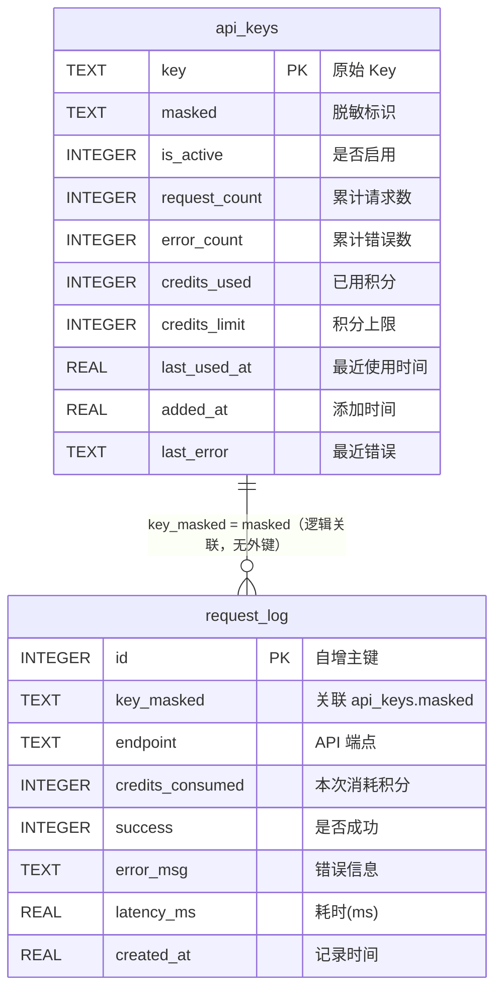
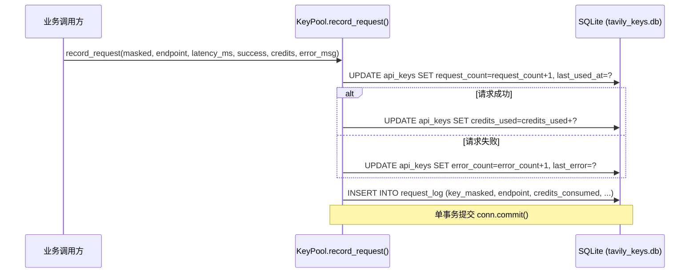
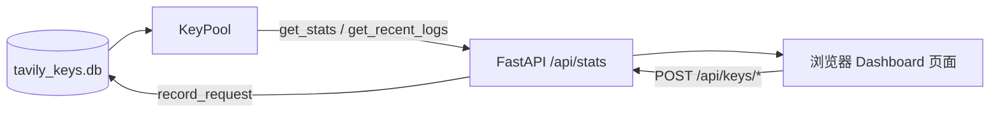

# 用量追踪与日志

> <cite>本文内容整理自以下源文件：[`key_pool.py`](file://app/key_pool.py) · [`cli.py`](file://app/cli.py) · [`dashboard.py`](file://app/dashboard.py)。</cite>

## 目录

- [概述](#概述)
- [数据存储结构](#数据存储结构)
  - [api_keys 表](#api_keys-表)
  - [request_log 表](#request_log-表)
- [请求记录机制](#请求记录机制)
- [CLI 查看统计](#cli-查看统计)
  - [stats 命令](#stats-命令)
  - [recent 命令](#recent-命令)
  - [list 命令](#list-命令)
- [Dashboard 查看统计](#dashboard-查看统计)
- [统计指标说明](#统计指标说明)

## 概述

本项目的用量追踪体系将每个 API Key 的使用情况完整落地到本地 SQLite 数据库 `tavily_keys.db`（路径定义于 [`key_pool.py`](file://app/key_pool.py) 的 `DB_PATH`）。整个体系分为两层：

- **聚合层**：`api_keys` 表按「一个 Key 一行」保存累计指标，包括请求次数、错误次数、积分消耗、积分上限、最近使用时间等。
- **明细层**：`request_log` 表按「一次请求一行」保存请求日志，包括端点、耗时、成功/失败状态、消耗积分等。

所有读写操作都经由 `KeyPool` 单例完成，CLI（[`cli.py`](file://app/cli.py)）与 Dashboard（[`dashboard.py`](file://app/dashboard.py)）自身不直接操作数据库，而是统一调用 `KeyPool.get_stats()` 与 `KeyPool.get_recent_logs()` 获取数据。

## 数据存储结构

两张表在 `KeyPool._init_db()` 中创建。建表 SQL：

```sql
CREATE TABLE IF NOT EXISTS api_keys (
    key TEXT PRIMARY KEY,
    masked TEXT NOT NULL,
    is_active INTEGER DEFAULT 1,
    request_count INTEGER DEFAULT 0,
    error_count INTEGER DEFAULT 0,
    credits_used INTEGER DEFAULT 0,
    credits_limit INTEGER DEFAULT 0,
    last_used_at REAL DEFAULT 0,
    added_at REAL NOT NULL,
    last_error TEXT DEFAULT ''
);

CREATE TABLE IF NOT EXISTS request_log (
    id INTEGER PRIMARY KEY AUTOINCREMENT,
    key_masked TEXT NOT NULL,
    endpoint TEXT NOT NULL,
    credits_consumed INTEGER DEFAULT 0,
    success INTEGER DEFAULT 1,
    error_msg TEXT DEFAULT '',
    latency_ms REAL DEFAULT 0,
    created_at REAL NOT NULL
);
```

### api_keys 表

| 字段 | 类型 | 默认值 | 说明 |
|---|---|---|---|
| `key` | TEXT | — | 原始 API Key，主键 |
| `masked` | TEXT | — | 脱敏后的 Key 标识，用于界面展示 |
| `is_active` | INTEGER | `1` | 是否启用（`1` 启用 / `0` 停用） |
| `request_count` | INTEGER | `0` | 累计请求次数 |
| `error_count` | INTEGER | `0` | 累计错误次数 |
| `credits_used` | INTEGER | `0` | 累计消耗积分 |
| `credits_limit` | INTEGER | `0` | 积分上限，`0` 表示未设置 |
| `last_used_at` | REAL | `0` | 最近一次使用时间（Unix 时间戳） |
| `added_at` | REAL | — | 添加时间（Unix 时间戳） |
| `last_error` | TEXT | `''` | 最近一次错误信息（截断至 500 字符） |

### request_log 表

| 字段 | 类型 | 默认值 | 说明 |
|---|---|---|---|
| `id` | INTEGER | AUTOINCREMENT | 自增主键 |
| `key_masked` | TEXT | — | 请求使用的 Key（脱敏标识），逻辑关联 `api_keys.masked` |
| `endpoint` | TEXT | — | 调用的 API 端点（如 `search`） |
| `credits_consumed` | INTEGER | `0` | 本次请求消耗的积分 |
| `success` | INTEGER | `1` | 是否成功（`1` 成功 / `0` 失败） |
| `error_msg` | TEXT | `''` | 错误信息（截断至 500 字符） |
| `latency_ms` | REAL | `0` | 请求耗时（毫秒） |
| `created_at` | REAL | — | 记录时间（Unix 时间戳） |

两张表之间没有声明数据库外键，`request_log.key_masked` 与 `api_keys.masked` 通过相同的脱敏字符串逻辑关联。



数据库以 WAL 模式运行（`PRAGMA journal_mode=WAL`），支持并发读写。Key 的脱敏规则定义在 `_mask()` 中：`tvly-` 前缀的 Key 保留前 12 位与后 4 位，其余 Key 保留前 4 位与后 4 位。

## 请求记录机制

每次 Tavily API 调用完成后，由 `KeyPool.record_request()` 在**单个事务**中同时完成聚合更新与明细插入。调用方式：

```python
pool.record_request(
    masked="tvly-abc12345****6789",
    endpoint="search",
    latency_ms=312.5,
    success=True,
    credits=1,
)
```

核心实现（[`key_pool.py`](file://app/key_pool.py)）：

```python
def record_request(self, masked: str, endpoint: str, latency_ms: float, success: bool,
                   credits: int = 0, error_msg: str = ""):
    now = time.time()
    conn = self._get_conn()
    conn.execute(
        "UPDATE api_keys SET request_count=request_count+1, last_used_at=? WHERE masked=?",
        (now, masked),
    )
    if success:
        conn.execute(
            "UPDATE api_keys SET credits_used=credits_used+? WHERE masked=?",
            (credits, masked),
        )
    else:
        conn.execute(
            "UPDATE api_keys SET error_count=error_count+1, last_error=? WHERE masked=?",
            (error_msg[:500], masked),
        )
    conn.execute(
        "INSERT INTO request_log (key_masked, endpoint, credits_consumed, success, error_msg, latency_ms, created_at) VALUES (?,?,?,?,?,?,?)",
        (masked, endpoint, credits, 1 if success else 0, error_msg[:500], latency_ms, now),
    )
    conn.commit()
```

记录时机与行为要点：

- 无论成功失败，`request_count` 都会 +1，`last_used_at` 都会刷新。
- **只有成功**才累加 `credits_used`；失败则累加 `error_count` 并覆盖 `last_error`。
- `request_log` 每次请求追加一条明细，`success` 以 `0/1` 整数存储。
- 错误信息统一截断为 500 字符，防止异常堆栈撑爆数据库。
- 所有写操作在一次 `commit()` 中完成，避免出现「汇总已更新但明细未写入」的中间状态。



## CLI 查看统计

[`cli.py`](file://app/cli.py) 提供 `stats`、`recent`、`list` 三个与用量查看相关的子命令。

### stats 命令

输出整个 Key Pool 的统计聚合，内部调用 `KeyPool.get_stats()`：

```bash
python app/cli.py stats
```

输出为 JSON 格式，包含全局汇总、每个 Key 的明细以及最近 24 小时的端点统计：

```json
{
  "keys": [
    {
      "masked": "tvly-abc12345****6789",
      "is_active": true,
      "request_count": 520,
      "error_count": 3,
      "credits_used": 400,
      "credits_limit": 1000,
      "usage_pct": 40.0,
      "last_used_at": 1736303530.0,
      "added_at": 1736000000.0,
      "last_error": ""
    }
  ],
  "total_keys": 3,
  "active_keys": 2,
  "total_requests": 1250,
  "total_errors": 12,
  "total_credits": 980,
  "recent_24h": {
    "search": {
      "success": 880,
      "failed": 8
    }
  }
}
```

其中 `recent_24h` 来自对 `request_log` 的聚合查询——筛选 `created_at > now - 86400` 的记录，按 `endpoint + success` 分组计数：

```sql
SELECT endpoint, success, COUNT(*) as cnt
FROM request_log
WHERE created_at > ?
GROUP BY endpoint, success
```

### recent 命令

查看最近的请求明细日志，内部调用 `KeyPool.get_recent_logs(limit)`，按时间倒序排列：

```bash
python app/cli.py recent            # 默认最近 20 条
python app/cli.py recent --limit 100
python app/cli.py recent -n 100     # 简短写法
```

输出示例：

```
=== Recent Requests (last 3) ===
  [01-08 14:32:10] OK search via tvly-abc12345****6789 (234.5ms)
  [01-08 14:31:55] FAIL search via tvly-abc12345****6789 (5001.0ms) | timeout
  [01-08 14:31:02] OK search via tvly-abc12345****6789 (189.3ms)
```

每条日志包含时间、成功/失败状态、端点、使用的 Key 脱敏标识、耗时，失败时还会显示错误信息（截断 60 字符）。

### list 命令

`list` 命令用于查看每个 Key 的累计用量摘要，内部调用 `KeyPool.list_keys()`：

```bash
python app/cli.py list              # 全部 Key
python app/cli.py list --active     # 仅活跃 Key
```

输出示例：

```
=== API Key Pool (ACTIVE) ===
  + tvly-abc12345****6789 | 520 reqs, 400 credits, last: 2025-01-08 14:32
  + tvly-xyz98765****4321 | 310 reqs, 250 credits, last: 2025-01-08 14:29
Total: 3 keys, 2 active
```

活跃 Key 以 `+` 标记，停用 Key 以 `-` 标记，并展示历史请求数、积分消耗与最近使用时间；若有错误，还会打印最近一次错误信息。

## Dashboard 查看统计

[`dashboard.py`](file://app/dashboard.py) 基于 FastAPI 提供 Web 可视化页面：

```bash
python dashboard.py
# 打开 http://127.0.0.1:8000
```

页面前端模板由 `templates/dashboard.html` 渲染，数据通过以下接口获取：

| 接口 | 说明 |
|---|---|
| `GET /` | 返回 Dashboard 页面 |
| `GET /api/stats` | 返回 `get_stats()` 结果，并附加 `logs` 字段（最近 50 条 `request_log`） |
| `POST /api/health` | 触发健康检查，自动停用失效 Key |
| `POST /api/keys/add`、`remove`、`activate`、`deactivate` | Key 的增删改操作 |
| `GET/POST /api/settings` | 读取 / 保存部署设置（mode/domain/host/port/auth_token） |

数据流如下：



`/api/stats` 响应结构为 `stats` 对象内直接附加 `logs` 列表：

```json
{
  "total_keys": 3,
  "active_keys": 2,
  "total_requests": 1250,
  "total_errors": 12,
  "total_credits": 980,
  "recent_24h": { "search": { "success": 880, "failed": 8 } },
  "keys": [
    {
      "masked": "tvly-abc12345****6789",
      "is_active": true,
      "request_count": 520,
      "error_count": 3,
      "credits_used": 400,
      "credits_limit": 1000,
      "usage_pct": 40.0,
      "last_used_at": 1736303530.0,
      "added_at": 1736000000.0,
      "last_error": ""
    }
  ],
  "logs": [
    {
      "id": 1250,
      "key_masked": "tvly-abc12345****6789",
      "endpoint": "search",
      "credits_consumed": 1,
      "success": 1,
      "error_msg": "",
      "latency_ms": 234.5,
      "created_at": 1736303530.0
    }
  ]
}
```

Dashboard 页面据此展示：Key 总数与活跃数、累计请求/错误/积分汇总、每个 Key 的状态与用量百分比（`usage_pct`）、最近 24 小时各端点的成功/失败计数，以及最近 50 条请求日志列表。

## 统计指标说明

| 指标 | 数据来源 | 含义 |
|---|---|---|
| `request_count` | `api_keys.request_count` | Key 的累计请求次数，成功与失败均计入 |
| `error_count` | `api_keys.error_count` | 累计失败次数，仅失败时 +1 |
| `credits_used` | `api_keys.credits_used` | 累计消耗积分，仅成功时累加 |
| `credits_limit` | `api_keys.credits_limit` | 积分上限，`0` 表示未设置 |
| `usage_pct` | 计算属性 | `credits_used / credits_limit × 100`；上限为 `0` 时固定返回 `0.0` |
| `recent_24h` | `request_log` 聚合 | 最近 24 小时内各端点成功/失败次数 |
| `latency_ms` | `request_log.latency_ms` | 单次请求耗时（毫秒），由调用方在请求完成后传入 |
| `last_used_at` | `api_keys.last_used_at` | 最近一次请求的 Unix 时间戳 |
| `last_error` | `api_keys.last_error` | 最近一次失败的错误信息（500 字符内） |

补充说明：

- **删除 Key 不会清理明细日志**：`remove_key()` 只删除 `api_keys` 中的对应行，`request_log` 中的历史记录不受影响，可用于事后审计。
- 时间字段全部以 Unix 时间戳（`time.time()`）存储，CLI 展示时再转换为本地时间格式。
- `request_log` 无清理机制，长期运行后日志量会持续增长，可按需自行归档或清理。
