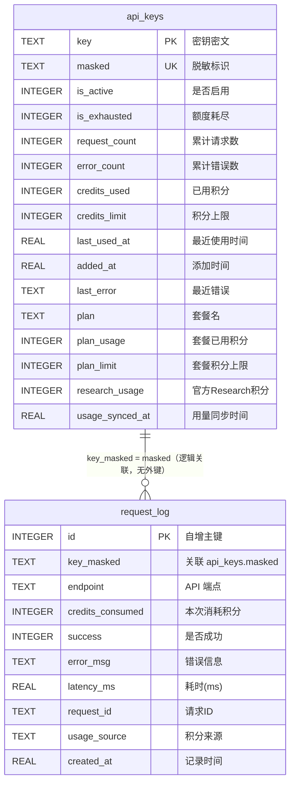
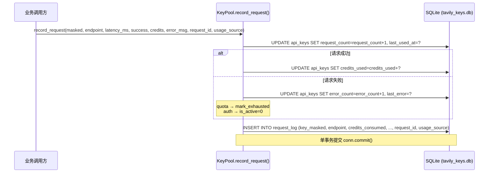
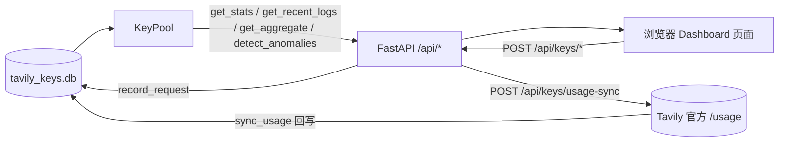

# 用量追踪与日志

> <cite>本文内容整理自以下源文件：[`key_pool.py`](file://app/key_pool.py) · [`cli.py`](file://app/cli.py) · [`dashboard.py`](file://app/dashboard.py)。</cite>

## 目录

- [概述](#概述)
- [数据存储结构](#数据存储结构)
  - [api_keys 表](#api_keys-表)
  - [request_log 表](#request_log-表)
- [请求记录机制](#请求记录机制)
  - [积分来源与计数规则](#积分来源与计数规则)
- [CLI 查看统计](#cli-查看统计)
  - [stats 命令](#stats-命令)
  - [recent 命令](#recent-命令)
  - [list 命令](#list-命令)
  - [usage 命令](#usage-命令)
  - [audit 命令](#audit-命令)
- [Dashboard 查看统计](#dashboard-查看统计)
- [统计指标说明](#统计指标说明)

## 概述

本项目的用量追踪体系将每个 API Key 的使用情况完整落地到本地 SQLite 数据库 `tavily_keys.db`（路径定义于 [`key_pool.py`](file://app/key_pool.py) 的 `DB_PATH`），并与 Tavily 官方 `/usage` 接口对账。整个体系分为三层：

- **聚合层**：`api_keys` 表按「一个 Key 一行」保存累计指标，包括请求次数、错误次数、积分消耗、积分上限、官方套餐用量（`plan` / `plan_usage` / `plan_limit`）、Research 积分（`research_usage`）、官方用量同步时间等。
- **明细层**：`request_log` 表按「一次请求一行」保存请求日志，包括端点、耗时、成功/失败状态、消耗积分、`request_id` 与积分来源 `usage_source` 等。
- **官方对账层**：通过 Tavily 官方 `/usage` 同步 billing cycle 真实用量（CLI `usage` 命令或面板「同步用量」按钮），供仪表盘展示、月度重置自动恢复与异常识别（泄露/耗尽）对账。

所有读写操作都经由 `KeyPool` 单例完成，CLI（[`cli.py`](file://app/cli.py)）与 Dashboard（[`dashboard.py`](file://app/dashboard.py)）自身不直接操作数据库，而是统一调用 `KeyPool.get_stats()`、`KeyPool.get_recent_logs()`、`KeyPool.sync_usage()` 等获取数据。

## 数据存储结构

两张表在 `KeyPool._init_db()` 中创建。建表 SQL：

```sql
CREATE TABLE IF NOT EXISTS api_keys (
    key TEXT PRIMARY KEY,
    masked TEXT NOT NULL,
    is_active INTEGER DEFAULT 1,
    is_exhausted INTEGER DEFAULT 0,
    request_count INTEGER DEFAULT 0,
    error_count INTEGER DEFAULT 0,
    credits_used INTEGER DEFAULT 0,
    credits_limit INTEGER DEFAULT 0,
    last_used_at REAL DEFAULT 0,
    added_at REAL NOT NULL,
    last_error TEXT DEFAULT '',
    plan TEXT DEFAULT '',
    plan_usage INTEGER DEFAULT 0,
    plan_limit INTEGER DEFAULT 0,
    research_usage INTEGER DEFAULT 0,
    usage_synced_at REAL DEFAULT 0
);

CREATE TABLE IF NOT EXISTS request_log (
    id INTEGER PRIMARY KEY AUTOINCREMENT,
    key_masked TEXT NOT NULL,
    endpoint TEXT NOT NULL,
    credits_consumed INTEGER DEFAULT 0,
    success INTEGER DEFAULT 1,
    error_msg TEXT DEFAULT '',
    latency_ms REAL DEFAULT 0,
    request_id TEXT DEFAULT '',
    usage_source TEXT DEFAULT '',
    created_at REAL NOT NULL
);
```

> 建表后还会执行 `_ensure_columns()` 自动迁移：用 `PRAGMA table_info` 检查旧库缺失的列并 `ALTER TABLE ADD COLUMN` 补齐（幂等，重复启动不报错），旧库无需手工迁移。另创建 `idx_api_keys_masked` 唯一索引作为 Key 重复检测兜底。

### api_keys 表

| 字段 | 类型 | 默认值 | 说明 |
|---|---|---|---|
| `key` | TEXT | — | API Key 的密文（加密存储，同一 Key 每次密文不同），主键 |
| `masked` | TEXT | — | 脱敏后的 Key 标识，用于界面展示，唯一索引兜底重复检测 |
| `is_active` | INTEGER | `1` | 是否启用（`1` 启用 / `0` 停用） |
| `is_exhausted` | INTEGER | `0` | 额度耗尽标记（官方 432/433 触发），`1` 时移出轮询，月度重置后自动恢复 |
| `request_count` | INTEGER | `0` | 累计请求次数 |
| `error_count` | INTEGER | `0` | 累计错误次数 |
| `credits_used` | INTEGER | `0` | 累计消耗积分（本地累计；同步官方后为官方 billing cycle 用量） |
| `credits_limit` | INTEGER | `0` | 积分上限，`0` 表示未设置（同步后为官方 limit，null 时回退套餐额度） |
| `last_used_at` | REAL | `0` | 最近一次使用时间（Unix 时间戳） |
| `added_at` | REAL | — | 添加时间（Unix 时间戳） |
| `last_error` | TEXT | `''` | 最近一次错误信息（截断至 500 字符） |
| `plan` | TEXT | `''` | 官方账户当前套餐名（`account.current_plan`） |
| `plan_usage` | INTEGER | `0` | 套餐周期内已用积分（`account.plan_usage`） |
| `plan_limit` | INTEGER | `0` | 套餐积分上限（`account.plan_limit`） |
| `research_usage` | INTEGER | `0` | 官方 Research 积分消耗（`key.research_usage`），供 suspected_leak 对账扣除 |
| `usage_synced_at` | REAL | `0` | 最近一次成功同步官方 `/usage` 的时间（Unix 时间戳） |

### request_log 表

| 字段 | 类型 | 默认值 | 说明 |
|---|---|---|---|
| `id` | INTEGER | AUTOINCREMENT | 自增主键 |
| `key_masked` | TEXT | — | 请求使用的 Key（脱敏标识），逻辑关联 `api_keys.masked` |
| `endpoint` | TEXT | — | 调用的 API 端点（如 `search`、`extract`、`research`） |
| `credits_consumed` | INTEGER | `0` | 本次请求消耗的积分（响应 `usage.credits` 回写；`unknown`/`none` 时为 `0`） |
| `success` | INTEGER | `1` | 是否成功（`1` 成功 / `0` 失败） |
| `error_msg` | TEXT | `''` | 错误信息（截断至 500 字符） |
| `latency_ms` | REAL | `0` | 请求耗时（毫秒） |
| `request_id` | TEXT | `''` | Tavily 请求 ID（截断至 200 字符），用于问题定位；Research 任务可凭此轮询结果 |
| `usage_source` | TEXT | `''` | 积分来源标记（截断至 20 字符）：`response` / `unknown` / `none`（见[积分来源与计数规则](#积分来源与计数规则)） |
| `created_at` | REAL | — | 记录时间（Unix 时间戳） |

`usage_source` 三值语义：

| 值 | 含义 | 典型场景 |
|---|---|---|
| `response` | 响应含 `usage` 字段，`credits_consumed` 为官方实际消耗 | search / extract / crawl / map（默认 `include_usage=True`） |
| `unknown` | 响应不含 `usage`，本地记 `0`，实际消耗以官方 `/usage` 的 `research_usage` 为准 | Research 系列（research / research-status） |
| `none` | 请求失败，无消耗 | 任意端点失败 |

两张表之间没有声明数据库外键，`request_log.key_masked` 与 `api_keys.masked` 通过相同的脱敏字符串逻辑关联。



数据库以 WAL 模式运行（`PRAGMA journal_mode=WAL`），支持并发读写。Key 的脱敏规则定义在 `_mask()` 中：`tvly-` 前缀的 Key 保留前 12 位与后 4 位，其余 Key 保留前 4 位与后 4 位。

## 请求记录机制

每次 Tavily API 调用完成后，由 `KeyPool.record_request()` 在**单个事务**中同时完成聚合更新与明细插入。调用方式（v0.3.2 起含 `request_id` 与 `usage_source` 参数）：

```python
pool.record_request(
    masked="tvly-abc12345****6789",
    endpoint="search",
    latency_ms=312.5,
    success=True,
    credits=1,
    request_id="f47ac10b-58cc-4372-a567-0e02b2c3d479",
    usage_source="response",  # response / unknown / none
)
```

核心实现（[`key_pool.py`](file://app/key_pool.py)）：

```python
def record_request(self, masked: str, endpoint: str, latency_ms: float, success: bool,
                   credits: int = 0, error_msg: str = "", request_id: str = "",
                   usage_source: str = ""):
    """记录一次请求。usage_source：response/unknown/none（见 request_log 表注释）。"""
    now = time.time()
    conn = self._get_conn()
    conn.execute(
        "UPDATE api_keys SET request_count=request_count+1, last_used_at=? WHERE masked=?",
        (now, masked),
    )
    if success:
        conn.execute(
            "UPDATE api_keys SET credits_used=credits_used+? WHERE masked=?",
            (credits, masked),
        )
    else:
        conn.execute(
            "UPDATE api_keys SET error_count=error_count+1, last_error=? WHERE masked=?",
            (error_msg[:500], masked),
        )
        cat = _classify_error(error_msg)
        if cat == "quota":
            # 额度耗尽：移出轮询（月度重置后自动恢复），请求层已自动切换其他 key
            self.mark_exhausted(masked, f"quota: {error_msg[:200]}")
        elif cat == "auth":
            conn.execute("UPDATE api_keys SET is_active=0 WHERE masked=?", (masked,))
    conn.execute(
        "INSERT INTO request_log (key_masked, endpoint, credits_consumed, success, error_msg, latency_ms, request_id, usage_source, created_at) VALUES (?,?,?,?,?,?,?,?,?)",
        (masked, endpoint, credits, 1 if success else 0, error_msg[:500], latency_ms, request_id[:200], usage_source[:20], now),
    )
    conn.commit()
```

记录时机与行为要点：

- 无论成功失败，`request_count` 都会 +1，`last_used_at` 都会刷新。
- **只有成功**才累加 `credits_used`；失败则累加 `error_count` 并覆盖 `last_error`。
- 失败请求按 `_classify_error()` 分类处置：`quota`（432/433 等）→ `mark_exhausted` 写入 `is_exhausted=1` 移出轮询（月度重置后自动恢复）；`auth`（401/403 等）→ 直接停用（`is_active=0`）；`rate`/`other` 仅记录错误计数。
- `request_log` 每次请求追加一条明细，`success` 以 `0/1` 整数存储；`request_id` 截断 200 字符、`usage_source` 截断 20 字符。
- 错误信息统一截断为 500 字符，防止异常堆栈撑爆数据库。
- 所有写操作在一次 `commit()` 中完成，避免出现「汇总已更新但明细未写入」的中间状态。

### 积分来源与计数规则

`usage_source` 由 MCP Server（[`mcp_server.py`](file://app/mcp_server.py) 的 `_record()`）在调用完成后判定并传入：

- **search / extract / crawl / map**：默认 `include_usage=True`，官方响应携带 `usage` 字段，取 `usage.credits` 作为消耗并标记 `response`；
- **Research 系列**（`research`、`research-status`）：官方响应不含 `usage`（`_usage_credits()` 返回 `has_usage=False`），本地记 `0` 并标记 `unknown`，真实消耗只存在于官方 `/usage` 的 `research_usage` 字段（`usage --sync` 后可见）；
- **失败请求**：标记 `none`，积分为 `0`。

积分计数规则（Tavily 官方计费，响应 `usage.credits` 直接回写，未达下限时官方返回 `0` 属正常、不是 bug）：

| 端点 | 计费规则 |
|---|---|
| `search` | `basic` 1 积分 / 次；`advanced` 2 积分 / 次 |
| `extract` | 每 5 个成功 URL 计 1 积分（`basic`）；`advanced` 每 5 个 URL 计 2 积分 |
| `crawl` / `map` | 每 10 页计 1 积分；提供 `instructions` 时翻倍为每 10 页计 2 积分（等价每 5 页 1 积分） |
| `research` | 官方响应无 usage，本地恒记 0，以官方 `research_usage` 为准 |

「本地记录 vs 官方用量」对账（`detect_anomalies()` 的 `suspected_leak` 判定）会**排除** `unknown` 记录：`_local_credits()` 只统计 `success=1 AND usage_source != 'unknown'` 的本地请求，并先从官方用量中扣除 `research_usage` 再比较，避免正常使用 Research 导致本地累计系统性偏低而被误判为泄露。



## CLI 查看统计

[`cli.py`](file://app/cli.py) 提供 `stats`、`recent`、`list`、`usage`、`audit` 五个与用量查看/审计相关的子命令。

### stats 命令

输出整个 Key Pool 的统计聚合，内部调用 `KeyPool.get_stats()`：

```bash
python app/cli.py stats
```

输出为 JSON 格式，包含全局汇总、每个 Key 的明细以及最近 24 小时的端点统计：

```json
{
  "keys": [
    {
      "masked": "tvly-abc12345****6789",
      "is_active": true,
      "is_exhausted": false,
      "request_count": 520,
      "error_count": 3,
      "credits_used": 400,
      "credits_limit": 1000,
      "usage_pct": 40.0,
      "last_used_at": 1736303530.0,
      "added_at": 1736000000.0,
      "last_error": "",
      "plan": "free",
      "plan_usage": 400,
      "plan_limit": 1000,
      "research_usage": 0,
      "usage_synced_at": 1736303530.0
    }
  ],
  "total_keys": 3,
  "active_keys": 2,
  "total_requests": 1250,
  "total_errors": 12,
  "total_credits": 980,
  "recent_24h": {
    "search": {
      "success": 880,
      "failed": 8
    }
  }
}
```

其中 `recent_24h` 来自对 `request_log` 的聚合查询——筛选 `created_at > now - 86400` 的记录，按 `endpoint + success` 分组计数：

```sql
SELECT endpoint, success, COUNT(*) as cnt
FROM request_log
WHERE created_at > ?
GROUP BY endpoint, success
```

### recent 命令

查看最近的请求明细日志，内部调用 `KeyPool.get_recent_logs(limit)`，按时间倒序排列：

```bash
python app/cli.py recent            # 默认最近 20 条
python app/cli.py recent --limit 100
python app/cli.py recent -n 100     # 简短写法
```

输出示例：

```
=== Recent Requests (last 3) ===
  [01-08 14:32:10] OK search via tvly-abc12345****6789 (234.5ms)
  [01-08 14:31:55] FAIL search via tvly-abc12345****6789 (5001.0ms) | timeout
  [01-08 14:31:02] OK search via tvly-abc12345****6789 (189.3ms)
```

每条日志包含时间、成功/失败状态、端点、使用的 Key 脱敏标识、耗时，失败时还会显示错误信息（截断 60 字符）。

### list 命令

`list` 命令用于查看每个 Key 的累计用量摘要，内部调用 `KeyPool.list_keys()`：

```bash
python app/cli.py list              # 全部 Key
python app/cli.py list --active     # 仅活跃 Key
```

输出示例：

```
=== API Key Pool (ACTIVE) ===
  + tvly-abc12345****6789 | 520 reqs, 400 credits, last: 2025-01-08 14:32
  + tvly-xyz98765****4321 | 310 reqs, 250 credits, last: 2025-01-08 14:29
Total: 3 keys, 2 active
```

活跃 Key 以 `+` 标记，停用 Key 以 `-` 标记，并展示历史请求数、积分消耗与最近使用时间；若有错误，还会打印最近一次错误信息。

### usage 命令

查看或同步每个 Key 的官方账单周期（billing cycle）用量，内部调用 `KeyPool.sync_usage()`：

```bash
python app/cli.py usage               # 展示本地已同步的官方用量
python app/cli.py usage --sync        # 先调用官方 /usage 同步，再展示
python app/cli.py usage --sync --json # 同步并输出原始 JSON 结果
```

不传 `--sync` 时只展示本地已有的同步数据（未同步过的 Key 提示先 `--sync`）：

```
Aggregate: 2 active / 3 total, used 650 / 2000 credits, remaining 1350
  tvly-abc12345****6789: 400/1000 (40.0%) plan=free
  tvly-xyz98765****4321: 250/1000 (25.0%) plan=free
```

传 `--sync` 时先请求 Tavily 官方 `/usage` 更新各 Key 的真实用量，再逐 Key 打印（含各端点明细与套餐）；`--json` 则输出同步结果的原始 JSON：

```
Synced 3/3 key(s).
  tvly-abc12345****6789: 400/1000 credits (search=350 extract=30 crawl=10 map=10 research=0) plan=free
```

同步要点：

- 同步成功会把 `credits_used` / `credits_limit` 更新为官方值，并写入 `plan` / `plan_usage` / `plan_limit` / `research_usage` / `usage_synced_at`；
- Key 自身无限额（官方返回 `limit=null`）时回退账户套餐额度 `plan_limit` 作为上限；
- 检测到「额度耗尽 Key 的 usage 归零/低于 limit」（月度重置）时自动恢复并标记 `[recovered]`；
- 同一 Key 短时间重复同步命中 TTL 缓存（配置 `usage_cache_ttl`，默认 60 秒）直接返回上次结果，避免触发官方限流。

### audit 命令

列出结合本地调用记录与官方用量的异常 Key，内部调用 `KeyPool.detect_anomalies()`：

```bash
python app/cli.py audit
```

输出示例：

```
Found 1 anomalous key(s):
  tvly-abc12345****6789 [suspected_leak]
      - 官方用量比本地记录多 ≥50 积分（已扣除官方 research 0），疑似被外部使用
```

异常类型（阈值见 `config.json` 的 `anomaly_thresholds`）：

| 标记 | 判定 |
|---|---|
| `exhausted` | 官方额度已耗尽（已触发 432） |
| `near_exhausted` | 官方用量占比 ≥ 90% |
| `suspected_leak` | 官方用量（扣除 `research_usage` 与本地 `unknown` 记录）比本地可对账积分多 ≥ `leak_diff_credits` |
| `high_error_rate` | 近 24h 错误率 > `error_rate` |
| `stale` | active 但近 `stale_days` 天无本地调用 |
| `slow` | 近 24h 平均延迟 > 池内均值 × `slow_ratio` |

## Dashboard 查看统计

[`dashboard.py`](file://app/dashboard.py) 基于 FastAPI 提供 Web 可视化页面：

```bash
python dashboard.py
# 打开 http://127.0.0.1:8000
```

页面前端模板由 `app/dashboard.html` 渲染（开发时为源码目录，打包后从资源目录读取），数据通过以下接口获取：

| 接口 | 说明 |
|---|---|
| `GET /` | 返回 Dashboard 页面 |
| `GET /api/stats` | 返回 `get_stats()` 结果，并附加 `logs` 字段（最近 50 条 `request_log`）、`aggregate`（全池聚合容量）与 `anomalies`（异常 Key 列表） |
| `POST /api/health` | 触发全部 active Key 健康检查，自动停用失效 Key |
| `POST /api/health/one` | 单个 Key 健康检查（面板逐个进度展示） |
| `POST /api/keys/add`、`remove`、`activate`、`deactivate` | Key 的增删改操作 |
| `POST /api/keys/usage-sync` | 从官方 `/usage` 同步所有 active Key 的用量（`sync_usage()`） |
| `POST /api/keys/usage-sync/one` | 同步单个 Key 的用量（`sync_usage_one()`） |
| `GET /api/keys/anomalies` | 返回异常 Key 列表（`detect_anomalies()`） |
| `GET /api/usage/aggregate` | 返回全池聚合容量（`get_aggregate()`） |
| `GET /api/usage/trend` | 按天聚合用量趋势（`get_usage_trend(days)`，本地时区） |
| `GET /api/logs` | 筛选请求日志（endpoint / key / 状态 / 时间范围 + 分页，`query_logs(...)`） |
| `GET /api/logs/export.csv` | 按筛选导出请求日志为 CSV |
| `GET/POST /api/settings` | 读取 / 保存部署设置（mode/domain/host/port/auth_token） |

数据流如下：



`/api/stats` 响应结构为 `stats` 对象内直接附加 `logs`、`aggregate`、`anomalies` 列表：

```json
{
  "total_keys": 3,
  "active_keys": 2,
  "total_requests": 1250,
  "total_errors": 12,
  "total_credits": 980,
  "recent_24h": { "search": { "success": 880, "failed": 8 } },
  "keys": [
    {
      "masked": "tvly-abc12345****6789",
      "is_active": true,
      "is_exhausted": false,
      "request_count": 520,
      "error_count": 3,
      "credits_used": 400,
      "credits_limit": 1000,
      "usage_pct": 40.0,
      "last_used_at": 1736303530.0,
      "added_at": 1736000000.0,
      "last_error": "",
      "plan": "free",
      "plan_usage": 400,
      "plan_limit": 1000,
      "research_usage": 0,
      "usage_synced_at": 1736303530.0
    }
  ],
  "logs": [
    {
      "id": 1250,
      "key_masked": "tvly-abc12345****6789",
      "endpoint": "search",
      "credits_consumed": 1,
      "success": 1,
      "error_msg": "",
      "latency_ms": 234.5,
      "request_id": "f47ac10b-58cc-4372-a567-0e02b2c3d479",
      "usage_source": "response",
      "created_at": 1736303530.0
    }
  ],
  "aggregate": {
    "total_keys": 3,
    "active_keys": 2,
    "exhausted_count": 0,
    "total_limit": 3000,
    "total_used": 980,
    "remaining": 2020,
    "usage_pct": 32.7
  },
  "anomalies": []
}
```

Dashboard 页面据此展示：Key 总数与活跃数、累计请求/错误/积分汇总、全池聚合容量（剩余积分/使用率/耗尽数）、每个 Key 的状态与用量百分比（`usage_pct`，基于有效额度上限）、异常 Key 列表、最近 24 小时各端点的成功/失败计数，以及最近 50 条请求日志列表。

## 统计指标说明

| 指标 | 数据来源 | 含义 |
|---|---|---|
| `request_count` | `api_keys.request_count` | Key 的累计请求次数，成功与失败均计入 |
| `error_count` | `api_keys.error_count` | 累计失败次数，仅失败时 +1 |
| `credits_used` | `api_keys.credits_used` | 累计消耗积分，仅成功时累加；同步后为官方 billing cycle 用量 |
| `credits_limit` | `api_keys.credits_limit` | 积分上限，`0` 表示未设置 |
| `is_exhausted` | `api_keys.is_exhausted` | 额度耗尽标记（432/433 触发），移出轮询，月度重置后自动恢复 |
| `plan` / `plan_usage` / `plan_limit` | 官方 `/usage` 同步 | 账户套餐名、套餐已用积分、套餐积分上限 |
| `research_usage` | 官方 `/usage` 同步 | 官方 Research 积分消耗（本地无法从响应统计），对账时扣除 |
| `usage_synced_at` | 官方 `/usage` 同步 | 最近一次成功同步官方用量时间 |
| `usage_pct` | 计算属性 | `credits_used / effective_limit × 100`；`effective_limit` 优先取 `credits_limit`，为 `0` 时回退 `plan_limit`，两者均为 `0` 时固定返回 `0.0` |
| `recent_24h` | `request_log` 聚合 | 最近 24 小时内各端点成功/失败次数 |
| `usage_source` | `request_log.usage_source` | 单次请求积分来源：`response` / `unknown` / `none` |
| `request_id` | `request_log.request_id` | 单次请求的 Tavily 请求 ID |
| `latency_ms` | `request_log.latency_ms` | 单次请求耗时（毫秒），由调用方在请求完成后传入 |
| `last_used_at` | `api_keys.last_used_at` | 最近一次请求的 Unix 时间戳 |
| `last_error` | `api_keys.last_error` | 最近一次失败的错误信息（500 字符内） |
| `aggregate` | `get_aggregate()` 聚合 | 全池总上限 / 总已用 / 剩余积分 / 使用率 / 耗尽数 |

补充说明：

- **删除 Key 不会清理明细日志**：`remove_key()` 只删除 `api_keys` 中的对应行，`request_log` 中的历史记录不受影响，可用于事后审计。
- **官方用量同步**：CLI `usage --sync` 或面板「同步用量」按钮触发，从 Tavily 官方 `/usage` 拉取 billing cycle 真实用量并回写（含月度重置自动恢复）；不依赖本地统计，避免本地漏记导致面板数据偏低。
- 时间字段全部以 Unix 时间戳（`time.time()`）存储，CLI 展示时再转换为本地时间格式。
- **`request_log` 自动保留（v0.4.0）**：默认保留 90 天，每插入 500 条日志触发一次周期清理（`KeyPool.prune_request_log()`），可通过 `config.json` 的 `log_retention_days` 调整（`0` = 不清理，长期运行日志持续增长，可按需自行归档）。
