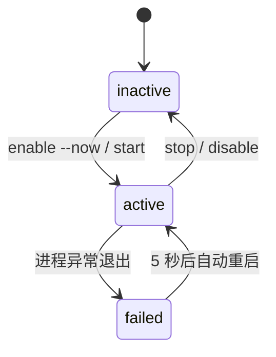

# systemd 自启

> <cite>来源：[`README.md`](file://README.md) 的「开机自启（systemd user service）」章节。本文聚焦于 Dashboard 的 systemd 托管方式，项目整体说明见 [项目概述](项目概述/项目概述.md)。</cite>

## 目录

- [概述](#概述)
- [服务文件位置](#服务文件位置)
- [Unit 文件详解](#unit-文件详解)
- [启用与启动](#启用与启动)
- [查看状态与日志](#查看状态与日志)
- [常用 systemctl 命令](#常用-systemctl-命令)
- [MCP Server 自启说明](#mcp-server-自启说明)
- [相关文档](#相关文档)

## 概述

Dashboard 是需要长期运行的 Web 服务。为了在服务器重启后自动恢复、并在进程崩溃时自动拉起，项目提供了 systemd **user service** 自启配置，服务名为 `tavily-dashboard`。

与手动执行 `./scripts/run_dashboard.sh` 相比，使用 systemd 托管有以下优势：

- 随用户登录自动启动，无需人工干预；
- 进程异常退出后自动重启（`Restart=on-failure`，间隔 5 秒）；
- 日志统一由 journald 收集，便于查看与排查。


## 服务文件位置

自启配置文件位于用户目录下：

```
~/.config/systemd/user/tavily-dashboard.service
```

这是一个 **user service**，归属于当前用户，操作时不需要 `sudo`。如果文件不存在，可以手动创建，内容见下一节。

> 提示：修改端口或项目路径时，直接编辑该文件，随后执行 `systemctl --user daemon-reload` 并重启服务即可生效。

## Unit 文件详解

完整内容如下：

```ini
[Unit]
Description=Tavily API Key Pool Dashboard
After=network.target

[Service]
Type=simple
WorkingDirectory=/home/user/code/Tavily
Environment=PYTHONUNBUFFERED=1
ExecStart=/usr/bin/python3 dashboard.py
Restart=on-failure
RestartSec=5

[Install]
WantedBy=default.target
```

各配置项说明：

| 配置项 | 说明 |
| --- | --- |
| `After=network.target` | 等待网络就绪后再启动服务 |
| `Type=simple` | 默认类型，`ExecStart` 启动的进程即服务主进程 |
| `WorkingDirectory` | 工作目录，必须指向项目根目录（示例为 `/home/user/code/Tavily`），确保 `dashboard.py` 可被导入，SQLite 数据库 `tavily_keys.db` 也创建在该目录下 |
| `Environment=PYTHONUNBUFFERED=1` | 关闭 Python 输出缓冲，日志实时写入 journald |
| `ExecStart` | 直接运行 `python3 dashboard.py`，**监听地址与端口从 `config.json` 读取**（由 `settings.py` 加载），无需在 unit 中指定 host/port |
| `Restart=on-failure` | 仅当进程非正常退出时自动重启 |
| `RestartSec=5` | 自动重启前等待 5 秒，防止频繁重启 |
| `WantedBy=default.target` | 随用户默认会话目标（登录）启动 |

> 生产环境推荐直接使用 `deploy/linux-server/` 部署包中的 `tavily-dashboard.service`（系统级 systemd 服务 + Nginx 域名反向代理），详见 [设置与两套版本](设置与两套版本.md)。

### 部署时需要注意

- 请按实际环境调整 `WorkingDirectory` 和 `/usr/bin/python3` 路径，可用 `which python3` 确认解释器位置；
- 该服务直接运行 `dashboard.py`，**不经过** `./scripts/run_dashboard.sh` 脚本，host/port 全部取自 `config.json`；
- SQLite 数据库 `tavily_keys.db` 会在工作目录下自动创建，删除后重启服务会自动重建空库（表结构见 [数据模型](架构设计/数据模型.md)）。

## 启用与启动

执行以下命令启用自启并立即启动：

```bash
systemctl --user daemon-reload
systemctl --user enable --now tavily-dashboard
systemctl --user status tavily-dashboard
```

说明：

- `daemon-reload`：重新读取 unit 文件（编辑过文件后必须执行）；
- `enable --now`：注册开机自启并立即启动；
- `status`：查看运行状态、主进程 PID 和最近日志。



> 补充：user service 默认在用户**登录**时启动。对于无人登录的纯服务器环境，可执行 `loginctl enable-linger <用户名>`，使服务在开机后即启动、不依赖登录会话（可选配置，项目未强制要求）。

## 查看状态与日志

```bash
# 查看运行状态
systemctl --user status tavily-dashboard

# 查看最近 100 行日志
journalctl --user -u tavily-dashboard -n 100

# 实时跟踪日志输出
journalctl --user -u tavily-dashboard -f
```

由于设置了 `PYTHONUNBUFFERED=1`，uvicorn 的访问日志与 `print` 输出会实时出现在 journald 中，便于观察 key 轮询与请求情况。

## 常用 systemctl 命令

| 操作 | 命令 |
| --- | --- |
| 重新加载配置 | `systemctl --user daemon-reload` |
| 立即启动 | `systemctl --user start tavily-dashboard` |
| 停止服务 | `systemctl --user stop tavily-dashboard` |
| 重启服务 | `systemctl --user restart tavily-dashboard` |
| 设置开机自启 | `systemctl --user enable tavily-dashboard` |
| 取消开机自启 | `systemctl --user disable tavily-dashboard` |
| 查看状态 | `systemctl --user status tavily-dashboard` |
| 查看最近日志 | `journalctl --user -u tavily-dashboard -n 100` |
| 实时日志 | `journalctl --user -u tavily-dashboard -f` |

## MCP Server 自启说明

**MCP Server 没有自启配置**，目前只支持手动启动：

```bash
./scripts/run_mcp.sh
```

如果你的服务器需要 MCP Server 也常驻运行，可以参照上文模式自行编写一个 unit 文件（例如 `tavily-mcp.service`）放入 `~/.config/systemd/user/`，或使用 `tmux` / `screen` / `nohup` 等工具托管。MCP Server 对外提供 `tavily-search`、`tavily-extract` 等工具，参见 [MCP 工具集](核心功能/MCP工具集.md)。

## 相关文档

- [启动服务](快速开始/启动服务.md) — 手动启动 Dashboard 与 MCP Server 的完整方式
- [快速开始](快速开始/快速开始.md) — 安装依赖与首次运行
- [数据模型](架构设计/数据模型.md) — SQLite 数据库与表结构说明
- [项目概述](项目概述/项目概述.md) — 项目定位与功能总览