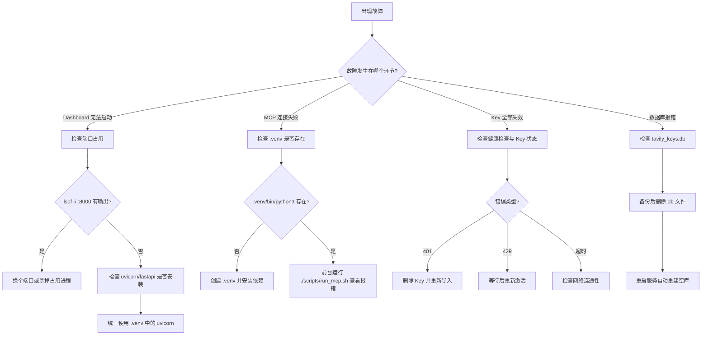
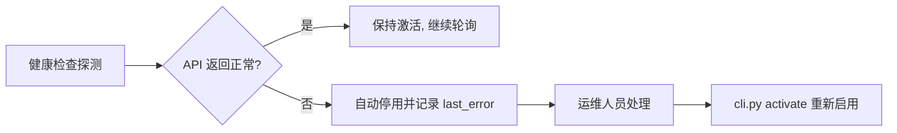

# 故障排查

> 本文面向运维与支持人员，汇总部署与运行 Tavily API Key Pool 过程中可能遇到的常见问题及对应解决方案，涵盖端口占用、MCP 连接失败、SQLite 数据库异常、API Key 失效、依赖版本冲突等场景，并结合 `key_pool.py` 的容错机制给出排查思路。

<cite>本文基于以下源码：[README.md](file://README.md) · [key_pool.py](file://app/key_pool.py) · [run_mcp.sh](file://scripts/run_mcp.sh) · [run_dashboard.sh](file://scripts/run_dashboard.sh)</cite>

## 目录

- [常见问题速查](#常见问题速查)
- [Dashboard 启动失败：端口占用](#dashboard-启动失败端口占用)
- [MCP Server 连接失败](#mcp-server-连接失败)
- [SQLite 数据库异常](#sqlite-数据库异常)
- [API Key 失效或限流](#api-key-失效或限流)
- [依赖版本冲突与 venv 路径问题](#依赖版本冲突与-venv-路径问题)
- [排查流程图](#排查流程图)
- [相关文档](#相关文档)

## 常见问题速查

| 症状 | 可能原因 | 快速处理 |
|------|----------|----------|
| `[Errno 98] Address already in use` | 8000 端口被其他进程占用 | 换端口启动或杀掉占用进程 |
| MCP 连接立即断开 / 调用失败 | `.venv` 不存在或未安装依赖 | 创建虚拟环境并安装 `requirements.txt` |
| `uvicorn: command not found` | 系统 Python 中未安装 uvicorn | 改用虚拟环境中的 uvicorn |
| `database disk image is malformed` | SQLite 文件损坏 | 删除 `data/tavily_keys.db` 后重启，自动重建 |
| Key 被自动停用 | 健康检查失败（401/429/超时） | `python app/cli.py activate tvly-xxxx****xxxx` |
| 所有 Key 均无法分发 | 全部处于停用状态 | `python app/cli.py list` 查看状态并处理 |
| `ModuleNotFoundError` | 依赖缺失或环境不一致 | 统一在 `.venv` 中安装依赖 |

## Dashboard 启动失败：端口占用

**症状**

执行 `./scripts/run_dashboard.sh` 后立即退出，并出现类似报错：

```text
ERROR:    [Errno 98] Address already in use
ERROR:    error while attempting to bind on address ('0.0.0.0', 8000): address already in use
```

**原因**

`run_dashboard.sh` 默认将 Dashboard 绑定到 8000 端口，该端口已被其他进程占用（常见于之前启动的 Dashboard 实例未退出，或系统上其他服务占用了该端口）。

**排查步骤**

```bash
# 查看 8000 端口被哪个进程占用
lsof -i :8000

# 或使用 netstat
netstat -tunlp | grep 8000
```

**解决方案**

- 杀掉占用端口的进程后重新启动：

```bash
kill <pid>
./scripts/run_dashboard.sh
```

- 或直接指定其他端口启动，`run_dashboard.sh` 接受端口号作为第一个参数：

```bash
./scripts/run_dashboard.sh 8080
```

脚本端口逻辑如下（[file://scripts/run_dashboard.sh](file://scripts/run_dashboard.sh)）：

```bash
PORT=${1:-8000}
uvicorn dashboard:app --host 0.0.0.0 --port "$PORT"
```

> **注意**：如果你配置了 systemd 用户级自启服务，修改端口后需要同步更新 `~/.config/systemd/user/tavily-dashboard.service` 中的 `--port` 参数，并执行 `systemctl --user daemon-reload` 重启服务，否则下次开机仍会尝试绑定 8000 端口。

## MCP Server 连接失败

**症状**

- AI Agent 侧提示连接失败、`Connection closed` 或 MCP 客户端报 `process exited`；
- 直接运行 `./scripts/run_mcp.sh` 时报错 `No such file or directory`。

**原因**

`run_mcp.sh` 固定使用项目根目录下 `.venv` 中的 Python 解释器启动 MCP Server。若 `.venv` 不存在、路径不对或其中的 Python 缺失，脚本会直接失败，导致 MCP stdio 连接无法建立。

脚本关键逻辑（[file://scripts/run_mcp.sh](file://scripts/run_mcp.sh)）：

```bash
SCRIPT_DIR="$(cd "$(dirname "$0")" && pwd)"
"$SCRIPT_DIR/.venv/bin/python3" "$SCRIPT_DIR/mcp_server.py"
```

**排查步骤**

```bash
# 确认虚拟环境是否存在
ls -la .venv/bin/python3

# 前台运行脚本，直接查看错误输出
./scripts/run_mcp.sh
```

**解决方案**

在项目根目录重建虚拟环境并安装依赖：

```bash
python3 -m venv .venv
./.venv/bin/pip install -r requirements.txt
./scripts/run_mcp.sh
```

如果脚本能够启动但仍无法被 AI Agent 调用，请检查客户端配置的工作目录是否正确，并参考 [MCP 工具集](../核心功能/MCP工具集.md) 确认工具注册与参数格式。

### MCP 连接报 `SSE error: Non-200 status code (404)` / `421 Misdirected Request`

**症状**

- VS Code 等 MCP 客户端连接网络模式服务时提示 `Error invoking remote method 'mcp:list-tools': SSE error: Non-200 status code (404)`；
- 服务端 `mcp_server.log` 中出现：

```text
Invalid Host header: 192.168.3.5:8001
INFO:     192.168.3.5:60762 - "GET /sse HTTP/1.1" 421 Misdirected Request
INFO:     192.168.3.5:53737 - "POST /mcp HTTP/1.1" 404 Not Found
```

**原因**

有两个叠加因素：

1. **新版 `mcp` 包（1.x）默认启用 DNS rebinding 防护**。`FastMCP` 在模块加载时（默认 `host=127.0.0.1`）自动将 `transport_security` 的 `allowed_hosts` 限制为 `127.0.0.1`/`localhost`/`[::1]`。若仅修改 `mcp.settings.host = "0.0.0.0"` 而未同步更新 `transport_security`，则局域网 IP 访问 `/sse` 会被拒绝（HTTP 421，`Invalid Host header`）。
2. **客户端配置的 URL 路径与传输方式不匹配**。SSE 模式只暴露 `/sse` 端点，`/mcp`（Streamable HTTP 端点）在该模式下返回 404；反之若服务端为 `streamable-http` 而客户端连 `/sse` 也会失败。

**解决方案**

- 服务端已内置修复：`app/mcp_server.py` 的 `main()` 在网络模式下显式设置 `transport_security = TransportSecuritySettings(enable_dns_rebinding_protection=False)`，局域网 IP 可直接访问。**修改后需重启 MCP 服务生效**。
- 客户端配置须与服务端传输方式一致：

| 服务端 `mcp_transport` | 客户端类型 | 连接地址 |
|------------------------|------------|----------|
| `sse`（默认） | SSE | `http://<IP>:8001/sse` |
| `streamable-http` | Streamable HTTP | `http://<IP>:8001/mcp` |

- 快速自测：`curl -s -o NUL -w "%{http_code}" -m 3 http://<IP>:8001/sse` 应返回 `200`（SSE 连接保持，`-m 3` 超时属正常）。

## SQLite 数据库异常

**症状**

```text
sqlite3.DatabaseError: database disk image is malformed
sqlite3.OperationalError: file is not a database
sqlite3.OperationalError: unable to open database file
```

**原因**

- 进程被强制杀掉（`kill -9`）、系统突然断电等导致数据库文件写入不完整；
- 磁盘空间不足导致写入失败；
- `-wal` / `-shm` 残留文件与主库状态不一致。

数据库文件路径由 `app/paths.py` 的 `runtime_dir()` 统一管理，位于 `data/` 目录（开发时为项目根目录下的 `data/`，打包后为 exe 同目录下的 `data/`，见 [file://app/key_pool.py](file://app/key_pool.py)）：

```python
DB_PATH = runtime_dir() / "tavily_keys.db"
```

**解决方案**

删除数据库文件后重启即可，系统会自动重建空库（README 明确说明"删除该文件不影响功能，下次启动自动重建空库"）：

```bash
rm -f data/tavily_keys.db data/tavily_keys.db-wal data/tavily_keys.db-shm
./scripts/run_dashboard.sh
```

> **注意事项**：
>
> - 删除数据库会清空 Key 列表、用量统计和请求日志，删除前建议先备份：
>
>   ```bash
>   cp data/tavily_keys.db data/tavily_keys.db.bak
>   ```
>
> - 删除后需要重新导入 Key（`python app/cli.py add --from-file keys.txt` 或通过 Web 界面）；
> - `key_pool.py` 已内置一定容错能力：使用 WAL 模式、设置 `busy_timeout=3000`、并为每个线程维护独立的 SQLite 连接（`threading.local`），正常使用场景下数据库不易损坏。

数据库表结构（`api_keys` 与 `request_log`）详见 [数据模型](../架构设计/数据模型.md)。

## API Key 失效或限流

**症状**

- 某个 Key 在 Dashboard 上显示为停用（inactive）；
- 请求返回 `401 Unauthorized`（Key 无效或被撤销）；
- 请求返回 `429 Rate limit exceeded`（触发限流）；
- 所有 Key 都无法分发，MCP 工具调用全部失败。

**原因与容错机制**

`KeyPool.check_health()` 会对每个激活的 Key 发送一次轻量搜索探测（`timeout=5` 秒），任何异常都会自动停用该 Key 并记录错误信息（[file://app/key_pool.py](file://app/key_pool.py)）：

```python
except Exception as e:
    err = str(e)
    results.append({"masked": k.masked, "alive": False, "error": err})
    self.deactivate_key(k.masked, f"health-check: {err[:200]}")
```

因此：

| 返回状态 | 含义 | 处理方式 |
|----------|------|----------|
| 401 | Key 已失效/被撤销 | 删除该 Key 并重新导入新 Key |
| 429 | 短时间请求过频，触发限流 | 等待一段时间后重新激活 |
| 超时/空响应 | 网络问题或服务异常 | 重试健康检查，确认网络连通性 |

注意：健康检查可能将**临时限流（429）误判为 Key 失效**，导致 Key 被自动停用。这是刻意的保守策略——优先保证请求成功率。若确认属于临时限流，重新激活即可。

另外，当所有 Key 都被停用时，`next_key()` 会返回 `None`，分发逻辑将无法提供可用 Key：

```python
# file://app/key_pool.py
def next_key(self) -> tuple[str, str] | None:
    rows = conn.execute(
        "SELECT key, masked FROM api_keys WHERE is_active=1 ORDER BY last_used_at ASC"
    ).fetchall()
    if not rows:
        return None
```

**排查步骤**

```bash
# 查看所有 Key 的状态与最近错误
python app/cli.py list
python app/cli.py health

# 查看最近请求日志，确认失败原因
python app/cli.py recent -n 50
```

**解决方案**

```bash
# 重新启用被误停用的 Key（使用掩码）
python app/cli.py activate tvly-xxxx****xxxx

# 删除彻底失效的 Key
python app/cli.py remove tvly-xxxx****xxxx

# 批量重新导入新 Key
python app/cli.py add --from-file keys.txt
```

Key 的自动轮询与健康检查完整机制参见 [Key 轮询与健康检查](../核心功能/Key轮询与健康检查.md)。

## 依赖版本冲突与 venv 路径问题

**症状**

```text
ModuleNotFoundError: No module named 'fastapi'
ModuleNotFoundError: No module named 'mcp'
ModuleNotFoundError: No module named 'tavily'
ImportError: cannot import name '...' from '...'
```

**原因**

依赖未安装、安装到了错误的 Python 环境，或不同组件间版本不兼容。

项目核心依赖（来自 [file://README.md](file://README.md)）：

```text
tavily-python
mcp
fastapi
uvicorn
```

**典型坑：两个启动脚本使用的 Python 环境不一致**

- `run_dashboard.sh` 直接调用系统命令 `uvicorn`；
- `run_mcp.sh` 使用项目内 `.venv/bin/python3`。

如果依赖只装进了 `.venv` 而系统 Python 缺少 fastapi/uvicorn，Dashboard 会启动失败（或提示 `uvicorn: command not found`）；反之如果依赖只装在系统 Python 中，MCP Server 会启动失败。**建议统一使用虚拟环境**：

```bash
# 统一安装依赖到 .venv
./.venv/bin/pip install -r requirements.txt

# 用虚拟环境的 uvicorn 启动 Dashboard
./.venv/bin/uvicorn dashboard:app --host 0.0.0.0 --port 8000
```

**解决方案**

出现无法解释的导入错误时，建议重建虚拟环境，彻底清除版本污染：

```bash
rm -rf .venv
python3 -m venv .venv
./.venv/bin/pip install --upgrade pip
./.venv/bin/pip install -r requirements.txt
```

仅需升级单个依赖时：

```bash
./.venv/bin/pip install --upgrade tavily-python fastapi uvicorn mcp
```

完整的依赖安装步骤见 [安装与配置](../快速开始/安装与配置.md)，服务启动流程见 [启动服务](../快速开始/启动服务.md)。

## 排查流程图



健康检查的自动停用决策流程：



## 相关文档

- [启动服务](../快速开始/启动服务.md) — 标准启动流程与脚本说明
- [安装与配置](../快速开始/安装与配置.md) — 依赖安装与环境准备
- [Key 轮询与健康检查](../核心功能/Key轮询与健康检查.md) — 健康检查与自动停用机制详解
- [数据模型](../架构设计/数据模型.md) — SQLite 表结构说明
- [模块划分](../架构设计/模块划分.md) — 各模块职责与边界
- [MCP 工具集](../核心功能/MCP工具集.md) — MCP 工具清单与使用方式