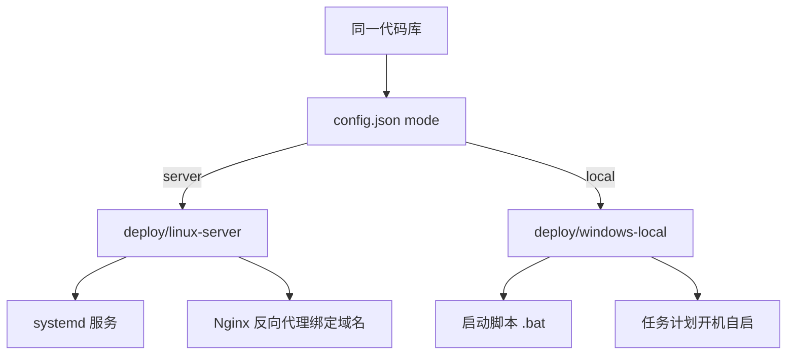

# 设置与两套部署版本

> 本文介绍项目新增的**部署设置**（域名绑定、监听地址、端口、访问令牌、部署模式）以及基于同一代码库的两套部署形态：**Linux Server 版**与 **Windows Local 版**。

## 目录

- [config.json 配置](#configjson-配置)
- [Web 设置页](#web-设置页)
- [访问鉴权](#访问鉴权)
- [两套部署版本](#两套部署版本)
- [相关文档](#相关文档)

## config.json 配置

项目所有部署相关的设置统一存放在项目根目录 `config.json`（由 `settings.py` 模块读写，首次启动自动生成默认值）：

```json
{
  "mode": "server",
  "domain": "api.example.com",
  "host": "0.0.0.0",
  "port": 8000,
  "auth_token": ""
}
```

| 字段 | 类型 | 默认值 | 说明 |
| --- | --- | --- | --- |
| `mode` | `string` | `local` | 部署模式：`server`（Linux 域名对外服务）/ `local`（Windows 本地） |
| `domain` | `string` | `''` | 绑定域名，仅用于界面展示访问地址与部署指引，不参与服务监听 |
| `host` | `string` | `127.0.0.1` | 监听地址：`127.0.0.1` 仅本机可访问，`0.0.0.0` 监听所有网卡 |
| `port` | `int` | `8000` | 服务监听端口 |
| `auth_token` | `string` | `''` | 访问令牌；非空时所有 `/api/*` 请求需携带 `X-Auth-Token` 请求头 |

**生效规则**：

- 修改 `host` / `port` 需要**重启服务**（重启 systemd 服务或重新运行启动脚本）后才生效；
- 修改 `mode` / `domain` / `auth_token` 即时生效，无需重启。

`settings.py` 提供 `get_settings()`、`save()`、`public_url()` 三个核心接口，其中 `public_url()` 按「域名优先，其次 host:port」推导对外访问地址。

## Web 设置页

Dashboard 界面顶部新增「**设置**」标签页，提供与 `config.json` 等价的图形化配置：

- **部署模式**：下拉选择 `Server` 或 `Local`；
- **绑定域名**：文本输入；
- **监听地址 Host**：文本输入（提示 `127.0.0.1` / `0.0.0.0` 两种取值含义）；
- **端口**：数字输入；
- **访问令牌**：密码框输入，留空表示不鉴权。

保存后界面会显示：

1. **对外访问地址**（由 `public_url()` 推导）；
2. **部署指引**：根据当前模式展示对应的 Linux / Windows 部署步骤与命令。

对应后端接口：

| 方法 | 路径 | 说明 |
| --- | --- | --- |
| GET | `/api/settings` | 读取当前设置与对外访问地址 |
| POST | `/api/settings` | 保存设置（校验 mode / port 合法性） |

## 访问鉴权

当 `auth_token` 非空时，Dashboard 通过中间件对**所有** `/api/*` 请求做鉴权：

- 请求需携带 `X-Auth-Token: <token>` 请求头（或 `?token=` 查询参数）；
- 未通过鉴权返回 `401`；
- 前端检测到 `401` 后弹出登录层，输入正确令牌后存入浏览器 `localStorage`，后续请求自动携带。

> 注意：`/`（HTML 页面）本身不鉴权，但页面内数据接口均受保护。设置令牌前请牢记令牌，忘记时可直接编辑 `config.json` 重置。

## 两套部署版本

同一代码库通过 `mode` 区分两种部署形态，部署包位于 `deploy/` 目录：



### Linux Server 版（域名对外服务）

- 目录：`deploy/linux-server/`
- 默认 `host=0.0.0.0`，监听所有网卡；
- 通过 **Nginx 反向代理**绑定域名（`nginx.conf.example`），可选 HTTPS；
- 通过 **systemd 服务**托管（`tavily-dashboard.service`），崩溃自动重启、开机自启；
- 一键部署：`sudo ./install.sh --domain api.example.com --token 你的令牌`。

### Windows Local 版（本机服务）

- 目录：`deploy/windows-local/`
- 默认 `host=127.0.0.1`，仅本机可访问；
- 启动脚本：`start_dashboard.bat`、`start_mcp.bat`；
- 开机自启：`install_service.ps1`（任务计划程序，管理员运行）；
- 如需局域网访问，将 `host` 改为 `0.0.0.0` 并放行防火墙端口。

详细部署步骤见 [`deploy/README.md`](../../../deploy/README.md) 及各版本目录内 README。

## 相关文档

- [部署运维](部署运维.md) — 整体部署与运维操作
- [Web 控制台](../Web控制台/Web控制台.md) — 界面与 API 说明
- [模块划分](../架构设计/模块划分.md) — `settings.py` 模块职责
