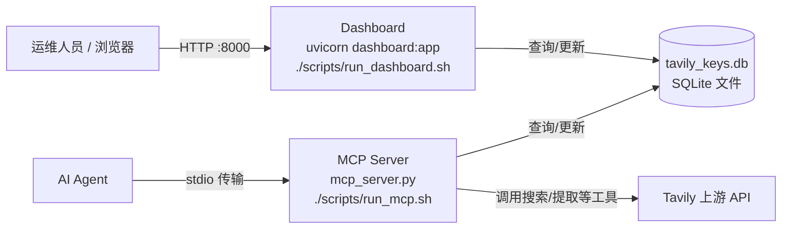
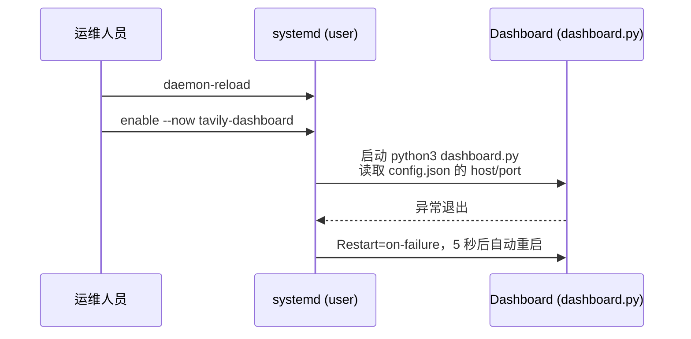

# 部署运维

> **源码与配置**
>
> 本页内容基于以下源文件整理：
>
> - <cite>[file://README.md](file://README.md)</cite> — 安装、导入、启动与自启配置说明
> - <cite>[file://scripts/run_mcp.sh](file://scripts/run_mcp.sh)</cite> — MCP Server 启动脚本
> - <cite>[file://scripts/run_dashboard.sh](file://scripts/run_dashboard.sh)</cite> — Dashboard 启动脚本
> - <cite>[file://requirements.txt](file://requirements.txt)</cite> — Python 依赖清单

## 目录

- [部署架构总览](#部署架构总览)
- [依赖安装](#依赖安装)
- [启动 MCP Server](#启动-mcp-server)
- [启动 Dashboard](#启动-dashboard)
- [systemd 用户级自启](#systemd-用户级自启)
- [数据库文件管理](#数据库文件管理)
- [环境变量与运行参数](#环境变量与运行参数)
- [运维操作速查](#运维操作速查)

## 部署架构总览

生产环境由两个相互独立、可单独部署的进程组成，二者共用同一个 SQLite 数据库文件。项目整体定位与功能范围参见[项目概述](项目概述/项目概述.md)，本文聚焦部署与运维操作。



- **MCP Server**：面向 AI Agent，通过 stdio 传输提供 tavily-search/extract/crawl/map/research 等工具，自动轮询分发 key。
- **Dashboard**：面向运维人员的 Web 界面，展示 key 列表、请求日志、健康检查与用量统计。
- **数据库**：单文件 SQLite，无需额外部署数据库服务，表结构详见[数据模型](架构设计/数据模型.md)。

部署前请先完成[安装与配置](快速开始/安装与配置.md)，从零开始的体验流程参见[快速开始](快速开始/快速开始.md)。

## 依赖安装

依赖清单定义于 [file://requirements.txt](file://requirements.txt)：

```text
tavily-python>=0.7.0
mcp>=1.0.0
fastapi>=0.115.0
uvicorn[standard]>=0.30.0
httpx>=0.27.0
aiofiles>=24.1.0
sqlite-utils>=3.37.0
```

安装命令：

```bash
pip install -r requirements.txt
```

各依赖用途：

| 包 | 版本下限 | 用途 |
| --- | --- | --- |
| `tavily-python` | 0.7.0 | Tavily API 客户端 |
| `mcp` | 1.0.0 | MCP 协议实现 |
| `fastapi` | 0.115.0 | Dashboard 的 Web 框架 |
| `uvicorn[standard]` | 0.30.0 | ASGI 服务器 |
| `httpx` | 0.27.0 | 异步 HTTP 客户端 |
| `aiofiles` | 24.1.0 | 异步文件读写 |
| `sqlite-utils` | 3.37.0 | SQLite 辅助工具 |

### 虚拟环境说明

[file://scripts/run_mcp.sh](file://scripts/run_mcp.sh) 固定调用项目目录下的 `.venv` 虚拟环境，因此以脚本方式启动 MCP Server 前需先创建并安装：

```bash
python3 -m venv .venv
.venv/bin/pip install -r requirements.txt
```

而 [file://scripts/run_dashboard.sh](file://scripts/run_dashboard.sh) 直接使用当前 PATH 中的 `uvicorn`，systemd 单元则使用系统 Python（`/usr/bin/python3`）。若只安装了虚拟环境，需要将 systemd 单元的 `ExecStart` 改为 `.venv/bin/uvicorn`，或把依赖安装到系统环境。

## 启动 MCP Server

MCP Server 通过 stdio 传输与 AI Agent 通信，启动脚本为 [file://scripts/run_mcp.sh](file://scripts/run_mcp.sh)：

```bash
#!/bin/bash
# Start Tavily MCP server (stdio transport)
# Usage: ./scripts/run_mcp.sh
SCRIPT_DIR="$(cd "$(dirname "$0")" && pwd)"
"$SCRIPT_DIR/.venv/bin/python3" "$SCRIPT_DIR/mcp_server.py"
```

启动：

```bash
./scripts/run_mcp.sh
```

**要点**

- 脚本通过 `SCRIPT_DIR` 自动定位项目目录，可在任意工作目录下执行。
- 使用项目内 `.venv` 虚拟环境的 Python 解释器，与系统环境隔离。
- 对外提供 tavily-search/extract/crawl/map/research 等工具，key 的轮询与失效处理见[Key 轮询与健康检查](核心功能/Key轮询与健康检查.md)。
- 该服务前台常驻运行，README 未提供自启配置，需要开机启动时可参照下文 Dashboard 的 systemd 单元自行添加。

## 启动 Dashboard

启动脚本为 [file://scripts/run_dashboard.sh](file://scripts/run_dashboard.sh)，**监听地址与端口自动从 `config.json` 读取**：

```bash
#!/bin/bash
# Start Tavily API Key Pool Dashboard
# Usage: ./scripts/run_dashboard.sh [port]   — port 可选，覆盖 config.json 中的端口
SCRIPT_DIR="$(cd "$(dirname "$0")" && pwd)"
cd "$SCRIPT_DIR"

HOST=$(python3 -c "import settings; print(settings.get_settings().get('host','127.0.0.1'))" 2>/dev/null || echo "127.0.0.1")
DEF_PORT=$(python3 -c "import settings; print(int(settings.get_settings().get('port',8000)))" 2>/dev/null || echo "8000")
PORT=${1:-$DEF_PORT}

exec python3 -m uvicorn dashboard:app --host "$HOST" --port "$PORT"
```

常用方式：

```bash
./scripts/run_dashboard.sh          # 按 config.json 启动
./scripts/run_dashboard.sh 8080     # 覆盖端口为 8080
```

等价的手动启动命令（host/port 覆盖配置）：

```bash
uvicorn dashboard:app --host 0.0.0.0 --port 8000
python dashboard.py         # 完全按 config.json 启动
```

**要点**

- `host`/`port` 通过 `config.json` 配置（Web 界面「设置」标签页可改），脚本参数可覆盖端口。
- `host=0.0.0.0` 监听所有网卡接口，便于局域网访问；`host=127.0.0.1` 仅本机可访问；暴露到公网前请评估安全风险。
- 界面包含 key 列表、请求日志、健康检查、用量统计与「设置」，使用细节见[用量追踪与日志](核心功能/用量追踪与日志.md)与[设置与两套版本](设置与两套版本.md)。
- 首次使用可在界面点击 "Add API Keys" 粘贴导入 key，或通过 CLI 从文件批量导入（见[快速开始](快速开始/快速开始.md)）。

## systemd 用户级自启

Dashboard 已提供 systemd **用户级**服务配置，存放于 `~/.config/systemd/user/tavily-dashboard.service`：

```ini
[Unit]
Description=Tavily API Key Pool Dashboard
After=network.target

[Service]
Type=simple
WorkingDirectory=/home/user/code/Tavily
Environment=PYTHONUNBUFFERED=1
ExecStart=/usr/bin/python3 dashboard.py
Restart=on-failure
RestartSec=5

[Install]
WantedBy=default.target
```

> 生产环境（域名对外服务）推荐使用 `deploy/linux-server/` 中的系统级 systemd 服务 + Nginx 反向代理，详见[设置与两套版本](设置与两套版本.md)。

启用自启：

```bash
systemctl --user daemon-reload
systemctl --user enable --now tavily-dashboard
systemctl --user status tavily-dashboard
```



**配置字段说明**

| 字段 | 含义 |
| --- | --- |
| `WorkingDirectory` | 必须指向项目根目录，否则 `dashboard.py` 导入与 `tavily_keys.db` 定位会失败，需按实际部署路径修改 |
| `PYTHONUNBUFFERED=1` | 关闭 Python 输出缓冲，日志实时写入 journal，便于排障 |
| `Restart=on-failure` | 进程非正常退出时自动重启 |
| `RestartSec=5` | 重启前等待 5 秒 |
| `WantedBy=default.target` | 用户登录后由 systemd 用户实例拉起 |

> 监听地址与端口由 `config.json` 决定（`settings.py` 加载），修改后重启服务生效。

**注意**：MCP Server 无自启配置，需手动执行 `./scripts/run_mcp.sh`；如需常驻，可参照上述单元为 `mcp_server.py` 增加服务。

## 数据库文件管理

- 数据库为项目根目录下的 SQLite 文件 `tavily_keys.db`，首次启动自动创建。
- 包含两张表：
  - `api_keys` — key 列表、用量、状态；
  - `request_log` — 请求日志。
- 删除该文件不影响功能，下次启动会自动重建空库；但 key 与用量记录会全部丢失，生产环境请勿随意删除。
- **备份**：建议先停止相关服务再复制文件；在线 `cp` 亦可，但存在写入不一致的小概率风险。
- **清理**：`request_log` 随请求持续增长，可周期性删除旧日志控制文件体积。
- 字段定义详见[数据模型](架构设计/数据模型.md)。

## 环境变量与运行参数

| 变量 / 参数 | 来源 | 说明 |
| --- | --- | --- |
| `PYTHONUNBUFFERED=1` | systemd 单元 | 强制 Python 输出无缓冲，日志实时写入 journal |
| `config.json` 的 `host`/`port` | [file://app/settings.py](file://app/settings.py) | Dashboard 监听地址与端口，Web 设置页可修改 |
| 脚本第一个参数 `PORT` | [file://scripts/run_dashboard.sh](file://scripts/run_dashboard.sh) | 覆盖 config.json 中的端口 |
| `SCRIPT_DIR` | [file://scripts/run_mcp.sh](file://scripts/run_mcp.sh) | 脚本内部变量，自动解析项目目录 |

## 运维操作速查

| 操作 | 命令 |
| --- | --- |
| 安装依赖 | `pip install -r requirements.txt` |
| 创建虚拟环境并安装 | `python3 -m venv .venv && .venv/bin/pip install -r requirements.txt` |
| 启动 MCP Server | `./scripts/run_mcp.sh` |
| 启动 Dashboard（默认端口） | `./scripts/run_dashboard.sh` |
| 启动 Dashboard（指定端口） | `./scripts/run_dashboard.sh 8080` |
| 手动启动 Dashboard | `uvicorn dashboard:app --host 0.0.0.0 --port 8000` |
| 导入 key（文件） | `python app/cli.py add --from-file keys.txt` |
| 健康检查并停用失效 key | `python app/cli.py health` |
| 重新加载 systemd 配置 | `systemctl --user daemon-reload` |
| 启用并启动 Dashboard 自启 | `systemctl --user enable --now tavily-dashboard` |
| 查看自启服务状态 | `systemctl --user status tavily-dashboard` |
| 查看运行日志（实时） | `journalctl --user -u tavily-dashboard -f` |
| 停止自启服务 | `systemctl --user stop tavily-dashboard` |

### 首次部署检查清单

1. 创建虚拟环境并安装依赖（见[依赖安装](#依赖安装)）。
2. 准备 key 列表文件 `keys.txt`（一行一个 key），执行 `python app/cli.py add --from-file keys.txt` 导入。
3. 依次启动验证：`./scripts/run_mcp.sh` 与 `./scripts/run_dashboard.sh`。
4. 执行 `python app/cli.py health` 确认 key 状态正常。
5. 配置 systemd 自启（见[systemd 用户级自启](#systemd-用户级自启)）。

> 更多日常操作：key 管理、统计与健康命令见[Key 轮询与健康检查](核心功能/Key轮询与健康检查.md)与[用量追踪与日志](核心功能/用量追踪与日志.md)；服务启动的完整流程见[启动服务](快速开始/启动服务.md)。