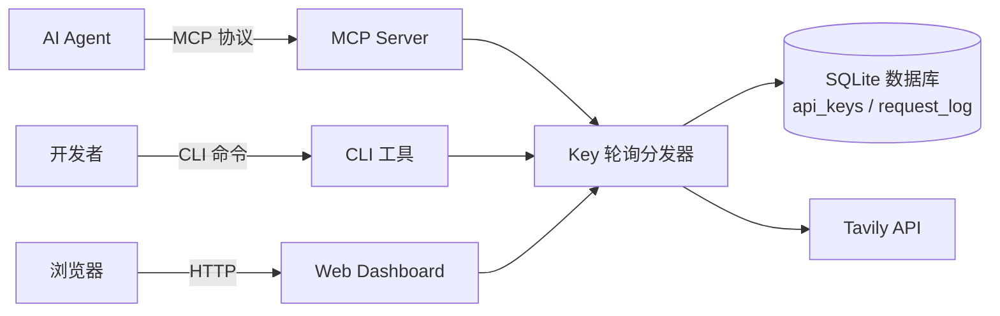

# Tavily API Key Pool 项目概述

<cite>本页内容整理自：file://README.md</cite>

## 目录

- [项目简介](#项目简介)
- [核心功能](#核心功能)
- [技术栈](#技术栈)
- [架构示意](#架构示意)
- [典型使用场景](#典型使用场景)
- [快速上手](#快速上手)
- [数据存储](#数据存储)
- [相关文档](#相关文档)

## 项目简介

Tavily API Key Pool 是一个集中管理多个 Tavily API key 的轻量级工具。它把散落在各处的 key 统一收纳进一个「钥匙池」，通过自动轮询（round-robin）方式分发请求，避免单个 key 因调用量过大触发限流或悄然失效。

项目内置 SQLite 数据库，自动记录每个 key 的累计用量与请求日志；同时提供健康检查机制，失效的 key 会被自动停用，无需人工盯守。对依赖 Tavily 搜索服务的开发者、团队或 AI 应用而言，它解决了多 key 管理混乱、配额分配不均、失效 key 拖垮服务等常见痛点，显著降低运维成本。

项目提供三种使用入口：**CLI 命令行**适合脚本化管理和日常运维；**Web Dashboard** 以可视化界面展示 key 列表、请求日志、用量统计与健康状态；**MCP Server** 让 AI Agent 直接调用 `tavily-search`、`tavily-extract` 等工具，并自动完成 key 轮换。三者共享同一套数据与轮询逻辑，互不冲突。

## 核心功能

| 功能 | 说明 |
| --- | --- |
| Key 集中管理 | 通过 CLI 或 Web UI 批量导入、启用、停用、删除 key |
| 自动轮询分发 | 多个 key 轮流处理请求，均衡配额消耗 |
| 用量统计 | 追踪每个 key 的调用次数，掌握配额使用情况 |
| 健康检查 | 自动检测失效 key 并停用，保证服务可用性 |
| 请求日志 | 记录最近请求，便于排查与审计 |
| MCP 工具集 | 对外提供 tavily-search / extract / crawl / map / research 等工具 |

## 技术栈

项目基于 Python 构建，核心依赖如下：

- **tavily-python** — Tavily API 官方客户端
- **mcp** — Model Context Protocol 框架，供 AI Agent 调用
- **FastAPI + Uvicorn** — 驱动 Web Dashboard
- **SQLite** — 本地轻量数据库，零额外配置

## 架构示意



系统由三类入口（CLI、Dashboard、MCP Server）汇聚到统一的 Key 轮询分发器，分发器负责挑选可用 key 并调用 Tavily API，所有请求与用量数据落盘到 SQLite。

## 典型使用场景

- **个人开发者**：手上有多个 Tavily key，希望自动均衡用量、避免单 key 超额。
- **团队共享**：多个成员共用 key 池，统一管控启停状态与配额。
- **AI 应用接入**：通过 MCP Server 让 Agent 透明使用 Tavily 搜索，无需关心底层 key 轮换。
- **生产环境守护**：配合健康检查与 systemd 自启，实现 7×24 小时稳定服务。

## 快速上手

安装依赖：

```bash
pip install -r requirements.txt
```

将 key 逐行写入 `keys.txt` 后批量导入：

```bash
python app/cli.py add --from-file keys.txt
```

启动 MCP Server（供 AI Agent 调用）：

```bash
./scripts/run_mcp.sh
```

启动 Web Dashboard：

```bash
./scripts/run_dashboard.sh          # 默认端口 8000
./scripts/run_dashboard.sh 8080     # 指定端口
```

常用 CLI 命令：

```bash
python app/cli.py list                    # 列出所有 key
python app/cli.py list --active           # 仅显示活跃 key
python app/cli.py stats                   # 用量统计
python app/cli.py health                  # 健康检查，自动停用失效 key
python app/cli.py recent -n 20            # 最近 20 条请求日志
```

Dashboard 也支持 systemd 用户级服务自启，服务单元文件位于 `~/.config/systemd/user/tavily-dashboard.service`，通过 `systemctl --user enable --now tavily-dashboard` 即可开机自启（详见 file://README.md）。

## 数据存储

所有数据保存在 SQLite 文件 `tavily_keys.db` 中（首次启动自动创建），包含两张表：

- `api_keys` — key 列表、用量、状态
- `request_log` — 请求日志

删除该文件不会影响功能，下次启动时系统会自动重建空库。

## 相关文档

本页为项目总览。更多细节（安装配置、CLI 命令、Dashboard 使用、系统架构、部署运维等）将在 Wiki 后续页面中展开，当前可直接参考仓库根目录的 file://README.md。